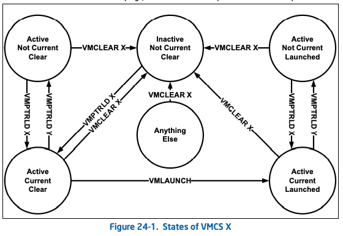

# Intel VM manual

## Vol.3A Chapter 2

### System-Level Registers

#### Descriptor Table

保护模式下，所有内存访问均需经过GDT或LDT，它们含有段描述符项，提供了段基址，访问权限等信息

每个段描述符对应一个段选择器，软件用它来查找GDT表index, global/local flag, access right

接触段中的一个字节，需要段选择器和偏移，前者查表选出段基址，后者算字节位置

## Vol.3A Chapter 23

- VMXON进入VMX operations
- VMEntry，VMM使一个Guest进入虚拟机
- VMLaunch, VMResume，VMM使VM entry生效
- VMExit，Gust将操作权转交给VMM指定位置，VMM推出虚拟机
- VMOFF，离开VM operations

### VMCS

每个逻辑CPU使用多个VMCS，并将一块内存区域与其结合，VMCS region，使用64bit物理地址指针VMCS pointer指向内存区域，4KB对齐

VMCS启动状态决定在其上使用的VM Entry指令

- VMLaunch: clear
- VMResume: launched

逻辑CPU根据VMCS region维护VMCS launching state，只有以下情况会发生更改：

- VMCS启动状态是clear，那么VMLaunch之后状态变为launched
- VMClear指令的内存操作数是VMCS地址，在指令执行完成后，VMCS状态变为clear

逻辑CPU通过以下操作决定VMCS active current:

- VMPtrld指令的内存操作数为VMCS地址，在指令执行完成后，VMCS为active current
- VMCS shadowing VM-execution控制指令成功实施后会将VMCS内部VMCS链接指针所指（即VMCS本身）设置为active
- VMClear指令的内存操作数是VMCS地址，在指令执行完成后，VMCS inactive noncurrent
- VMPtrst指令将逻辑CPU当前VMCS存入特定的内存

#### VMCS Region

|Byte offset|Contents|
|:-:|:-:|
|0|Bits 30:0: VMCS修订标识 Bit 31: 影子VMCS指示|
|4|VMX-abort指示|
|8|VMCS数据|

VMCS修订标识有很多种，VMPtrld将会失败若修订标识不同或为影子VMCS且硬件不支持，硬件是否支持通过读取MSR_IA32_VMX_PROCBASED_CTLS2

软件发现VMCS revision通过读取MSR_IA32_VMX_BASIC

#### VMCS DATA

##### Guest-state area

**Guest register state**

- control registers: CR0,3,4
- Debug Registers
- RSP, RIP, RFLAGS
- CS, SS, DS, ES, FS, GS, LDTR, TR
    - selector(16 bits)
    - Base addr
    - Segment limit(32 bits)
    - Access right(32 bits)
        - [3:0] Segment type
        - [4]   system/code or data, descriptor type
        - [6:5] DPL - descriptor priviledge level
        - [7]   P - segment presetn
        - [12]  AVL - available for use by system software
        - [13]  L - 64-bit mode activate, for CS only
        - [14]  D/B - default operation type, 16/32-bit segment
        - [15]  G - Granularity，粒度
        - [16]  Segment unusable(0 -  usable)
- fields for each GDTR and IDTR
    - Base addr
    - Limits(32 bits)
- MSRs
- shadow-stack pointer register SSP
- SMBASE register, basr addr of CPU SMRAM image

- Host-state area
- VM-execution control fields
- VM-exit control fields
- VM-exit info fields

**Guest non-register state**

- activity state(32 bits):逻辑CPU状态
    - 0: Active
    - 1: HLT, inactive because of HLT
    - 2: Shutdown, inactive because of triple fault(三重错误)
    - 3: Wait-for-SIPI, inactive because waiting for startup IPI
- Interuptibility state(32 bits)
- pending debug exceptions
- VMCS link pointer(64 bits): 当VM shadowing VM execution control = 1，VMREAD和VMWRITE使用此指针来获取VMCS
- VMX-preemption timer value(32 bits)
- Page directory pointer table entries(0~4, 64 bits each)
- Guest interrupt status(16 bits)
    - Requesting
    - Servicing
- PML index(16 bits)

##### Host state area

- control registers: CR0,3,4
- RSP, RIP, RFLAGS
- CS, SS, DS, ES, FS, GS, TR selector fields(16 bits each)
- FS, GS, TR, GDTR, IDTR base addr fields
- MSRs
- shadow-stack pointer register SSP

##### VM execution control fields

**Pin based**

一个32bit向量管理interrupts等事务

**Processor based**

3个向量，管理特殊指令执行：primary(32), secondary(32), VVM-exe ctrl(64)

**Exception Bitmap**

32 bit，每个对应一个异常，异常触发时查询域中bit，若为1，则VM exit，若为0，则送往IDT

**I/O bitmap addr**

**Time-Stamp Counter offset and multiplier**

**Guest/Host masks and read shadows for CR0 and CR4**

**CR3-Target Controls**

**Controls for APIC Virtualization**

**MSR-Bitmap addr**

**Executive-VMCS pointer**

**Extended page table pointer(EPTP)**

**VPID**

Virtual-Processor Identifier

##### VM-entry control field

##### VM-Exit information field

##### Shadow and ordinary VMCS

- ordinary: 能够被用作VM Entry，non-root模式不能进行VMREAD/VMWRITE
- Shadow:不能用作VM Entry，non-root模式可以VMREAD, VMWRITE

##### Software Use

VMCS至多在一个处理器上active，如果要复用，使用VMCLEAR

不能修改active VMCS的shadow VMCS indicator，修改应该VMCLEAR

应该使用VMREAD/WRITE而不是普通访存请求获取VMCS数据

VMCLEAR在VMXOFF之前

VMCS每一个域对应32-bit数作为它的编码，编码作为VMREAD/WRITE的操作数

|Bit position|Contents|
|:-:|:-:|
|0|Access type, 0-full, 1-high|
|9:1|index|
|11:10|type: 0-control, 1-VM-exit info, 2-guest state, 3-host state|
|14:13|Width: 0-16bit, 1-64bit, 2-32bit, 3-natural-width|

