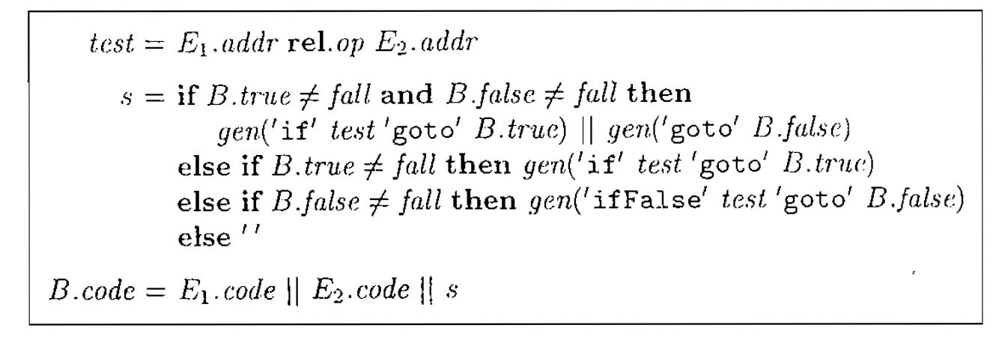
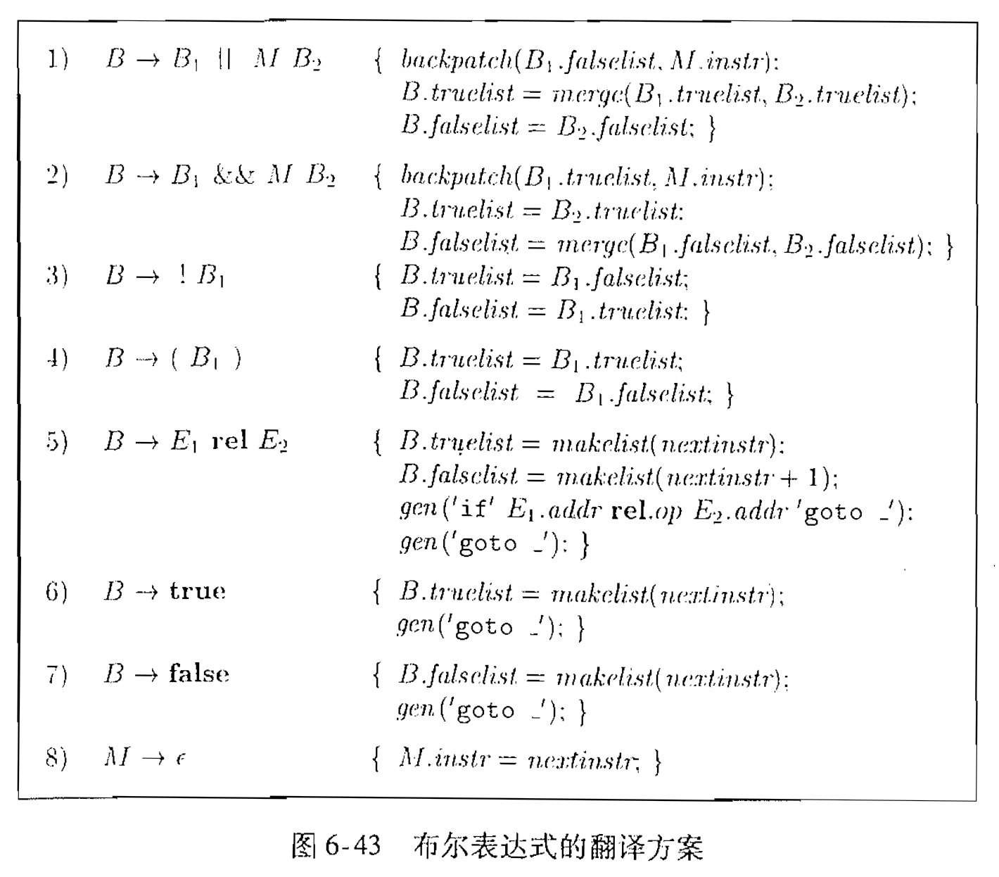

# 编译原理 龙书

## 简易语法制导翻译器

上下文无关文法：

- 一个终结符号集合
- 一个非终结符号集合
- 一个产生式集合
- 指定一个非终结符作为开始符

推导

语法分析的任务是：接受一个终结符号串作为输入，找出从文法的开始符号推导出这个串的方法，若不能找到，则报错

语法分析树：

- 根结点开始符号
- 叶节点终结符
- 内部节点非终结符

二义性：对于文法，存在一个终结符号串，是两棵或以上的语法分析树的结果

左结合：+ -
右结合：* /

算术表达式文法：

$$expr\rightarrow expr + term \mid expr - term \mid term$$$$term \rightarrow term * factor \mid term / factor \mid factor$$$$factor\rightarrow digit \mid (expr)$$

### 语法制导翻译

通过向一个文法的产生式附加一些规则或程序片段得到

- 属性：与程序构造相关的量
- 翻译方案

后缀表示

语法制导：

- 把每个文法符号和一个属性集合相关联
- 每个产生式和一组语义规则相关联，规则用于计算与产生式中符号关联的属性值

语法分析树的一个节点N的符号为文法记号X，X.a表示结点上X的属性a的值

注释分析树：语法分析树节点+属性值

综合属性：某个属性在语法分析树节点N伤的值是由N的子节点以及N本身的属性值确定

语义动作：嵌入到产生式体中的程序片段，用花括号括起，执行位置指定

#### 预测分析法

各个非终结符号对应的过程中的控制流可以有向前看符号无二义地确定。

预测分析需要知道哪些符号可能成为一个产生式体所生成串的第一个符号

另$\alpha$为一个文法符号

$FIRST(\alpha)$：可以由$\alpha$生成的一个或多个终结符号串的第一个符号的结合

通常情况下$\alpha$

- 以一个终结符号开头，此时该终结符号为$FIRST(\alpha)$中的唯一符号；
- 以一个非终结符开头，且该非终结符的所有产生式体都以某个终结符号开头，那么这些终结符号为$FIRST(\alpha)$的所有成员

若有两个产生式：$A\rightarrow \alpha, A\rightarrow \beta$，就必须考虑相应的FIRST集合

预测分析器程序：由各个非终结符对应的过程组成

1)向前看检查符号，决定拿个产生式；若一个产生式体为$\alpha$（非空串），且向前看符号为$FIRST(\alpha)$，那么就选这个产生式，最后检查$A\rightarrow \epsilon$产生式

2)模拟被选中产生式的体，从左边开始逐个执行产生式中的符号

#### 左递归

$$expr \rightarrow expr + term$$

无限循环，进行替代

### 词法分析

词法分析器从输入中读取字符，并将他们组成`词法单元对象`

一个词法单元就是一个带有附加信息的终结符号

词素：构成一个词法单元的字符序列

终结符号`num`具有属性`value`，`id`具有属性`lexeme`

剔除空白和注释

词法分析器预读入缓冲区供语法分析器判断

将词法单元写成`<>`元组

```
<num, val>
<op>
<id, "name">
```

保留字：关键字，不能被用作标识符

词法分析器使用表保存字符串，解决：

- 单一表示
- 保留字

#### 符号表

保存有关源程序构造的信息的数据结构

每个条目中包含与一个标识符相关的信息

为每个作用域设置一个符号表

#### 生成中间代码

- 树型结构
- 线性表示形式，三地址代码

静态检查：

- 语法检查
- 类型检查

左右值

- 词法单元由一个词法单元名和一个可选属性值组成
- 模式描述了一个词法单元的词素可能具有的形式
- 词素是源程序中的一个字符序列

词法单元分类：

- 每个关键字有一个词法单元，关键字的模式就是关键字本身
- 表示运算符的词法单元
- 表示所有标识符的词法单元
- 表示常量的词法单元
    - 数字
    - 字符串
- 每个标点符号有一个词法单元

词法单元属性：id（标识符）的属性即位指向符号表对应条目的指针

#### 输入缓冲

使用缓冲区处理输入，维护两个指针

- lexemeBegin：当前词素开始位置
- forward：一直向前扫描，直到发现模式匹配

在缓冲区末尾加哨兵字符(可以为`eof`)，则可通过识别当前字符判断是否到达缓冲区末尾

正则表达式：

<center></center>

NFA->DFA：子集构造法

正则表达式构造NFA

- $\epsilon$：
- a：
- 并：
- 连接：
- 星：

## 语法分析器

从词法分析器获得有词法单元组成的串，验证串可以由源语言的文法生成。

自顶向下：从根向叶构造语法分析树
自底向上：从叶节点向根节点构造

### 设计文法

#### 消除二义性

if-then-else

then-else之间的语句必须是一匹配的，不能以未匹配的then结尾

open代表至少存在一个未匹配else的语句，matched代表匹配else的语句

```
stmt            : matched_stmt
                | open_stmt
matched_stmt    : if expr then matched_stmt else matched_stmt
                | other
open_stmt       : if expr then stmt
                | if expr then matched_stmt else open_stmt
```

#### 消除左递归

二元：

$$A\rightarrow A\alpha \mid \beta$$

change into:

$$\begin{align*} & A\rightarrow \beta A' \\ & A'\rightarrow \alpha A'\mid \epsilon \end{align*}$$

多元：

$$A\rightarrow A\alpha_{1} \mid \cdots \mid A\alpha_{m}\mid \beta_{1} \mid \cdots \mid \beta_{n} $$

change into:

$$A\rightarrow \beta_{1}A' \mid \cdots \mid \beta_{n} A'$$$$A'\rightarrow \alpha_{1}A' \mid \cdots \mid \alpha_{m}A'\mid \epsilon $$

#### 提取左公因子

二元：

$$A\rightarrow \alpha\beta_{1}\mid \alpha \beta_{2}$$

change into:

$$\begin{align*} & A\rightarrow \alpha A' \\ & A'\rightarrow \beta_{1} \mid \beta_{2} \end{align*}$$

多元：

$$A\rightarrow \alpha\beta_{1}\mid \cdots \mid \alpha\beta_{n}\mid \gamma$$

change into:

$$A\rightarrow \alpha A' \mid \gamma $$$$A'\rightarrow \beta_{1} \mid \cdots \mid \beta_{n} $$

#### 自顶向下语法分析

##### FIRST

求文法符号X的FIRST(X):

- 若X为终结符，则FIRST(X) = X
- 若X为非终结符，且有一个产生式为$X\rightarrow Y_{1}Y_{2}\cdots Y_{k}$，则弱对某个i，a在FITST(Y_{i})中且$\epsilon$在$FITST(Y_{1}),\cdots , FITST(Y_{i-1})$，则a在FIRST(X)中
- 若$X\rightarrow \epsilon$为一个产生式，则将$\epsilon$加入FIRST(X)中

##### FOLLOW

- 将$放到FOLLOW(S)，S为开始符号
- 若存在一个产生式$A\rightarrow \alpha B\beta$，那么$FIRST(\beta)$除$\epsilon$之外的所有符号都在FOLLOW(B)中
- 若存在一个产生式$A\rightarrow \alpha B$，或存在产生式$A\rightarrow \alpha B \beta$且$FIRST(\beta)$中包含$\epsilon$，则FOLLOW(A)中的所有符号都在FOLLOW(B)中

#### LL(1)文法

L:从左向右扫描输入，L:最左推导，1每步向前看一个符号决定语法分析动作

一个文法G为LL(1)的，当且仅当G的任意两个不同的产生式$A\rightarrow \alpha\mid\beta$：

- 不存在终结符号a使得$\alpha$和$\beta$都能够推导出以a开头的串
- $\alpha$和$\beta$最多只有一个可以推导出空串
- 若$\beta \overset{*}{\Rightarrow} \epsilon$，则$\alpha$不能推导出任何以FOLLOW(A)中某个终结符号开头的串，反之亦然。

前两个条件和第三个条件具体来说：

- $FIRST(\alpha)\bigcap FIRST(\beta) = \varnothing$
- 若$\epsilon$在$FIRST(\beta)$中，则$FIRST(\alpha)\bigcap FOLLOW(A) = \varnothing$，反之亦然

核心：避免两种选择使得读入一个字符无法判断产生式走向

##### 预测分析表

<table>
    <tr>
        <th rowspan="2">非终结符号</th>
        <th colspan="3">输入符号</th>
    </tr>
    <tr>
        <th>id</th>
        <th>+</th>
        <th>...</th>
    </tr>
</table>

构造算法：

对文法G中的每个产生式$A\rightarrow \alpha$：

- 对$FIRST(\alpha)$中的每个终结符a，将$A\rightarrow \alpha$加入M[A,a]中
- 若$\epsilon$在$FIRST(\alpha)$中，则对于FOLLOW(A)中的每个终结符号b，将$A\rightarrow \alpha$加入M[A,b]，b包括$

预测分析表体现下一步采取的产生式动作，当读入一个输入符号

因此对产生式体求FIRST，若有$\epsilon$，则对产生式头求FOLLOW，相当于移向下一个非终结符进行展开

栈+扫描实现

|已匹配|栈|输入|动作|
|:-:|:-:|:-:|:-:|

栈存储产生式符号，左边栈顶右边栈底$，每次处理栈顶符号，终结符匹配，非终结符展开（动作为输出）。非终结符按照输入符号和栈顶符号查表

#### 自底向上

句柄：产生式与产生式体出现的位置（最右句型）

若有$S\xRightarrow[rm]{*}\alpha A\omega \xRightarrow[rm]{}\alpha\beta\omega$，则紧跟$\alpha$的产生式$A\rightarrow \beta$为句柄

##### 移进(shift)-归约(reduce)

- 起始：栈-\$，输入-$\omega\$$
- 终结：栈-\$S，输入-\$

|栈|输入|动作|
|:-:|:-:|:-:|

- 将输入移入栈中-shift
- 栈顶元素满足条件，可进行归约-reduce

移进归约冲突

##### LR

- 项：G的一个产生式再加上一个位于它的体中某处的点，点左边为已经看到串的推导符号，右边为希望看到的串的推导符号，若点在最后，则产生式体已经出现，可以归约为产生式头

G以S为开始符号，则G增广文法G'为G中加上新开始符号S'和产生式$S'\rightarrow S$的文法，引入的目的为告诉语法分析器合适停止语法分析并接受输入符号串，即当且仅当采用$S'\rightarrow S$归约，即.在S后时接受

项目集的闭包CLOSURE:

若I为文法G的一个项集，则CLOSURE(I)为根据以下规则从I构造得到的项集：

- 将I各项加入
- 若$A\rightarrow \alpha\cdot B\beta$在CLOSURE(I)中，$B\rightarrow \gamma$为一个产生式，并且$B\rightarrow \cdot \gamma$不在CLOSURE(I)中，则将项加入其中，不断应用直到不再加入新的项

简单而言，$A\rightarrow \alpha \cdot B\beta$表明家下来看到$B\beta$推导得到的串，而子串的前缀可以从B的产生式推导，因此将其加入

两类项：

- 内核项：初始项$S'\rightarrow \cdot S$以及点不在最左端的所有项
- 非内核项：除了$S'\rightarrow \cdot S$之外点在最左端的所有项

新加入的项只能是非内核项，非内核项只需要记录产生式左部非终结符，因为它们的所有产生式都在非内核项中

GOTO函数：

GOTO(I,X)，I为项集，X为文法符号，返回I中形如[$A\rightarrow \alpha\cdot X\beta$]的项所对应的项[$A\rightarrow \alpha X\cdot \beta$]的集合的闭包

即LR(0)自动机的转换

LR(0)自动机用法：

开始状态：$CLOSURE([S'\rightarrow \cdot S])$

文法符号串使自动机运行到状态j，若下一个输入符号为a且状态j有一个在a上的转换，则一如a，否则选择归约，按照j的项

LR语法分析表：

<table>
    <tr>
        <th rowspan="2">状态</th>
        <th>ACTION</th>
        <th>GOTO</th>
    </tr>
    <tr>
        <th>终结符</th>
        <th>非终结符</th>
    </tr>
</table>

状态i遇到非终结符x采取ACTION(i,x)，遇到非终结符Y进行移入（跳转）状态操作GOTO(i,Y)

|栈|符号|输入|动作|
|:-:|:-:|:-:|:-:|
|状态|当前处理符号（[非]终结符）|输入串|移入/按产生式归约/报错/接受|

##### SLR:

构造方法：

1. 构造规范LR(0)项集族
2. 状态i的语法分析动作决定如下：
    - 若$[A\rightarrow \alpha \cdot a\beta]$在$I_{i}$中且$GOTO(I_{i},a)=I_{j}$，则将ACTION[i,a]设置为$s_{j}$，a为终结符
    - 若$[A\rightarrow \alpha \cdot]$在$I_{i}$之中，则对于**FOLLOW(A)**中的所有a，将ACTION[i,a]设置为$r_{j}$，A不为S'
    - $[S'\rightarrow S\cdot]$在$I_{i}$中，则将$ACTION[i,\$]$设置为acc

LR(0)对所有情况归约，SLR对FOLLOW集合中的归约

优先移进，当产生式末尾采取归约，归约查看产生式左部FOLLOW，下一个符号

若产生冲突，则不是SLR(1)的文法

非终结符由GOTO函数产生转换

可行前缀：可以出现在移入归约分析栈中的最右句型前缀(从头开始的子串)，即没有越过最右句柄的右端

若存在一个推导过程$S\xRightarrow[rm]{*}\alpha A \omega \xRightarrow[rm]{}\alpha\beta_{1}\beta_{2}\omega$，则项$A\rightarrow\beta_{1}\cdot\beta_{2}$对于可行前缀$\alpha\beta_{1}$有效

LR(0)自动机从初始状态开始沿着标号为某个可行前缀$\gamma$的路径到达一个状态，则该状态对应$\gamma$的一个有效项集（即可以推导该可行前缀）

##### LR(1)

规范LR(1)：为LR(0)添加额外的信息，指明哪些符号出现时可以按照产生式归约，$[A\rightarrow \alpha\cdot\beta,a]$

LR(1)项$[A\rightarrow \alpha\cdot\beta, a]$对于一个可行前缀$\gamma$有效的条件是存在一个推导$S\xRightarrow[rm]{*}\delta A \omega \xRightarrow[rm]{}\delta\alpha\beta\omega$，其中：

- $\gamma = \delta\alpha$，且
    - a为$\omega$第一个符号
    - 或$\omega$为$\epsilon$且a等于\$

构造算法：

- CLOSURE(I):
    - 对I中每个项$[A\rightarrow \alpha\cdot B\beta,a]$
        - 对G'中每个$B\rightarrow \gamma$产生式
            - 对$FIRST(\beta a)$中的每个终结符号b（比LR(0)多出的项）
                - 将$[B\rightarrow \cdot \gamma, b]$加入集合I
    - 直到无可加入新项
- GOTO(I,X):
    - J初始化为空集
    - 对I中每个项$[A\rightarrow \alpha\cdot X\beta,a]$
        - 将项$[A\rightarrow \alpha X\cdot \beta,a]$加入集合J
    - **求CLOSURE(J)**，若与某状态**完全一致**则转到彼状态，否则建立新状态

SLR(1)为LR(1)文法，但LR(1)状态多于SLR

##### LALR

LA-向前看，SLR和LALR分析表具有相同数量的状态

简单来说，将具有**完全一致**产生式的状态进行合并，归约符号求并集

但求并集后同一状态下存在相同归约条件的不同产生式（归约/归约冲突）或~~移进/归约冲突~~（不会发生，因为不是LR文法）

存在冲突则不为LALR文法

#### 使用二义性文法

用优先级和结合性解决冲突

## 语法制导翻译

语法制导定义(SDD)为上下文无关文法和属性及规则的结合，属性和文法符号相关联，规则和产生式相关联

### 属性

- 综合属性：分析树节点N上非终结符号A的综合属性是由N上以A为头的产生式所关联的语义规则定义的。结点N的综合属性只能通过N的子节点或N本身的属性值来定义
- 继承属性：分析树节点N上非终结符号A的继承属性是由N父节点上包含A为体的产生式所关联的语义规则定义的。结点N的继承属性只能通过N的父节点或N本身或N的兄弟节点的属性值来定义

允许节点N的综合属性通过N本身的继承属性定义

终结符可以具有综合属性，但不能有继承属性，属性值为词法值

只包含综合属性的SDD成为S属性SDD，每个规则根据产生式体中属性值计算头部非终结符的属性

显示了属性的语法分析树成为注释语法分析树

### SDD求值顺序

#### 依赖图

属性之间的依赖关系

属性求值顺序：拓扑排序，需要无环

S属性：SDD每个属性都是综合属性，可按照语法分析树自底向上的顺序计算属性值

L属性：依赖图的边总是从左到右，每个属性必须要么是一个综合属性，要么是存在限制的继承属性，限制是若存在产生式$A\rightarrow X_{1}\cdots X_{n}$，且有一个通过这个产生式所关联的规则计算得到的继承属性$X_{i}.a$，那么规则只能使用：

(1) 和产生式头A关联的继承属性
(2) 位于$X_{i}$左边的文法符号实例相关的继承属性或者综合属性
(3) $X_{i}$本身相关的继承属性或综合属性，但不存在环

### 抽象语法树

语法树结点：

- `op`字段，结点标号
- 若节点为叶子，则有一个附加的域存放叶子的词法值（可以是指向符号表对应值的指针）
- 若为内部节点，则附加字段的个数和子节点个数相同

### 语法制导的翻译方案(SDT)

在产生式体中嵌入了程序片段的一个上下文无关文法

程序片段：语义动作，要加花括号，花括号作为文法符号加引号

将每个内嵌的语义动作替换为独有的标记非终结符号，只有一个到空串的产生式
若有标记非终结符的文法可以使用某个方法进行语法分析，SDT可以在语法分析过程中实现

#### 后缀翻译方案

文法可以用自底向上的方法来分析，且SDD为S属性的

SDT将每个动作放在产生式的最后，并且在按照产生式将体归约为头的时候执行动作

即动作都在产生式最右端的SDT

将属性和文法符号放在栈中

若产生式内部带有语义动作，动作左边的所有符号被处理过后，动作立刻执行

产生式$B\rightarrow X\{a\}Y$

- 若语法分析过程自底向上，则X出现在语法分析栈顶时立刻执行a
- 若自顶向下，则在试图展开Y（非终结符）或在输入中检测到Y（终结符）之前执行a

若要在判断出采取的产生式之前就执行语义动作是不可实现的

SDT实现：

- 忽略语义动作，对输入进行语法分析，产生语法分析树
- 检查内部节点，对N的产生式$A\rightarrow \alpha$，将$\alpha$各个动作当作N的附加子节点加入，顺序保持
- 对语法树进行前序遍历

#### L属性SDT

由L属性SDD$\rightarrow$SDT:

- 把计算某个非终结符号A的继承属性的动作插入到产生式体中紧靠在A之前的位置。若A多个继承属性相互依赖但无环，则需要对求值顺序排序
- 将计算产生式头综合属性的动作放置在产生式体的最右端

#### L属性SDD

语法分析栈保存动作记录和综合记录，动作记录表示即将被执行的语义动作，综合记录保存非终结符号的综合属性值。

- 非终结符号A的继承属性放在表示非终结符号的栈记录中，对这些属性求值的代码通常使用紧靠在A的栈记录之上的动作记录来表示。从L属性的SDD到SDT的转换方法保证了动作记录紧靠在A上面。
- 非中科符号放在单独的综合记录中，在A之下

翻译工作：

- 建立注释语法分析树
- 加入动作，并按照前序顺序执行
- 使用递归下降语法分析器，边扫描边执行生成代码：对每个非终结符建立函数，以参数形式接受A的继承属性，返回A的综合属性
- 与LL语法分析器结合
- 与LR语法分析器结合

非终结符A对应函数A，进行语法分析并处理属性：

- 决定用哪个产生式展开A
- 需要读入一个终结符时，在输入中检查符号是否出现
- 在局部变量中保存所有必要属性值，计算继承属性值，或产生式头部非终结符的综合属性
- 调用产生式体中非终结符的函数，并提供正确参数

边扫描边生成代码：

使用属性来表示代码由于字符串操作过多导致开销很大

- 存在一个主属性，且为综合属性
- 对主属性求值的规则保证：
    - 主属性石讲产生式体中非终结符号的主属性值连接得到，连接可能包括其他非主属性的元素
    - 各个非终结符号的主属性值在连接运算中出现的顺序和非终结符在产生式体中出现的顺序相同

LL语法分析：

语法分析栈保存终结符、非终结符记录、动作记录、综合记录，动作记录表示即将被执行的语义动作，综合记录保存非终结符号的综合属性值

管理栈中的属性原则：

- 非终结符号A的继承属性放在栈记录中，对这些属性求值的代码使用紧靠在A站记录上面的动作记录表示
- 非终结符号A的综合属性放在单独的综合记录中，在栈中紧靠在A的记录之下

动作记录包含指向动作代码的指针，动作也可能在综合记录里，把其他记录中的综合属性拷贝到栈中更低的位置，以便弹出后在更低的位置找到该属性的值

## 中间代码生成

为表达式构建无环有向图指出了表达式的公共子表达式

SDD中构造新节点时查找是否存在一个相同节点

DAG图的节点存放在记录数组中，数组每行表示一个记录，给出节点对应的记录下标即可引用该节点，称整数下标为值编码

建立hash

三地址代码

地址：

- 名字
- 常量
- 临时变量

- `x = y op z`
- `x = op y`
- `x = y`
- `goto L`
- `if [false] x goto L`
- `if x relop y goto L`
- `param x`
- `[y = ]call p, n`
- `return y`
- `x = y[i], x[i] = y`
- `x = &y, x = *y, *x = y`

四元式：上述三地址代码存在二维数组中，第二个维度宽为4，列为op, arg1, arg2, result

三元式：使用`x op y`的位置表示其结果

间接三元式：包含一个指向三元式指针的列表，优化编译器可以通过`instruction`列表的重新排序来移动指令的位置

静态单赋值形式(SSA)，所有赋值针对不同名称的变量。若为控制流语句，使用$\phi(x_{1},x_{2})$函数表示真假值是采取的变量

## 类型表达式

- 基本类型
- 类名
- 类型构造算子array作用于数字与类型表达式
- 一个记录是包含有名字段的数据结构(record, struct)
- 使用类型构造算子$\rightarrow$构造函数类型的类型表达式
- 若s, t为类型表达式，笛卡尔积$s\times t$也是类型表达式，用于描述类型的列表或元组（函数参数），左结合且优先级高于$\rightarrow$
- 包含取值为类型表达式的变量

### 类型等价

类型之间结构等价当且仅当以下某个条件为真：

- 基本类型相同
- 相同的类型构造算子应用于结构等价的类型而构造得到
- 一个类型是另一个类型表达式的名字

### 类型声明

$$\begin{align*} & D\rightarrow T\ id; D\mid \epsilon \\ & . T\rightarrow BC\mid record '{' D '}'\\ B\rightarrow int\mid float\\ C\rightarrow \epsilon \mid [num] C \end{align*}$$

T生成基本、数组、记录类型，B生成int, float，C生成数组分量，记录类型由各个记录字段的声明序列构成

### 局部变量名的存储布局

符号表条目存储相对地址信息

空间少时压缩，否则对齐


对象所需的存储单元的数量：类型的宽度，尽量分配连续内存块给统一数据

记录中的字段名称互不相同，字段名的偏移量是相对于记录的数据区字段而言


## 表达式翻译


top为当前符号表，top.get根据lexeme返回符号表条目，addr为指向符号表条目的指针，gen(x '=' y '+' z)表示三地址指令，三个指代符号先进行表达式求值，其余按字面量传递，返回一个临时变量，存储该产生式的中间结果

增量更新code，gen操作生成三地址指令后将其加在code后面，SDT中不需要再用到code属性

数组引用的翻译：

$$L\rightarrow L[E] \mid id[E]$$


L三个综合属性：

- addr指示一个临时变量，被用于累加$l_{j}\times \omega{j}$项，计算数组引用的偏移量
- array是一个指向数组名字对应符号表条目的指针，array.base表示数组基址
- type为L生成的子数组的类型，type.width为其宽度

## 类型检查

若编译器保证接受的程序在运行时刻不会发生类型错误，那么语言的实现为强类型的，无需动态类型检查

类型检查的形式：综合和推导

- 综合根据子表达式类型构造出表达式的类型，要求名称先声明后使用：若f的类型为$s\rightarrow t$，且x的类型为s，则表达式f(x)的类型为t
- 推导根据一个语言结构的使用方式确定该结构的类型，若f(x)为一个表达式，则对某些$\alpha, \beta$，f的类型为$\alpha\rightarrow\beta$且x的类型为$\alpha$

## 类型转换

拓宽、窄化
隐式、显式

- max(t1,t2)返回拓宽层次结构中类型较大者
- widen(a,t,w)，将类型为t的地址a中的内容转换成w类型的值


## 重载

重载函数的类型综合规则

- 若f可能的类型为$s_{i}\rightarrow t_{i}(1\leqslant i\leqslant n)$，其中$s_{i}\neq s_{j}(i\neq j)$
- 且x的类型为$s_{k}(1\leqslant k\leqslant n)$
- 则表达式f(x)的类型为$t_{k}$

函数范型由其函数名和参数类型组成

## 多态

可以在不同参数类型上运行的代码片段

在类型表达式中可能出现变量，引入置换，即一个从类型变量到类型表达式的映射，把对类型表达式t中的变量应用置换S后得到的结果写作S(t)，两个类型表达式合一的条件是存在置换S使得$S(t_{1}) = S(t_{2})$

置换：t为类型表达式，且S为置换，用S(t)表示将t中的每个类型变量$\alpha$的所有出现替换为$S(\alpha)$后得到的结果，$S(t)$成为t的一个实例

对于类型表达式$t_{1}, t_{2}$，若$S(t_{1}) = S(t{2})$嘛，则置换为合一替换

多态函数类型推导算法：

- 对于函数定义$fun\ id_{1}(id_{2}) = E$，创建一个新的类型变量$\alpha, \beta$，将函数$id_{1}$于类型$\alpha\rightarrow\beta$相关联，参数$id_{2}$和类型$\alpha$相关联，然后推导出表达式E的类型
- 对函数和应用$E_{1}(E_{2})$，推导出$E_{1}$和$E_{2}$的类型。因为$E_{1}$被用作一个函数，类型一定具有$s\rightarrow s'$的形式。对$E_{1}, E_{2}$的类型进行合一处理，若失败则类型错误，否则推导得到的类型为s'
- 对一个多态函数的每次出现，将其类型表达式中的首先变量替换为互不相同的新变量，并且移除全称量词，替换得到的类型表达式为多态函数对应的推导类型
- 对于第一次碰到的变量，引入新的类型变量代表其类型

### 合一算法

输入表示类型的图以及需要进行合一处理的节点对m和n

节点用记录实现，记录中的字段用于存放一个二元运算符和分别指向左右子节点的指针。字段set用于保存等价节点的集合，每个等价类有一个节点被选作代表，set字段为空指针，其余（直接或间接）指向该节点。初始时刻，每个节点n自身组成一个等价类，n为他自己的代表节点。

合一算法在节点上进行两种操作：

- find(n)返回当前包含节点n的等价类的代表节点
- union(n)将包含节点m和n的等价类合并，若m和n所对应的等价类代表节点中有一个为非变量的节点，则union将非变量的节点作为合并后的等价类的代表节点；否则将任意一个原代表节点作为新的代表节点，非对称性。若一个等价类对应于一个带有类型构造算子的类型表达式或基本类型，则不能用变量座位该等价类的代表，非则不等价的表达式会通过该变量被合一。
    - 集合union只需改变代表节点set字段，指向另一个等价类代表节点

算法：

- 找到代表节点s和t
- 若s==t，返回true
- 若s和t表示相同的基本类型，返回true
- 若s,t为一个带有子节点$s_{1}, s_{2}, t_{1}, t_{2}$的op节点
    - union(s,t)
    - 返回$s_{1}, t_{1}$和$s_{2}, t_{2}$合一的结果，递归检查子节点是否等价
    - 因为先进行合并操作，因此减少等价类的个数，算法收敛
- 若s或t为一个变量
    - union(s,t)
    - 返回true
- 返回false

将变量置换为一个表达式的实现方法：把代表该变量的叶子节点加入到代表该表达式的节点所在的等价类中。等价类中的一个节点代表的表达式或者带有一个类型构造算子或者是一个基本类型
find将会返回代表节点，是的使得一个变量不会和两个不同的表达式合一

## 控制流

首先建立表达式的抽象语法树

- 两趟处理，构造抽象语法树，而后DFS
- 对语句进行一趟处理，对表达式进行两趟处理，while(E) S中E两趟，S一趟

特殊标号fall表示不生成任何跳转指令

true, false属性为跳转目标



属性E.n表示对应于表达式E的抽象语法树的节点，且抽象语法树的节点都为对象。令方法jump产生一个表达式节点的跳转代码，令方法rvalue产生式计算节点的值且将值存储到临时变量的代码，

对于出现在$S\rightarrow while(E) S$中的E，在节点E.n上调用方法jump，跳转代码调用E.n.jump(t, f)生成，t为指向S.code第一条指令新标好，f指向S.next

对于出现在$S\rightarrow id=E;$中的E，在节点E.n上调用方法rvalue，若E形如$E_{1} \&\& E_{2}$，首先为E生成跳转代码，然后再真假出口分别将true, false赋给临时变量t，临时变量t最后作为赋值语句右部

## 回填

将跳转指令和目标匹配，一趟生成

非终结符号B的综合属性truelist和falselist用来管理布尔表达式的跳转代码中的符号，生成B代码时不完整

将生成的指令放入指令数组中，标号为数组的下标

- makelist(i)，创建一个只包含i的列表，i为指令数组的下标，返回指向新创建列表的指针 
- merge($p_{1}, p_{2}$)，将$p_{1}, p_{2}$指向的列表进行合并，返回合并后的列表指针
- backpatch(p, i)，将i作为目标标号插入到p所指列表的各指令中



M语义动作要在适当的时候获取要生成的下一条指令的下标

## 控制转移

应用回填：


S为语句，L为语句列表，A为赋值语句，B为布尔表达式。对$if(B) S_{1} else S_{2}$，$S_{1}$底部需要有跳过$S_{2}$部分的跳转指令，非终结符号N来生成跳转指令，产生式为$N\rightarrow\epsilon$，N具有属性nextlist，由N的语义动作生成的跳转指令goto的序号组成的列表


