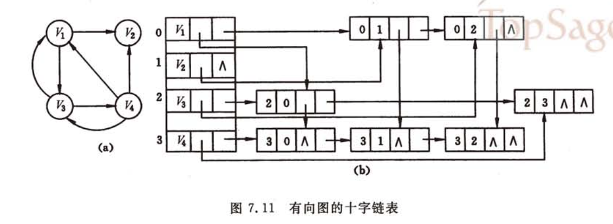
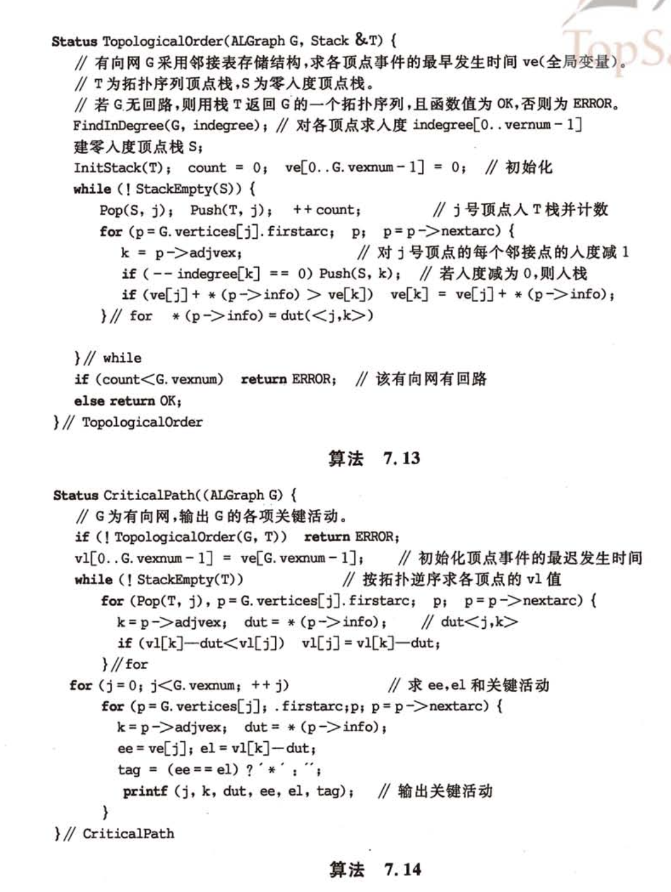
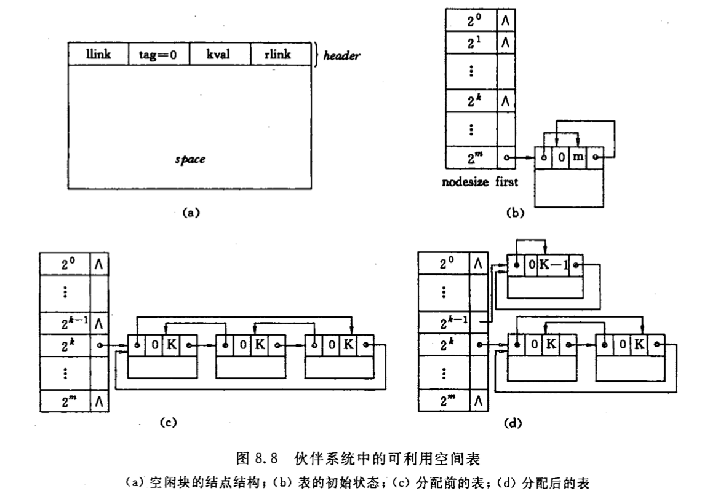
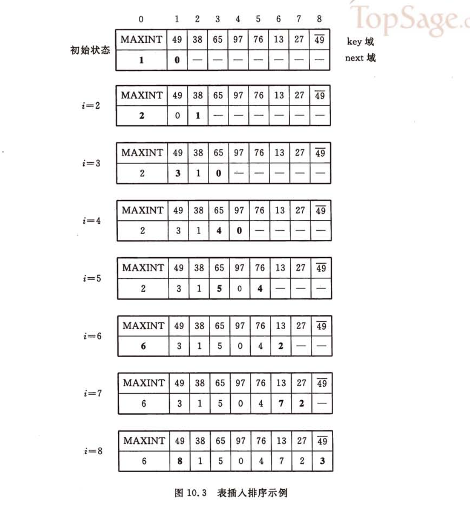

# 数据结构_课程笔记

## 线性表

### tree
 
- ADT
- 顺序表示/实现
    - 顺序表的初始化
    - 插入
    - 删除
    - 查找
    - 合并
- 链式表示/实现
    - 单链表
    - 数组/静态链表
        - 应用：集合合并
    - 双向链表
    - 循环链表

### concepts

线性表：$a_{1},\cdots,a_{n}$

- $n=0$，空表，$a_{1}$表头，$a_{n}$表尾
- $a_{i}$前驱：$a_{1},\cdots,a_{i-1}$，$a_{i-1}$直接前驱
- $a_{i}$后继：$a_{i+1},\cdots,a_{n}$，$a_{i+1}$直接后继

ADT:

`LocateElem(L,e,compare)`:返回**第一个**和e满足compare()关系的元素位置
`ListInsert(&L,i,&e)`:在第i位**之前**插入元素e，L长度+1
`ListTraverse(L,visit)`:对L每个元素调用visit()

集合合并：

依次对Lb的每个元素在La中查找，不存在时在La末尾插入

集合去重：

构造两个线性表La, Lb，遍历Lb，将不在La的元素插入La

有序列表合并：

1. 原有序列表为La,Lb，初始化Lc为空表；
2. 取元素$a_{i},b_{i}$
    - 若$a_{i}\leqslant b_{i}$，$a_{i}$插入Lc末尾
    - 反之插入$b_{i}$
3. 重复2，知道某个列表被取完
4. 将另一个列表剩余元素合并到Lc

顺序实现：用存储位置的相邻来表示元素的有序关系
- 插入操作，$E_{insert}=\frac{n}{2}$，算法平均时间复杂度$O(n)$。
- 删除操作，$E_{insert}=\frac{n-1}{2}$，算法平均时间复杂度$O(n)$。
- 查找操作，时间复杂度$O(L->length)$
- 合并有序链表，时间复杂度$O(La->length+Lb->ength)$

单链表：

```C
typedef  struct  Lnode {
 	ElemType  data;  /*数据域，保存结点的值*/
	struct   Lnode  *next;            /*指针域*/
} Lnode, LinkedList; /*结点、链表的类型 */
```

改进：

```C
// 结点类型
typedef struct LNode {  
	ElemType       data;
	struct LNode   *next;
} Link, Position; 
// 链表类型
typedef struct {
    // head, tail分别指向头结点和最后一个结点的指针
    Link  *head, *tail; 
    // current指向当前被访问的结点的指针
    Link  *current; //其初始位置指向头结点
    int   curpos;     //指示当前指针位置,初值为0
    int   len; 	      //指示链表长度
} LinkedList;
```

一元多项式

```C
typedef struct node{
	int c;	//多项式，系数， 可以用float类型
	int e;	//多项式，指数
	struct node *next;
}Polynomial;
```
p1和p2相当于两有序链表，以指数为key进行合并，若指数相同则系数相加，为0需删除该节点，否则按原操作

静态链表
利用数组下标来代替指针

```C
#define MAXSIZE 1000
typedef struct SLinked{
    ElemType data;
    int cur;//指针指向
} SLinkedList[MAXSIZE];
SLinkedList s; 
```
插入结点，在数组尾端加如结点，而后利用指针域

双向链表

```C
typedef struct node {
    ElemType  data ;
    struct node  *prior , *next ;
} DoublyLinkedList; 
```

循环链表

操作时间复杂度：


## 栈

LIFO==FILO

栈顶（表尾），栈顶指针指示
栈底，表头

数制转换：余数逐一入栈
括号匹配：按照括号种类顺序入栈出栈进行匹配，遇到左括号入栈，遇到有括号弹栈查看是否匹配，最后检查是否栈为空

顺序栈，链式栈

行编辑程序，对当前读入元素判断是否入栈和对栈顶元素操作

### 应用：

#### 四则运算/算术表达式求值

<center>
<image src="photos/stack_calculator.png" style="width:50%"></image>
</center>

02为新遇到的运算符

四则运算规则：
- 先乘除，后加减(brown)
- 同级运算顺序从左算到右(blue)
- 先算括号内，后括号外(red)

设置两个工作栈：
- `OPTR`：存放运算符，栈底元素为`#`
- `OPND`：存放运算数，即操作数和运算结果，初始为空

依次读入输入字符，分类存放，运算数直接进栈，若为运算符需根据优先级比较：
- `<`：运算符进栈，仅此步会存入运算符
- `=`：脱括号，continue
- `>`：栈顶运算符操作，进行运算，将结果入运算数栈，continue

二元运算符`BNF`定义：
- 表达式:=  操作数 运算符 操作数
- 操作数:=  简单变量|表达式
- 简单变量:= 标识符|无符号整数

表达式在计算机中表示：
- 前缀：`OP S1 S2`，对应先序遍历，运算规则：2连续操作数与前方最近操作数形成最小表达式
- 中缀：`S1 OP S2`，对应中序遍历
- 后缀/逆波兰：`S1 S2 OP`，对应后序遍历，运算规则：运算符与其前方2连续操作数构成最小表达式
    - 求值：遇到操作数进栈，遇到运算符连续推出两个操作数计算后结果压栈

中缀表达式转后缀：

表达式结束符:`#`
1. 设立运算符栈，`#`入栈，读入字符`ch`
2. 分情况：
    - 若`ch`为操作数，直接输出
    - 若`ch`为运算符，比较`ch`与栈顶运算符的优先级：
        - `ch`优先级高，则`ch`进栈
        - `ch`优先级低，栈顶运算符退栈输出，转[2]
        - 优先级相等，栈顶运算符退栈输出，若退出运算符非`(`，转[2]
3. 读入下一个字符`ch`，若`ch=='#'`且栈顶元素为`#`，即将空栈，转至[4]，否则转[2]
4. 结束，输出序列即为后缀表达式

优先级低靠近根节点，因此需要后输出

#### 迷宫

#### 递归

尾递归：在递归函数中递归调用为最后一条执行语句
单向递归：递归结束时答案已经算出

汉诺塔，递归实现，时间复杂度：$O(2^{n})$

递归可通过循环结构算法转化为非递归

### 队列

只允许在一端插入，另一端删除，FIFO
- 队头，允许删除；队尾，允许插入

链式表示：

```C
typedef struct Node {
    	ElemType data;
    	struct Node *next;
}QNode;
typedef struct {
	QNode *front;   //删除进行处
	QNode *rear;    //插入进行处
}LinkedQueue;
```

顺序表示：

```C
#define MAXQUEUESIZE   100
typedef  struct  queue {
    ElemType  Queue_array[MAXQUEUESIZE] ;
    int  front; // 队头指针
    int  rear;  // 队尾指针
    int  queueSize;     //队列空间的大小
}SqQueue;
```

- 入队：将新元素插入rear所指的位置，然后rear加1 
- 出队：删去front所指的元素，然后front加1并返回被删元素

假溢出：尾指针达到上界，无法入队，原因：头尾指针都不减

循环队列：头尾指针增加始终+1取模

队空和队满时，头尾指针均相等

solutions:（采用第三种）
- 增加一个计数器，记录队列中的元素个数(即队列长度)
- 增加一个标志位，区分队列是“空”还是“满”
- 少用一个元素空间，约定：以“队列头指针在队尾指针的下一个位置上”为队满的标志
    - (rear+1) % MAXQUEUESIZE == front
    - 即`rear`所指的单元格始终为空

定义：

```C
#define MAXQUEUESIZE   100
typedef  struct  queue {
    ElemType *base;  // 动态分配的存储空间
    int  front; // 队头指针，
            //若队列不空，指向队头元素
    int  rear;  // 队尾指针，若队列不空，
            //指向队列尾元素 的下一个位置
} CircularQueue;
```

应用：

杨辉三角：横向移动的队列，`next_row[i]=cur_row[i]+cur_row[i-1]`
迷宫：利用队列进行广度优先搜索，获得最短路径

无冲突日程安排：即将集合划分为若干互不相交的子集，每个子集内为无冲突元素
冲突可看作二元关系，于是冲突集合可写成矩阵`ConflictMatrix`，引入`clash[n]`记录与当前元素冲突的情况。

过程：
对首元素，写冲突数组clash[n]，对为0的元素，写其clash[n]，将其累加到原clash[n]上，取仍为0的元素即可。
而后清空，进行接下来几轮。

离散事件模拟

## 串

线性表，表中每个元素为字符

<string.h>中，串处理函数：

```C
char *gets(char *str) ； //从stdin中读取串
int puts(char *str) ； //向stdout输出串
int strlen(char *str); //返回串的长度
char *strcpy(char *dest, char *src); //复制串
char *strcat(char *dest, char *src); //联接串
int strcmp(char *str1, char *str2); //比较串，  s1<s2时返回负数，相等返回0，s1>s2时返回正数
char *strstr(char *str,char *substr); //返回子串首次出现的位置
strchr //检索并返回字符c在字符串s中第一次出现的位置
strrchr //检索并返回字符串s中最后一次出现给定字符c的位置
strspn //检索并返回在s1和s2中均有的字符个数
strpbrk //检索并返回两个字符串中首个相同字符的位置
strupr //将字符串s中的小写字母全部转换成大写字母，并返回转换后的字符串
strlwr //将字符串s中的大写字母全部转换成小写字母，并返回转换后的字符串
strtol //将字符串str转换成长整型数，并返回这个数
strtod //将字符串str转换成双精度数，并返回这个数
strdup //将字符串s复制到新建的位置
strrev // 将字符串逆置
strtok //将字符串分割成由定界符隔离的一个个片段
strncat //将字符串src中最多maxlen个字符复制到字符串dest中
strncmp //比较字符串s1与s2中的前maxlen个字符
strncpy //复制src中的前maxlen个字符到dest中
stricmp //以不区分大小写的方式比较字符串s1和s2,并返回s1-s2
strnicmp //以不区分大小写的方式比较字符串s1与s2中的前maxlen个字符
```

KMP:
令主串的长度是n，模式串的长度是m，则算法的时间复杂度：O(m+n)

```python
# 获取next数组
def get_next(T):
    i = 0
    j = -1
    next = [-1] * len(T)
    while i < len(T)-1:
        if j == -1 or T[i] == T[j]:
            i += 1
            j += 1
            next[i] = j
        else:
            # 回复j，来推进i
            j = next[j]
    return next

# 获取next_val数组
def get_next_val(T):
    i = 0
    j = -1
    next_val = [-1] * len(T)
    while i < len(T)-1:
        if j == -1 or T[i] == T[j]:
            # 匹配，则查找下一个
            i += 1
            j += 1
            if T[i] != T[j]:
                # 失配，则恢复到原先j处进行匹配
                next_val[i] = j
            else:
                # 同样模式，同样数值
                next_val[i] = next_val[j]
        else:
            # 失配，则回复j，来推进i
            j = next_val[j]
    return next_val

# KMP算法
def kmp(S, T):
    i = 0
    j = 0
    next = self.get_next(T)
    while i < len(S) and j < len(T):
        if j == -1 or S[i] == T[j]:
            i += 1
            j += 1
        else:
            # j = 0
            j = next[j]
    if j == len(T):
        return i - j
    else:
        return -1
```

## 数组

- 一维数组：向量
- 二维数组，考虑行序为主序/列序为主序
    - 行序为主序：`LOC(i,j) = LOC(0,0)+(i × n + j) × L`
    - 列序为主序：`LOC(i,j) = LOC(0,0)+(j × m + i) × L`
- 三维数组：以行序为主序：`LOC(i, j, k) = LOC(0,0,0)+(i × n × p + j × p + k) × L`

多维数组定义：

```C
Typedef struct{
     ElemType *base;
     int        dim;
     int       *bounds;     //数组各维的大小bi
     int       *constants; //数组映像函数常量基址ci
} Array;
```

特殊矩阵，例：
- 对称矩阵
- 三对角矩阵：只有主对角线及其上下两对角线有非零值
- 稀疏矩阵

压缩存储
- 下三角矩阵：
$$k=\begin{cases} \frac{i\times (i+1)}{2}+j, & i\geqslant j\\ \frac{j\times (j+1)}{2}+i, & i<j \end{cases}$$
- 三对角矩阵：
    - 三对角矩阵`A`压缩到数组`B`
    元素 A[i][j] 在`B`中位置：`k = 2 × i + j`
    在第 i 行前面，有 3 × i -1 个非零元素
    在第 i 行第 j 列前面，有 j – i +1 个非零元素
    - 数组`B`映射到三对角矩阵`A`

- 稀疏矩阵
    - 三元组顺序表/三元组表：矩阵转置
    - 行逻辑联接的顺序表：矩阵相乘
    - 十字链表：矩阵相加

---
三元组顺序表：

```C
 #define  MAXSIZE  12500
 typedef struct {
     int  i, j;            //该非零元的行下标和列下标
     ElemType  e; // 该非零元的值
 } Triple; // 三元组类型
typedef  struct {
     Triple  data[MAXSIZE + 1]; 
      int      mu, nu, tu; 
     //矩阵的行数、列数和非零元素个数
} TSMatrix;  // 稀疏矩阵类型

//非零元在表中按行序有序存储
//便于进行依行顺序处理的矩阵运算
```

### 稀疏矩阵

稀疏矩阵快速转置：
从a.data->b.data，希望直接知道转置后的三元组存放位置
加速转置速度，建立辅助数组 num和 cpot
- num[col]：记录矩阵转置前各列(即转置矩阵各行)非零元素个数
- cpot[col]：记录各列非零元素在转置三元组表中开始存放位置
对每个非零元的列值col，可立刻找到位置cpot[col]进行交换操作

```C
for (col=0; col<M.nu; ++col)  num[col] = 0;
for (t=0; t<M.tu; ++t)  ++num[M.data[t].j];
cpot[0] = 0;
for (col=1; col<M.nu; ++col)
	cpot[col] = cpot[col-1] + num[col-1];
```

时间复杂度为O(M.nu+M.tu)

---
行逻辑链接的顺序表

需随机存取某一行中的非零元
增加一个数据成员rpos，指示各行第一个非零元素的位置

取元素：

```C
ElemType Value(RLSMatrix M, int r, int c) {
     //给定行和列坐标(r, c)，求取矩阵元素的值
     p = M.rpos[r]; 
     while (M.data[p].i==r && M.data[p].j < c) 
              p++;
      if (M.data[p].i==r && M.data[p].j==c)
             return M.data[p].e;
      else return 0;
} // value
```

### 十字链表

```C
typedef struct OLNode{
	int i, j;
	ElemType    e;
    struct OLNODE  *right, *down;
} OLNode, *Olink;

typedef struct{
	//行和列链表 头指针向量的基址
	Olink   *rhead, *chead;
	in mu, nu, tu;
} CrossList
```

建表方法：
1. 初始化行/列链表
2. 行插入
    - 若`rhead[i]`为空或首元素j更大，插在此处
    - 沿着`rhead[i]`寻找插入位置
3. 列插入
    - 若`chead[j]`为空或首元素j更大，插在此处
    - 沿着`chead[j]`寻找插入位置

十字链表进行矩阵加法：
`pa, pb`分别指向矩阵A和B中行值相同的两个结点；
1. 若`pa==NULL`或`pa->j > pb->j`，则在A链表中插入值$b_{ij}$的结点，改变同行前一个结点`right`域的值，以及同一列前一个结点`down`域的值
2. 若`pa->j < pd->j`，只需将`pa`指针后移
3. 若`pa-j == pb->j`
    - 若`pa->e + pb->e !=0`，直接修改`pa->e`即可
    - 否则删除`pa`结点，改变同行前一个结点`right`域的值，以及同一列前一个结点`down`域的值


## 广义表

任何一个非空广义表LS = ( a1, a2, …, an)均可分解为：
- 表头  Head(LS) = a1
- 表尾  Tail(LS) = (a2, …, an) 

表头表尾分析法：

```C
typedef enum {ATOM, LIST} ElemTag;
typedef struct GLNode {	
    ElemTag tag; // ATOM or LIST
    union { //原子结点和表结点的联合部分
        AtomType atom;	          
        struct {struct GLNode *hp, *tp;} ptr;
	    //ptr.hp, ptr.tp指向表结点的表头、表尾
    }
} *Glist;
```

形式例：`Tag=0|atom`, `Tag=1|hp|tp`

子表分析法：

```C
typedef enum {ATOM, LIST} ElemTag;
typedef struct GLNode {	
    ElemTag tag; // ATOM or LIST
    union { //原子结点和表结点的联合部分
        AtomType atom;	          
	    struct GLNode *hp;//指向子表的指针
     };
     struct GLNode *tp;
    //指向同一层下一个表元素结点的指针
} *Glist;
```

形式：`Tag=0|atom|tp`，`Tag=1|hp|tp`

m元多项式：

```C
typedef struct MPNode {	
     ElemTag  tag; 
     int            exp; //指数域
     union {	//原子结点和表结点的联合部分
          float   coef;   //系数域	          
	struct MPNode *hp;
     };
     struct MPNode *tp;//相当于线性链表的next
} *Mplist;      //m元多项式广义表类型定义
```

按照某个元素为主元进行提取，而后对系数建立子表
形式例：`Tag=1|exp|hp|tp`，`Tag=0|exp|coef|tp`

`sever(str,hstr)`类似`strtok`，将`str`第一个","前的子串赋给`hstr`，若无","则整个赋值，str变到","之后的串，若无则为NULL
且同时要求`hstr`内的括号需匹配

建立广义表：
CreateGList(GList &L, SString S)
- 若S为"()"，则建立空表
- 否则：
    - 建立表结点
    - 若S长度为1，创建单原子表
    - 否则创建List，脱外层括号
        - 重复建立n个子表，每次用sever取子串，建立子表到p->ptr.hp
        - 若表尾不空，则该结点仍为List，p插在后面ptr.tp

## 树

- 广义表表示法
- 树形表示法
- 文氏图
- 目录结构表示法

结点，孩子，双亲，兄弟，堂兄弟（双亲在同一层），祖先（根结点到该结点路径上所有结点），子孙（某结点的孩子与孩子的子孙）

- 结点的度：拥有子树的数量
    - 度为m的树称为m叉树
    - 叶结点：度为0的结点，终端
    - 分支结点：非叶结点
- 树的宽度：max{每层结点数量}
- 结点之间路径：结点之间所经分支+结点
- 结点的层次/深度：根结点位于第1层，若某结点在第i层，子树根结点在第i+1层
- 结点的高度：叶结点高度为1，若某结点在第i层且有双亲，则双亲在第i+1层
    - 高度定义与深度相反
- 树的深度：树中叶结点的最大层次
- 树的高度：根结点的高度

满m叉树：深度为k且有$2^{k}-1$个结点的二叉树称为满二叉树，每一层的结点数都为最大结点数
完全m叉树：空的叶结点只可能在最下两层，且倒数第二层的叶结点只可能在右边
满m叉树一定是完全m叉树

二叉树的性质：
- 性质1 ：若二叉树结点的层次从$1$开始, 则在二叉树的第$i$层($i\geqslant 1$)最多有$2^{(𝒊−𝟏)}$ 个结点
- 性质2：深度为$k(k\geqslant 1)$的二叉树最少有$k$个结点，最多有$2^{k}-1$个结点
- 性质3：对任何一棵二叉树，如果其叶结点有$n_0$个，度为$2$的非叶结点有$n_2$个, 则有：$n_{0}=n_{2}＋1$

满二叉树除叶结点外的结点度均为2
深度为$k$且有$2^k-1$个结点的二叉树

完全二叉树

顺序存储，按行序遍历二叉树查看结点

链式存储
二叉链表：
左右孩子指针
```C
typedef struct BiTNode { 
    // 结点结构
    TElemType      data;
    struct BiTNode  *lchild, *rchild;
    // 左右孩子指针
} BiTree;
```
三叉链表：
添加双亲结点指针：
```C
typedef struct TriTNode { 
    // 结点结构
    TElemType       data;
    struct TriTNode  *lchild, *rchild; 
    //左右孩子指针
    struct TriTNode  *parent;  
    //双亲指针 
} TriTree; 
```

二叉树遍历：
顺序对根的位置而言
先序：根左右
中序：左根右
后序：左右根

先序遍历：
若二叉树为空，则空操作
否则
访问根结点 (D)
先序遍历左子树 (L)
先序遍历右子树 (R)

中序遍历 (Inorder Traversal)
若二叉树为空，则空操作
否则，
中序遍历左子树 (L)
访问根结点 (D)
中序遍历右子树 (R)

后序遍历 (Postorder Traversal)
若二叉树为空，则空操作
否则，
后序遍历左子树 (L)
后序遍历右子树 (R)
访问根结点 (D)

非递归描述：

中序遍历：
1. p=树根
2. p不空，p入栈，p=p的左孩子，重复2直到p空
3. 若栈不空，则访问栈顶元素，p=栈顶元素的右孩子，执行2

层序遍历，采用队列：
p=树的根
当p不空时：入队列，否则返回
当队列不空时：取队头并访问，并将其非空左右孩子入队列

先序输入建立二叉链表：
CreateBiTree(BiTree &T)
1. 读取输入
2. 若表示空树，则`T=NULL`
3. 否则
    - 给T分配空间
    - T->data由输入确定
    - CreateBiTree(T->lchild)
    - CreateBiTree(T->rchild)


例：

表达式树：
前缀，中缀，后缀

线索二叉树

线索：指向数据元素前驱和后继的指针

`lchild|ltag|data|rtag|rchild`
两标志位指示孩子是前驱还是后继线索

```C
typedef enum { Link, Thread } PointerThr;  
	//Link==0，表示是指针，
	//Thread==1，表示是线索
typedef struct BiThrNod {
    TElemType        data;
    struct BiThrNode  *lchild, *rchild; //左右指针
    PointerThr         LTag, RTag;    //左右标志
} BiThrNode, *BiThrTree;
```

而后遍历过程不需要栈，在原叶结点处直接访问线索所指

中序遍历：
结点的后继应是遍历其右子树访问的第一个结点，即右子树最左下的结点；
结点的前驱：左子树最右下的结点

线索化：
- 左子树线索化
- 利用pre指示上轮访问过的结点，p表示当前结点，则将他们指针互指即可
- pre=p
- 右子树线索化

树采用二叉链表表示法，即孩子兄弟表示法时，将其看作二叉树可得树等价的二叉树
对多棵不相交的树组成的森林，树根可作为右子树连接到一起，整体形成二叉树

Huffman树

树的路径长度：从树根到每个结点路径长度之和
结点带权
带权路径长度：$WPL = \sum_{k=1}^{n} \omega_{k} l_{k}$

前缀编码：二叉树，左结点0，右为1，只有最后一个结点在右叶子，其余都在左叶子

Huffman树：带权路径长度最小，权值越大的结点离根越近

Huffman树中没有度为1的结点，树中任意非叶子结点都有2个孩子，这类树又称为满或正则或严格二叉树(regular/strict binary tree)
一棵有n个叶子结点的Huffman树共有2n-1个结点 

贪心算法：
由n棵二叉树的集合F开始：
1. 每次选取权值最小的二叉树作为左右子树构造新二叉树，设置根结点权值为左右子树根权值之和
2. 删去原先
3. 加入F
4. 返回1，直到F为一棵树

```C
//用三叉静态链表表示Huffman树
typedef struct{
    char data;
    int weight;
    int parent, lchild, rchild;
} HTNode;
typedef struct{
    HTNode elem[MAXNum];
    int num, root;
    //num:叶结点数，root:根
}
```

### 回溯法

回溯法求解过程：先序遍历

例：
求幂集，幂集元素可以表示在二叉树中，左向表示取，右向表示舍，求幂集元素即为先序遍历此二叉树

### 树的计数

具有$n$个结点不同形态的树有多少棵

二叉树相似：形态相同
等价：数据元素相同

$n$个结点不相似的二叉树有$\frac{1}{n+1} C_{2n}^{n}$棵

## 图

n个图结点
- 完全图：有$\frac{1}{2} n(n-1)$条边的无向图
- 稀疏图：有很少边或弧
- 稠密图：反之

带权图：网
子图：包含原图的部分边和结点

无向图中，$(v,v')\in E$，则$v,v'$互为邻接点，边$(v,v')$依附于$v,v'$，或称相关联，顶点$v$的度$TD(v)$为与其相关联边的数目
有向图定义入度和出度

路径，回路

无向图中若$v,v'$存在路径，则为连通的，若途中任意两个顶点连通，则图是连通图。连通分量，为无向图中极大连通子图

有向图中，若$v_{i},v_{j}$互相存在路径，则称其为强连通图，极大强连通子图为强连通分量

连通图的生成树为一个极小连通子图，含有途中全部顶点，但只有$n-1$条边，构成树
若在生成树上再添加一条边，则会产生环路

有向图，生成森林，含有全部结点但只有足以构成不相交有向树的弧

### 图的存储结构

#### 数组表示法

图的邻接矩阵，判断任意两个顶点之间是否有边
网的邻接矩阵：$$A[i][j]=\begin{cases} & \omega_{i,j}, <v_{i},v_{j}> \in VR \\ & \infty, otherwise \end{cases}$$

#### 邻接表

链式存储

头结点
data|first arc
:-:|:-:

表结点
adjvex|next arc|info
:-:|:-:|:-:
对应头结点的一条边所指顶点信息

邻接表：
头结点$\rightarrow$表结点$\rightarrow$表结点

逆邻接表：
为了便于确定顶点入度，有向图中，建立指向顶点的结点信息

<center>
    
</center>

#### 十字链表

有向图

顶点结点
data|first in|first out
:-:|:-:|:-:

first in，以该顶点为弧头的首个结点
first out，以该顶点为弧尾的首个结点

弧结点
tail vex|head vex|hlink|tlink|info
:-:|:-:|:-:|:-:|:-:

hlink指向弧头相同的下个结点，tlink指向弧尾相同的下条弧



#### 邻接多重表

无向图

边结点表示：
mark|ivex|ilink|jvex|jlink|info
:-:|:-:|:-:|:-:|:-:|:-:

mark，标志域，标记是否被搜索
ivex,jvex，该边依附的两个顶点在图中的位置
ilink,jlink，下条依附于ivex/jvex的边

顶点结点
data|first edge
:-:|:-:

first edge，第一条依附于该顶点的边

<center>
    
</center>

### 图的遍历

#### DFS，深度优先

类似于树的先根遍历

```C++
bool visited[MAX];  // 访问标志

void DFSTraverse(Gragh G /* , func */){
    /* func */
    for(v = 0; v < G.vexnum; ++v){
        visited[v] = false;
    }
    for(v = 0; v < G.vexnum; ++v){
        if(!visited[v]){
            DFS(G,v);
        }
    }
}

void DFS(Gragh G, int v){
    visited[v] = true;
    /* Func */
    for(w = FirstAdjVex(G,v); w >= 0; w = NextAdjVex(G,v,w)){
        if(!visited[w]){
            DFS(G, w);
        }
    }
}
```
二维数组存储，时间复杂度$O(n^{2})$
邻接表存储，时间复杂度$O(n+e)$

#### BFS，广度优先搜索

类似树的层序遍历，先访问点的所有邻接点

```C++
void BFSTraverse(Graph G, /* Func */){
    for(v = 0; v < G.vexnum; ++v){
        visited[v] = false;
    }
    deque<int> Q;
    for(v = 0; v < G.vexnum; ++v){
        if(!visited[v]){
            visited[v] = true;
            /* Func */
            Q.push_back(v);
            while(!Q.empty()){
                u = Q.pop_front();
                for(w = FirstAdjVex(G,u); w >= 0; w = NextAdjVex(G,u,w)){
                    if(!visited[w]){
                        visited[w] = true;
                        /* Func */
                        Q.push_back(Q, w);
                    }
                }
            }
        }
    }
}
```

### 图的连通性

#### 无向图

连通图只需从一个结点DFS/BFS即可遍历所有节点
非连通图需多个顶点触发，每次遍历连通分量的顶点集

无向图深度优先搜索，建立深度优先生成森林最左孩子、右兄弟链表

```C++
void DFSForest(Graph G, CSTree &T){
    T = nullptr;
    for(v = 0; v < G.vexnum; ++v){
        visited[v] = false;
    }
    for(v = 0; v < G.vexnum; ++v){
        if(!visited[v]){
            p = new CSNode;
            *p = {GetVex(G,v), nullptr, nullptr};
            if(!T){
                T = p;
            }
            else{
                q->nextsibling = p; // 前一棵根的兄弟
            }
            q = p;
            DFSTree(G, v, p);
        }
    }
}

void DFSTree(Graph G, CSTree &T){
    visited[v] = true;
    first = true;
    for(w = FirstAdjVex(G,v); w >= 0; w = NextAdjVex(G,v,w)){
        if(!visited[v]){
            p = new CSNode;
            *p = {GetVex(G,w),nullptr,nullptr};
            if(first){
                T->lchild = p;
                first = false;
            }
            else{
                q->nextsibling = p;
            }
            q = p;
            DFSTree(G,w,q);
        }
    }
}
```

#### 有向图

十字链表存储
求强连通分量步骤：
1. 在有向图G上，从某定点出发沿以其为尾的弧进行DFS，并按搜索顺序将顶点排列起来，因此修改原DFS代码：
    - 在进入`DFSTraverse`函数时进行计数变量初始化，加`count = 0`
    - 在退出`DFS`函数是将完成搜索的顶点号记录在辅助数组`finished[vexnum]`中，即加`finished[++count] = v`
    - (C++直接push_back)
    - 即逆后序入栈
2. 从最后完成搜索的顶点出发，沿着以该顶点为头的弧进行逆向DFS，若此遍历不能访问有向图所有顶点，则从余下顶点中最后完成的顶点出发，逆向DFS

每次第二步访问到的顶点集便是有向图G中一个强连通分量顶点集

第二步实质：
1. 构造有向图$G_{r}$，拥有与$G$相反的弧
2. 在$G_{r}$上，从逆初始点DFS，则森林中每棵树的顶点集为G强连通分量的顶点集

#### 最小生成树

代价最小的生成树

##### Prim算法

$N=(V,\{E\})$为连通网，$TE$最小生成树边的集合

从$U=\{u_{0}\},(u_{0}\in V), TE =\{\}$开始，重复执行：
- 在**所有**$u\in U,v\in V-U$的边$(u,v)\in E$中找一条代价最小的彼岸并入集合$TE$，同时$v_{0}$并入$U$，直到$U=V$为止

需设辅助数组`closedge`，记录$U$到$V-U$具有最小代价的边，对每个顶点$v_{i}\in V-U$，辅助数组中存在相应分量`closedge[i-1]$，包含两个域：
- `.lowestcost`$=\min\{cost(u,v_{i})\}$
- `.vex`存储该边依附在U中的顶点

##### Kruskal算法

每次选不构成回路的最小边

判断是否形成回路，利用一维数组`vSet[]`存放每个顶点所在连通分量的编号，若相等则两点处于同一连通分量，形成回路

初始`vSet[]`为各点编号，若连接两边，则将两顶点连通分量合并（一个点的换成另一个点的）

时间复杂度$O(e\log{e}+n^{2})$

#### 关节点和重连通分量

关节点：删去顶点`v`和与其相关联的各边后，将图的一个连通分量分割为多个连通分量（出现互不连通的点集），则该顶点为关节点
重连通图：无关节点的连通图

深度优先生成树可得两类关节点特性：
1. 若生成树的根有两棵或两棵以上的子树，则根节点比为关节点，因为删去后将有生成森林
2. 若生成树某非叶子结点`v`，其某棵子树的根和子树其他结点没有指向`v`祖先的回边

核心：将会使子树孤立起来

对生成树任意顶点，孩子结点为它之后搜索到的邻接点
双亲结点和回边连接的祖先结点为它之前搜索到的邻接点

重新定义`visited[v]`：DFS遍历连通图时访问顶点`v`的次序号，DFS前序序列的序号
定义：
$$low(v) = \min\{visited[v],low[w],visited[k]\}$$

- `w`为顶点`v`在DFS生成树上的孩子结点
- `k`为顶点`v`在DFS生成树上回边链接的祖先结点
- $(v,w)\in Edge$
- $(v,k)\in Edge$

若对于某个顶点`v`，存在孩子结点`w`，$low[w] \geqslant visited[v]$，则`v`必为关节点，因为它表明`w`及子孙均无指向祖先的回边


### 有向无环图

描述表达式

无向图判断环：DFS过程中遇到回边

#### 拓扑排序

由某个集合上一个偏序得到全序

偏序：若集合上关系R满足自反，反对称，传递
全序，若R为偏序，且对每个$x,y\in X$，必有$xRy, yRx$

例：课程有先决条件

表示活动间优先关系的有向图成为AOV网，i到j有一条有向路径，则i为j的前驱，j为i的后继，路径为弧的时候加上`直接`

AOV网中不该出现有向环

拓扑排序：
1. 在有向图中选择一个没有前驱的顶点，输出
2. 从图中删除该顶点及所有以它为尾的弧
3. 重复1,2，知道全部顶点均已输出，或当前图中不存在无前驱的顶点为止，后者说明有向图存在环

邻接表存储，头结点中增加存放顶点入度的数组`indegree`

```
对各个顶点求入度indegree[0:vexnum-1]
建零入度顶点栈S
入度为0者进栈
输出顶点计数，使用count

当栈不空{
    弹栈，输出该顶点，计数
    对该顶点每个邻接点入度-1
    入度为0者进栈
}

若count<G.vexnum，则有向图存在回路
```

#### 关键路径

AOE网，边表示活动，带权的有向无环图，边权表示活动持续时间

开始到结束最长路径：关键路径

决定结束事件最早发生时间

开始点$v_{1}$，从$v_{1}$到$v_{i}$的最长路径长度：$v_{i}$的最早发生时间
也即所有以$v_{i}$为尾弧的最早开始时间

e(i)，活动$a_{i}$最早开始时间，l(i)，活动$a_{i}$的最迟开始时间，l(i)-e(i)为时间余量

e(i)=l(i)的活动为关键活动

活动$a_{i}$由弧$<j,k>$表示，因此最早发生时间ve(j)，最迟发生时间vl(j)，持续时间dut(<j,k>)：
$$e(i)=ve(j)$$$$l(i)=vl(k)-dut(<j,k>)$$
求ve(i)和vl(j)分两步：
1. 从ve(0)=0开始向后递推
$$ve(j)=\max\limits_{i}\{ve(i)+dut(<i,j>)\}$$
2. 从vl(n-1)=ve(n-1)开始向前递推
$$vl(j)=\min\limits_{i}\{vl(j)-dut(<i,j>)\}$$

递推公式必须在（逆）拓扑有序条件下进行

求关键路径算法：
1. 输入e条弧<j,k>，建立AOE-网的存储结构
2. 从$v_{0}$出发，令ve[0]=0，按拓扑有序求其余顶点最早发生时间ve[i]，若拓扑有序判断存在环，则拒绝
3. 从$v_{n}$出发，令vl[n-1]=ve[n-1]$，按逆拓扑有序求其余各顶点的最迟发生时间vl[i]
4. 根据各顶点的ve和vl值，求每条弧s的最早开始时间e(s)和最迟开始时间l(s)，若某条弧满足条件e(s)=l(s)，则为关键活动



### 最短路径

Dij算法：
1. 假设带权的邻接矩阵arcs表示带权有向图，arcs[i][j]表示弧$<v_{i},v_{j}>$上的权值，若弧不存在，则权值为$\infty$
S表示从v出发最短路径重点集合，初始态$\varnothing$
2. 选择$v_{j}$，使得：$$D[j]=\min\{D[i]|v_{i}\in V-S\}$$
$v_{j}$为当前求得的一条从v出发的最短路径终点，$$S=S\bigcup \{j\}$$
3. 修改从v出发到集合V-S上任意顶点$v_{k}$可达的最短路径长度
若$D[j]+arcs[j][k]<D[k]$，则修改$D[k]$为$D[k]=D[j]+arcs[j][k]$
4. 重复2,3共n-1次，求得最短路径依路径长度递增序列


### 思考题

#### 拓扑排序
- 成功仅限于有向无环图
- 任何有向无环图的顶点都可以排到拓扑有序序列中，且拓扑序列不唯一
- 若有向图邻接矩阵中对角线以下元素均为0，则改图拓扑排序序列必存在（必无环）
- 在拓扑排序序列中任意两个相继排列的顶点$v_{i}$和$v_{j}$在有向无环图中未必存在路径
- DFS图每次递归结束并退出时将当前顶点入队，记录了拓扑有序序列，前提是图中无环

#### 图的最短路径
- 有向图中从一个顶点到另一个顶点最短路径未必唯一
- 求单源最短路径的Dij算法同样适用于有回路的带权有向图
- 带权有向图的最短路径一定是简单路径（无环）

#### 最小生成树
- 若带权无向连通图上所有变权重互不相同，Prim/Kruskal算法构造出的最小生成树唯一
- 只要带权无向连通图中有权重相同的边，最小生成树也可能唯一（因为权重大可能不会选入）
- 当带权连通图上具有相同较小权重的几条边形成回路时，可能生成不同最小生成树

## 动态存储管理

### 可利用空间表

tag|size|link|space|
:-:|:-:|:-:|:-:

`tag`为0时，空闲块，`tag`为1时占用块

- 首次拟合，找到第一个大小满足的空闲块分配
- 最佳拟合
- 最差拟合

### 边界标识法

head|foot|llink|tag|size|rlink|space|uplink|tag
:-:|:-:|:-:|:-:|:-:|:-:|:-:|:-:|:-:

注意到头的指针要指回形成环

分配算法
首次拟合
从表头指针pav所指结点起，于可利用空间表中查找，找到第一个容量不小于请求分配的存储量n的空闲块即可分配

回收算法
查找左右临近空闲块是否直接连接，若是则直接合并

看题时候直接计算首尾地址，方便判断是否合并

### 伙伴系统

无论是占用块还是空闲块，大小均为2的k次幂，

头结点从上至下依次表明该行块的大小



分配算法
提出大小为n的内存请求时，在可利用表上寻找结点大小与n匹配的字表，若非空一部分分配（刚好满足$2^{k}\geqslant n$的），一部分插入子表

回收算法
需查找伙伴空闲块，一起合并为大的
伙伴空闲块是由同一大块分裂出的小块
初始地址p，大小$2^{k}$的内存块，其伙伴的起始地址：
$$buddy(p,k)=\begin{cases} & p+2^{k}, p\pmod{2^{k+1}}=0 \\ 
                           & p-2^{k}, p\pmod{2^{k+1}}=2^{k}
              \end{cases}$$

## 查找

查找表：同一类型数据元素构成的集合
关键字：数据元素中某个数据项的值，可以标识一个数据元素，若可唯一标识，则关键字为主关键字
查找

性能分析：
平均查找长度：$$ASL=\sum\limits_{i=1}^{n}P_{i}C_{i}$$
$P_{i}$为查找表中第i个记录的概率，$\sum\limits_{P_{i}}=1$

对树而言，采用PH值：$$PH = \sum\limits_{i=1}^{n}\omega_{i}h_{i}$$
$h_{i}$为第i个结点在二叉树上的层数，权$\omega_{i}=c p_{i}$，c为常量，$p_{i}$为查找概率

### 顺序查找

查找都成功
$$ASL_{SS}=\frac{n+1}{2}$$
查找成功/不成功等可能性：
$$ASL_{SS}=\frac{3n+3}{4}$$

### 有序表查找

#### 折半查找


$$ASL_{bs}=\frac{n+1}{n}\log_{2}{(n+1)}-1$$

#### 静态树表

PH最小的二叉树：静态最优查找树
PH值在同样权值二叉树中最小：次优查找树

已知：含有关键字的记录序列$(r_{l},r_{l+1},\cdots,r_{h})$，其中$r_{l}.key<\cdots < r_{h}.key$，每个记录权值：$\omega_{l},\cdots ,\omega_{h}$

构造次优查找树方法：
- 首先在构造根节点，求$i(i\in [l,h])$使得：$$\Delta P_{i} = |\sum\limits_{j=i+1}^{h} \omega_{j} - \sum\limits_{j=l}^{i-1} \omega_{j}|$$
取最小值，即左右权值和的差最小
- 而后对左右子序列分别构造两棵次优查找树，分别设为$r_{i}$左子树和右子树

构造时间复杂度$O(n\log n)$，查找过程类似折半查找，比较关键字个数不超过树深，平均查找长度$O(\log{n})$

#### 分块查找

先查找记录所在块，而后在块内顺序查找

长度为$n$的表均匀分为$b$块，每块内$s$个记录，
$$ASL_{bs} = L_{b}+L_{W} = \frac{b+1}{2}+\frac{s+1}{2} = \frac{1}{2}(\frac{n}{s}+s)+1$$
可用折半查找确定块，将更快

### 动态查找表

#### 二叉排序树

空树或具有下列性质二叉树：
1. 若左子树不空，则左子树上所有节点值均小于根节点值
2. 若右子树不空，则右子树上所有节点值均大于根节点的值
3. 左右子树为二叉排序树

查找过程：小于key数据查找左子树，大于的数据查找右子树

查找不成功时根据和当前父结点的关系，选择插入左叶子还是右叶子

删除节点：
1. 若*p结点为叶结点，左右子树均为空，由于删去叶子结点不破坏整棵树的结构，则只需修改其双亲结点指针即可
2. 若*p结点只有左子树或右子树，若\*p为左子树，只要令左子树或右子树成为其双亲结点的左子树即可，否则为右子树
3. 若*p左右子树均不空
    - 若*p为左子树，令\*p左子树为\*f（\*p父结点）左子树，\*p的右子树为\*s（\*p最右上子树）的右子树
    - 若*p为右子树，则\*p左子树为\*f（\*p父结点）右子树，\*p的右子树为\*s（\*p最右上子树）的左子树

ASL是$O(\log{n})$的，随机意义下，还需转换AVL树

#### 平衡二叉树

AVL树：为空树或具有如下性质二叉树：
- 左右子树为AVL树，且左右子树深度之差绝对值不超过1

平衡因子BF：左子树深度-右子树深度，只能为-1,0,1

假设二叉排序树引插入结点失衡的最小子树根节点指针为a，则失衡后调整的规律：
1. 单向右旋，左子树失衡
2. 单向左旋，右子树失衡
3. 双向旋转（先左后右），左子树的右子树失衡
4. 双向旋转（先右后左），右子树的左子树失衡

对旋转，只需根据二叉排序树性质确定旋转后子树的位置，注意排序树的性质仍然满足

<center>
    
</center>

查找时间复杂度$O(\log{n})$

#### B-树

B-树，平衡的多路查找树

m阶B-树，或为空树，或为满足下列特性的m叉树：
1. 树中每个节点至多m棵子树
2. 若根节点非叶子结点，则至少有两棵子树
3. 除根节点外的所有非终端节点至少有$\lceil \frac{m}{2} \rceil$棵子树
4. 所有非终端节点包含信息数据：$(n,A_{0},K_{1},A_{1},\cdots,K_{n},A_{n})$，$K_{i}$为关键字，且$K_{i}<K_{i+1}$；$A_{i}$为指向子树根节点的指针，且指针$A_{i-1}$所指子树中所有结点的关键字均小于$K_{i}$，
5. 所有叶子结点出现在同一层次上，视为空节点

相当于每一层每一个结点都是有序的，直接按层查找是否属于某一块，而后向下递归查找

插入：从空树开始插入结点，若每个结点关键字个数超过m-1，则节点进行分裂，
若为叶结点，则将一个结点上移，而后插空
若为非叶结点，若父结点有空，可上移，否则直接拆开作为子结点

注：所有要按照大小来操作


删除关键字：找到关键字所在结点，删除之，除非为最下层非终端结点，要进行合并操作；
若删除节点$K_{i}$不在最下层，只需将指针$A_{i}$所指子树的最小关键字（右子树最左上结点）替换$K_{i}$，删除该结点即可；
因此只需讨论最下层结点
(m为阶)
1. 被删关键字所在结点中关键字数目不小于$\lceil \frac{m}{2} \rceil$，则只需从该结点中删去该关键字和相应指针
2. 被删关键字所在结点中关键字数目等于$\lceil \frac{m}{2} \rceil$，而与该结点相邻的右（左）兄弟结点中关键字数目大于$\lceil \frac{m}{2} \rceil$，则需将兄弟结点最小（大）的关键字上移至双亲结点，双亲结点中小于（大于）的相邻结点下移至被删关键字结点。**相当于在不满结点中删除结点，要进行左旋或右旋**
3. 被删关键字所在结点及其兄弟结点关键字数目等于$\lceil \frac{m}{2} \rceil$（都不满），将父结点对应的$K_{i}$与$A_{i}$合并至兄弟结点中


#### $B^{+}$树

m阶$B^{+}$树和B树的差异在于：
1. n棵子树结点中包含n个关键字
2. 所有叶子结点包含全部关键字的信息，及指向含这些关键字记录的指针，且叶子结点本身依关键字的大小自小而大顺序链接
3. 所有非终端节点看作索引部分，结点中仅含其子树（根节点）中最大（最小）关键字

查找/插入/删除过程类似，但总需要到叶子结点

#### 键树

数字查找树

每个结点只含有组成关键字的符号，字典法

存储结构：
1. 双链树，孩子兄弟链
    - 分支结点3个域：`symbol`,`first`,`next`

<center></center>

查找：对往下走，错往右走

2. Trie树，树的多重链表
    - 若从某结点到叶结点都只有一条路径，则被压缩为叶结点


查找：在结点表中逐个查找

#### 哈希表

##### 哈希函数

###### 构造方法

1. 直接定址法

取关键字或关键字某个线性函数为哈希地址
$$H(key) = key$$或$$H(key) = a\cdot key + b$$

2. 除余取留法

$$H(key) = key\pmod{p},p\leqslant m$$

###### 处理冲突

1. 开放定址法

$$H_{i} = (H(key) + d_{i}) \pmod{m},i=1,2,\cdots,k(k\leqslant m-1)$$

$H(key)$为哈希函数，$m$为哈希表表长，$d_{i}$为增量序列
增量序列可选$1,2,\cdots$（线性探测），或$1,4,9,\cdots$（二次探测），或伪随机序列

2. 再哈希法

3. 链地址法

所有关键字为同义词记录储存在同一线性链表`Chain ChainHash[m]`，凡哈希地址为$i$的记录都插入头指针为`ChainHash[i]`的链表中

3. 建立公共溢出区

##### 性能分析

###### 装填因子

$$\alpha = \frac{表中填入记录数}{哈希表长}$$

###### 成功查找

线性探测再散列
$$ASL_{nl}\approx \frac{1}{2}(1+\frac{1}{1-\alpha})$$
随机探测再散列、二次探测再散列
$$ASL_{nr}\approx -\frac{1}{\alpha}\ln{(1-\alpha)}$$
链地址法
$$ASL_{nc}\approx 1+\frac{\alpha}{2}$$

## 内部排序

含$n$个记录的序列
$$\{R_{1},R_{2},\cdots,R_{n}\}$$
对应关键字序列（值序列）
$$\{K_{1},K_{2},\cdots,K_{n}\}$$
假设$K_{i}=K_{j},(i\neq j)$，若排序后$R_{i},R{j}$的先后顺序和排序前相同，则称排序方法稳定；否则若顺序相反，则排序方法不稳定

稳定排序|Exp
:-:|:-:
冒泡排序|遇到相等元素不会交换
插入排序|遇到相等元素不会插入
归并排序|递归分为短序列，因此相等元素前后位置不变
基数排序|依然是相等元素不会交换排序

不稳定排序|Exp
:-:|:-:
选择排序|选择后，前面的会被交换到后面，可能会在相等元素的后面
快速排序|依然是在相等元素不参与的情况下调整元素位置
希尔排序|按照步长跳跃，因此可以在相等元素不参与情况下调整位置
堆排序|有的父结点交换了某元素，另一个未交换

### 插入排序

#### 直接插入排序

直接遍历找到已排好序列中适配当前的位置，插入

时间复杂度$O(n^{2})$

#### 折半插入排序

查找适配位置使用折半查找

#### 2-路插入排序

另外设置一个同存储记录的数组大小相同的环形数组`d`
将无序表中第一个记录添加进`d[0]`的位置上，然后从无序表中第二个记录开始，同`d[0]`作比较：如果该值比`d[0]`大，则添加到其右侧；反之添加到其左侧。

#### 表插入排序



用修改2n次指针替代了移动元素，时间复杂度仍为$O(n^{2})$

#### 希尔排序

增量序列（每次增加探查的index）没有除1以外的公因子，并且最后一个增量值为1

每次以增量序列取元素组成子序列进行插入排序

### 交换排序

#### 冒泡排序

将前面的元素冒泡比较后移，每次能够选出最大元素，直接输出后对剩余元素冒泡排序

时间复杂度$O(n^{2})$

#### 快速排序

将序列分为左右两部分，左边所有元素小于枢轴（支点，标志），右边大于标志，然后对左右序列分别递归

平均时间：$T_{avg} = kn\ln{n}$

### 选择排序

每趟在$n-i+1,(i=1,2\cdots,n-1)$个记录（$i,\cdots,n$）中选取最小记录作为有序序列第$i$个记录（交换）

#### 简单选择排序

通过$n-i$次关键字比较

#### 树形选择排序

锦标赛排序，首先对n个记录两两比较，然后在$\lceil \frac{n}{2} \rceil$较小者间两两比较

除了最小关键字外，每选一个次小关键字进行$\lceil \log_{2}{n} \rceil$次比较，时间复杂度$O(n\log{n})$

#### 堆排序

n个元素序列$\{k_{1},k_{2},\cdots,k_{n}\}$满足：
$$k_{i}\leqslant k_{2i}, k_{i}\leqslant k_{2i+1}$$或$$k_{i}\geqslant k_{2i}, k_{i}\geqslant k_{2i+1}$$

前者小顶堆，后者大顶堆

筛选：从堆顶调整至叶子

- 输出堆顶元素后如何调整剩余元素为新堆？
以堆中最后一个元素代替之，此时左右子树均为堆，仅需自上至下调整，每次不满足的都选择唯一满足的替代筛选

大顶堆：
```
MAX-HEAPIFY(A,i)
l = LEFT(i)
r = RIGHT(i)
if l <= A.heap-size and A[l]>A[i]
    largest = l
else largest = i
if r <= A.heap-size and A[r]>=A[largest]
    largest = r
if largest != i
    exchange(A[i],A[largest])
    MAX-HEAPIFY(A,largest)
```

- 如何由无序序列建立堆？
```
BUILD-MAX-HEAP(A)
A.heap-size = A.length
for i = [A.length/2] downto 1
    MAX-HEAPIFY(A,i)
```

堆排序：
```
HEAPSORT(A)
for i = A.length downto 2
    exchange(A[1],A[i])
    A.heap-size = A.heap-size-1
    MAX-HEAPIFY(A,1)
```

最坏情况，时间复杂度也为$O(n\log{n})$，仅需一个记录大小交换的辅存空间

### 归并排序

将两个或以上有序表组合成一个新的有序表

2-路归并排序，将一维数组前后两个相邻有序序列归并


时间复杂度$O(n\log{n})$，需要$\lceil \log{n} \rceil$趟

### 基数排序

分配：按照本次关键字进行排序
收集：收集结果

### 总结

