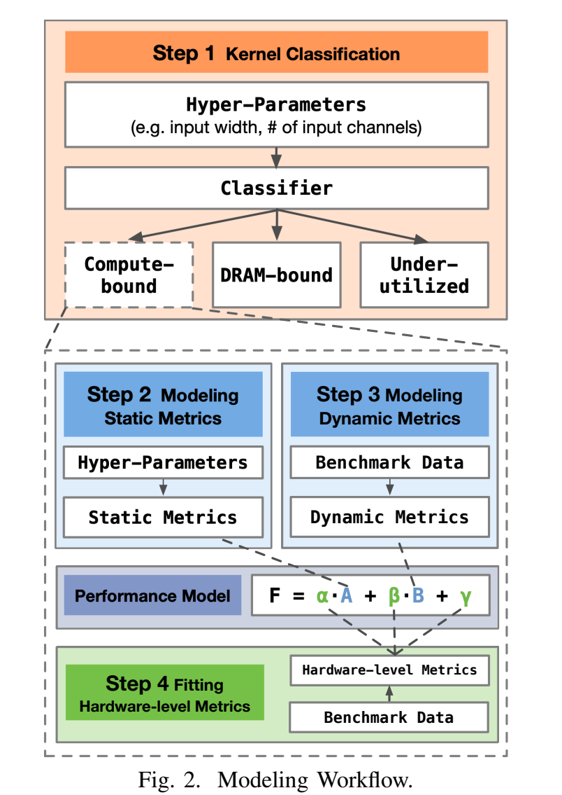
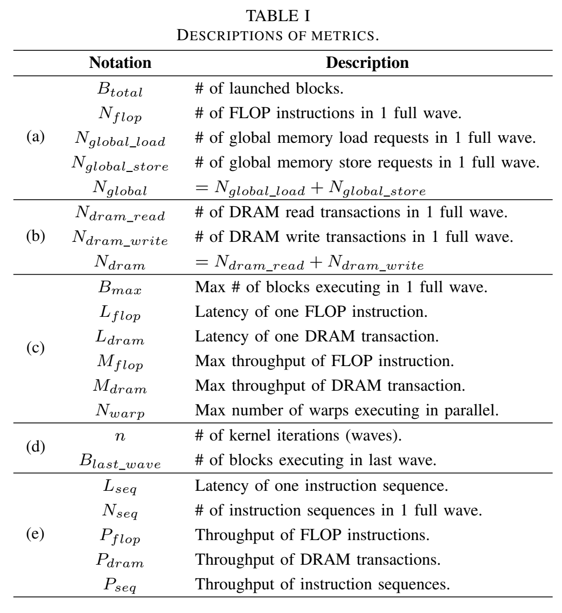

# 论文笔记 - SEER：从GPU内核视角的CNN时间预测模型

核心：**准确预测GPU上CNN的性能**

GPU性能模型：

- 分析模型：使用运行时度量，如FLOPS/指令延迟，**计算**卷积核的执行时间
- 学习模型：直接通过运行时度量/影响性能因素（内存缓冲重用率/循环展开因子）**学习**程序执行时间

SEER将二者结合，分析模型为基础、使用学习的方法预测分析运行时度量

CNN时间开销分布：

三类卷积算法：

- GEMM：卷积操作转化为矩阵乘法
- Winograd：基于Winograd最小滤波算法实现
- FFT：两个输入的卷积的傅里叶变换等于这两个输入的傅里叶变换的乘积

> Little’s Law:
> $$并发度=延迟\times 吞吐量$$

Workflow：

1. 卷积核分类（使用分类树）
2. 建模静态指标，多项式模型
3. 建模动态指标，多项式模型和回归树
4. 拟合硬件指标

分类：内核可能受到计算单元/内存带宽/其他因素的限制

- 计算密集
- 内存密集
- 中等
    - 原因是有其他的限制因素：共享内存大小、指令流水线、SM块数

计算指令和DRAM事务在内核中均匀分布？

性能模型指标：

指标分类：

- (a)中指标在给定kernel实现和输入的情况下是固定的，与硬件无关，即静态指标，建模为卷积超参数的多项式，通过benchmark拟合
    - profile也可以获得，但希望不通过profile生成可泛化预测的模型
- (b)中指标是动态指标，DRAM事务数量属于该组，与硬件架构和kernel实现密切相关，使用回归树获得
- (c)中的指标为硬件级指标，通常由硬件决定，如FLOPS吞吐量，设备确定时不变，因此也可以通过benchmark拟合
- (d)中指标可以通过上面三组计算得到，(e)中指标仅仅是抽象概念，这两组为中间的抽象指标，无需明确获取

反向传播梯度计算时间基本上与前向计算时间成正比，训练回归树预测比例

Evaluation主要回答：

- Q1：性能模型的准确度和泛化能力如何？
    - op-level experiments，两组测试集
        - 1000个卷积核，70%作为benchmark，剩余为第一组测试集测试集，能够评估性能模型的一般准确性
        - CNN常见操作符: AlexNet, ResNet-50等，评估性能模型在常见CNN上的准确性
- Q2：使用模型预测CNN的整体执行时间时的准确度如何？
    - network-level experiments

- op-level experiments: 评估具体操作函数对网络的影响
- network-level experiments: 评估不同网络架构的影响

排除了所有持续时间小于0.01毫秒或大于1000毫秒的卷积核

在Titan V上，我们的性能模型对于卷积核的RMSPE误差率为14.71%，RMSE误差为7.27毫秒