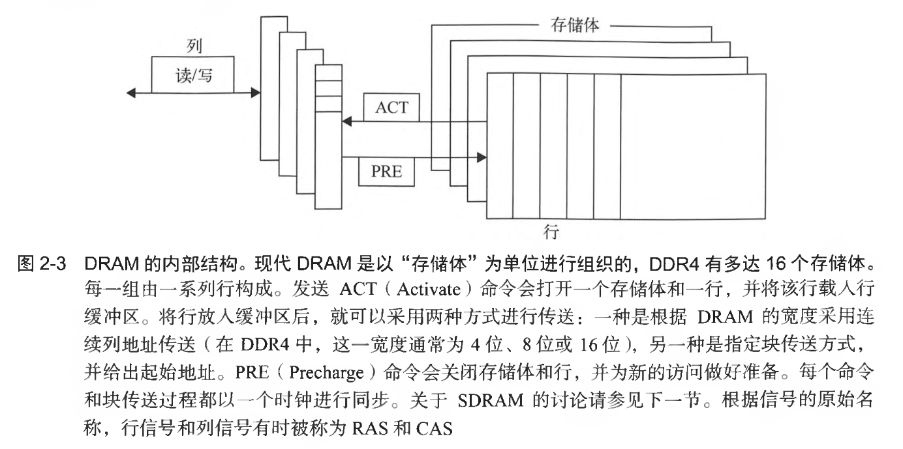
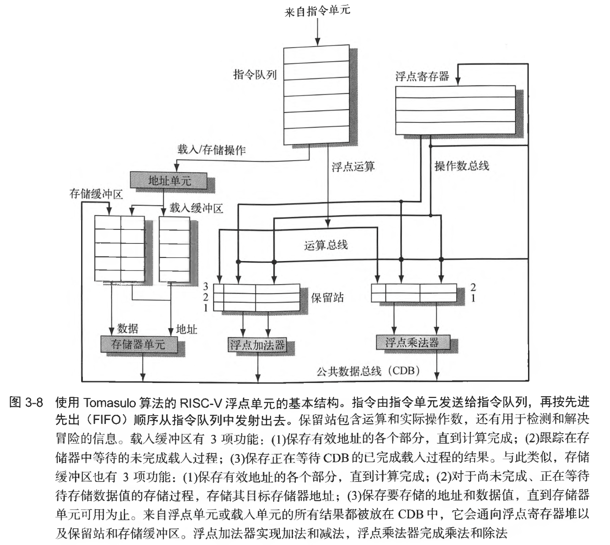

# 计算机体系结构·量化研究方法笔记

## 基础

1. 动态能耗

一个周期转换

$$能耗_{动态}\propto 容性负载\times 电压^{2}$$

总功耗：

$$功耗_{动态}\propto \frac{1}{2}\times 容性负载\times 电压^{2}\times 开关频率$$

2. Amdahl定律

根本上而言

$$加速比=\frac{整个任务在未采用该改进时的执行时间}{整个任务在采用该改进时的执行时间}$$

$$总加速比=\frac{1}{(1-改进比例)+\frac{改进比例}{改进加速比}}$$

3. CPI

## 存储

### Cache

若当前缓存中找不到一个字，则从更低一级取，一次取一个**缓存行/缓存块**，每个缓存块包括一个**标签(tag)**，用来指明对应的地址

**组相联**：组是指缓存中的一组块，一个块先被映射到这个组上，然后可以放置在组内的任意位置，查找块时要先根据地址查找该组，再在组内逐一比较`tag`

写入一致性：

- **写直达/写穿透**：写缓存时同时写主存
- **写回**：只写缓存，替换时写主存

**存储器平均访问时间**：

$$存储器平均访问时间 = 命中时间 + 缺失率\times 缺失代价$$

多级缓存：

$$存储器平均访问时间 = 命中时间_{L_{1}} + 缺失率_{L_{1}}\times (命中时间_{L_{2}} + 缺失率_{L_{2}} \times 缺失代价_{L_{2}})$$

降低缺失率方法：

1. 增大缓存块
2. 增大缓存
3. 提高相联度
4. 多级缓存
5. 为读缺失指定高于写操作的优先级（写缓冲区）
    - 读缺失之前先检查写缓冲区的内容，若无冲突则写之前先发读请求
6. 在索引缓存期间避免虚实地址转换
    - 使用页内偏移地址（虚实相同）来索引缓存，否则会引入虚实地址转换

DRAM内存（主存），SRAM缓存（无需刷新）

### DRAM

行选通期间发送一半地址，列选通期间发送另一半

现代DRAM以存储体为单位进行组织，DDR4有16个存储体，每组由一系列行构成，ACT命令打开一个存储体和一行，将行放入缓冲区，而后开始传送，有两种方式：

- 根据DRAM宽度(4/8/16)采用连续列地址传送
- 指定块传送方式，给出气势地址

PRE命令关闭存储体和行，为新访问做准备

DRAM只使用一个晶体管存储一位数据，检测电荷的传感线必须预充电，对数据行的读取会破坏信息，因此不需要该行时必须再写回；为了防止电荷泄漏，必须定期刷新每个位

SDRAM(Synchronous)，增加时钟信号进行同步，引入Bank

DDR(Double Data Rate)双倍数据速率，DRAM在时钟上升、下降沿都能够传输数据

DRAM放在可扩展DIMM阵列中

### 闪存

EPROM（电可擦可编程只读存储器）

- 闪存读取是顺序的，而且会读取一整页(512B, 2/4KB)
- 重写闪存必须先擦出（写入速度为SDRAM的$\frac{1}{1500}$，磁盘的8到15倍）
- 闪存非易失
- 块写入次数有上限
- 便宜

## 指令级并行(ILP)

$$流水线CPI = 理想流水线CPI + 结构化停顿 + 数据冒险停顿 + 控制停顿$$

依赖三种类型：

- 数据依赖
- 名称依赖
    - 指令使用相同的寄存器或存储地址，但之间没有数据流动
    - 寄存器重命名
- 控制依赖
    - 分支语句
    - 分支预测
        - 相关/两级预测器：利用其他分支的行为
        - 竞争预测器：全局预测器（历史做索引）和局部预测器（分支地址做索引）

数据/名称依赖并称为数据冒险：

- RAW，**写后读**
- WAW
- WAR，**读后写**

### 动态调度

乱序执行：ID分为两个阶段

- 发射(issue)：指令译码，检查结构冒险
- 读取操作数：无数据冒险后读取操作数

#### Tomasulo

寄存器重命名，功能由保留站提供，保留站为等待发射的指令缓冲操作数，基本思想：在一个操作数可用时提取并缓存，于是就不再需要从寄存器中读取，发射指令时会重命名待用操作数的寄存器说明符

1. **发射/分派**：从指令队列头取下一条指令，指令队列按照FIFO维护，检测保留站是否存在空位，寄存器值可用时也发往保留站，若操作数不在寄存器中，则将跟踪生成它的功能单元。完成寄存器重命名，消除WAR冒险和WAW冒险
2. **执行**：若有一个或多个操作数不可用，则等待计算同时监视公共数据总线，可用时放入保留站，所有操作数可用时前往运算，避免RAW冒险；load/store指令保持顺序；保护异常，每条指令需要在前面所有分支指令完成之后才能执行
3. **写结果**：计算出结果写到公共数据总线，传送给寄存器和保留站

