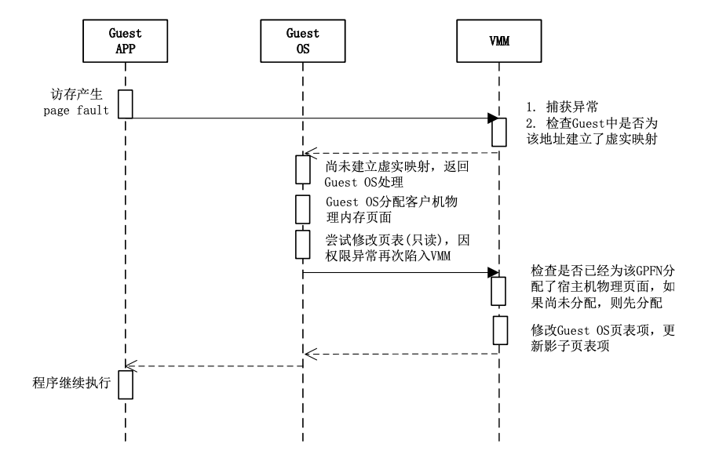
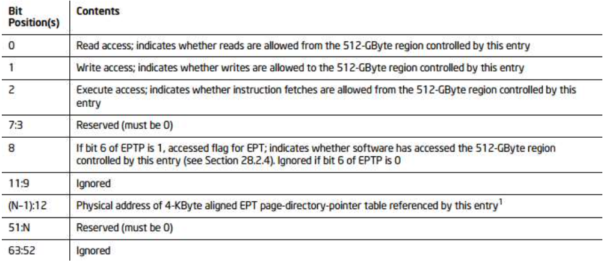
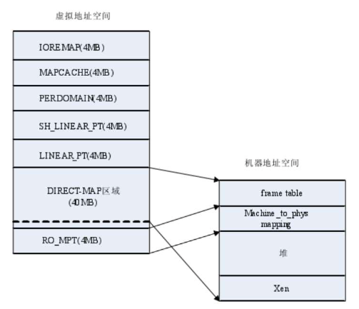

# 云计算课程讲义

## 虚拟化技术

### CPU虚拟化

#### CPU工作模式

##### 实模式

寻址：

- 内存地址：`Segment: Offset`
- 内存绝对地址：`Segment Base Addr + Offset`
- `Segment`为段的基地址，一个`Segment`最大长度为`64KB`
- `Offset`段内偏移量
- 16位段寄存器`CS(code), DS(data), SS(stack)`指定`Segment`，左移4位，成为20位段基地址
- 实模式下，段的描述信息：`Base Addr, Limit`

##### 保护模式

- 内存地址表示方式与上相同
- 内存管理分为段模式和页模式（段页式）
- 段描述信息包括：`Base Addr, Limit, Access`，64位数据结构，段描述符

段描述符：

- DPL: 特权级别，2位对应Ring 0 \~ Ring 3
- P: 段存在(Present)，处理器访问时位0会触发异常
- Type: 类别，4位：
    - 数据段（值小于8）：`XEWA`(`允许执行 | 扩展方向(0-上，1-下) | 允许写入| 最近是否被访问(Access)`)
    - 代码段（值大于8）：`XCRA`(`允许执行 | 一致性(0-非) | 允许读取 | 最近是否被访问(Access)`)

段选择子：索引号（段寄存器高13位） + T1(0-GDT, 1-LDT) + 请求特权级别

段描述符放入段描述符(GDT, LDT)，利用段选择子作为下标索引描述符表

基于GDT段式寻址：

- CPU `GDTR`寄存器读取`GDT`入口地址
    - `LGDT`指令将`GDT`入口内存地址装入`GDTR`寄存器，`GDT`系统中只有一个，所有任务共享
- 段寄存器保存的段选择子结构高13位，得到索引
- 得到段描述符->段基地址
- 基地址+偏移（线性地址）

段描述符会加载到CPU描述符cache

LDT:

- 每个进程对应一个LDT，进程切换CPU将新进程LDT段选择子自动加载到LDTR寄存器
- LDT表存放在LDT类型的段中，段描述符存储在GDT中

特权级：

- CPL: 当前特权级，由`CS.RPL`位域
- DPL: 描述符特权级，由代访问数据段或代码段描述符`DPL`位域决定
- RPL: 请求特权级，由代访问数据段或代码段描述符`RPL`位域决定

- 对数据段(DS)或堆栈段(SS)访问的权限检查规则：
    - `CPL <= DPL`，同时`RPL <= DPL`
    - 对数据段或堆栈段的访问不会改变`CPL`
- 对代码段(CS)访问的权限检查规则
    - 段内跳转（短跳转），不检查
    - 段间跳转（远跳转），检查

代码段一致性（段描述符42位），只有在作为被指令访问的目标时才会考虑是否一致

- 一致：
    - 能够在不同特权级共享、允许低访问高
    - DPL定义的事允许访问该一致代码段的`最高权限等级`
    - 跳转成功后CPL不改变，仍为原代码段特权级
- 非一致：
    - 非共享
    - 只允许同级访问

- 段间跳转，若目标代码段是特权级更高的一致代码段则跳转成功，CPL不变（与目标代码段RPL不同）
- 若目标代码段为特权级更高的非一致代码段，跳转失败，需要使用调用门
- 若目标代码段为特权级更低的代码段，无论是否一致都会失败，除非使用`retf`跳转

特权指令：

- 处理器特权级CPL为0时执行，如`LGDT, LIDT, LTR, POPF`等，涉及到内存管理、中断等
- I/O读写指令收到IOPL限制，如`IN, OUT, CLI, STI`等，特权级大于等于IOPL时可执行

IOPL:限制访问I/O指令的最低特权级，每个任务有自己的IOPL

#### 临界指令问题

所有敏感指令都是特权指令

Trap & Emulation

- 解除OS的特权使其运行在Ring1或Ring3下，将VMM运行在Ring0下，OS和应用程序中的非特权指令直接运行在屋里CPU上
- OS特权指令执行时产生General Protection Fault，进而会被VMM异常处理程序捕获，捕获后VMM模拟特权指令的执行，之后返回到OS执行客户机下一条指令

敏感指令：读写时钟寄存器、中断寄存器、访问存储保护系统、地址重定位系统、I/O指令

临界指令：非特权状态的敏感指令

`popf`:

- 从栈中弹出数据存储到标志寄存器中（`RFLAGS/EGLAGS/FLAGS`）
- 在Ring0下修改ALU标志位（如`ZF`）和系统标志位（如`IF`中断投递位）

`smsw`:

- 取处理器状态字指令，即CR0寄存器的第0到第15位
- Guest OS不经过VMM直接读取，获得宿主机状态

`push`:

- 能够不经VMM直接读取宿主机读取代码选择器的内容和当前CPL

#### x86漏洞

- 处理器CPL保存在CS低两位，通过`push cs, pop eax`指令很容易发现不再ring0运行，违背透明性
- 特权级机制不能保证所有访问处理器状态的指令在低特权级状态下执行都会发生故障，因此VMM无法捕获并仿真
- 控制CPU状态的指针修改在Ring0，但允许所有特权级读取。Guest OS读取判断运行在虚拟机环境
- 操作系统可以访问VMM存储空间，造成威胁
- 系统调用速度变慢
- 在虚拟机之间切换CPU上下文时不能够读取和恢复处理器当前状态，段描述符高速缓存 无法通过指令访问

#### CPU虚拟化实现方式

##### 全虚拟化

- Guest OS不知道自己运行在虚拟机环境下，也不需要任何修改
- VMM捕获并处理所有特权和敏感指令，用户级指令不经修改直接运行在宿主机CPU
- 全虚拟化最佳隔离性、安全性，简化迁移和移植
- 软件方式：二进制翻译+直接运行（VMware）
- 硬件辅助虚拟化（KVM）

BT:

- Guest操作系统内核代码动态二进制翻译在宿主机CPU Ring 1特权级下执行
- 动态扫描Guest OS代码在需要VMM介入的地方插入trap，进而可以由VMM接管特权指令
- 减少Trap捕获带来的开销

DE:

- Guest用户模式应用代码直接在宿主机CPU Ring3特权级执行

##### 半虚拟化

- 修改Guest OS使其运行在低特权级，调用Hypercall主动请求VMM代理特权操作，提升虚拟机性能，简化VMM设计
- 不改变ABI，应用程序无需修改、重编译

Xen基本原理：

- Xen位于OS和硬件之间(Ring 0)，负责位上层运行的操作系统内核(Ring 1)提供虚拟化的硬件资源，负责管理和分配这些资源，确保上层虚拟机（域，Domain）之间相互隔离
- Xen设置特权域Doman 0管理其他域Doman U
- Hypervisor不负责处理网络和磁盘请求，因此Doman U通过Doman 0与Hypervisor通信
- 采用事件通道实现、

线性内存空间布局

- 线性地址空间顶部Xen(64MB)
- 通过设置Guest OS的段limit来将Top 64MB线性地址空间预留给Xen，使Guest OS不能访问Xen地址空间
- 页表项S/U位只控制是否在Ring 3运行的Guest应用

内存隔离：GDT设置

- Guest OS段描述符宝存在GDT，由VMM设定、检查、加载
- 启动前通过struct vcpu预置GDT表地址，VMM模拟LGDT指令时实现加载

Guest OS特权解除，特权指令调用改写为对Xen的hypercall

Guest OS向Xen注册异常处理表，每个VCPU有自己的虚拟IDT表(Interrupt Descripter)，记录对每类异常进行描述的句柄

Xen对IDT检查：

- Guest OS处理例程所在的code segmant执行权限不能是Ring 0，通过检查段选择子

Fast exception handler

- Guest App Exception(Ring 3) -> Xen(Ring 0) -> Guest OS(Ring 1) -> Guest App(Ring 3)

Syscall, 快速异常处理函数

- Guest App Exception(Ring 3) -> Guest OS(Ring 1) -> Guest App(Ring 3)

Page Fault处理函数修改，使能够从Xen为其准备的内存单元读取导致异常的地址

Xen VCPU调度：

- 以VCPU为单位调度，而非Domain
- 物理CPU信息
    - VCPU
    - idle VCPU
    - 调度计时器
- 四种状态
    - runstate_running
    - runstate_runnable: 未被调度到物理CPU上
    - runstate_block
    - runstate_offline

Credit算法：

- 根据权重比例分享CPU给予时间跑的多级队列轮转调度算法
- Domain U设置两个参数
    - weight
    - cap: 可占用最多物理CPU比例
- 每个物理CPU上维护一个VCPU调度队列，分为三个优先级，低至高：OVER, UNDER, BOOST
    - under, ober级别根据credit值区分
    - credit值根据domain的weight计算

- 初始VCPU都为under，每隔10ms进行一次调整，credit减100，30ms根据weight重新计算credit
- VCPU执行I/O进入BLOCK，降低响应时间设置为BOOST，插入到优先级尾部
- VCPU处在BOOST级最多连续10ms

- 系统总credit = 物理CPU credit * 物理CPU个数
- 活跃的domain之间的weight比例计算分给domain的credit(fair)
- 计算domain能够得到的上限credit(peak)
- 根据domain的CAP计算domain能够获得的上限credit(cap)
- 若credit_cap < credit_peak，credit_peak = credit_cap，于是在credit_peak和credit_fair中选最小者
- 把domain的credit除以domain活动的VCPU数

##### 硬件辅助虚拟化

Intel VT-x VMX根模式/非根模式

- VMM root Ring0
- Guest OS non-root Ring0
- Guest non-root Ring3
- VMEntry: root -> non-root
- VMExit: non-root -> root

- root/non-root各有四个特权级，上下文切换问题不存在
- 隔离地址空间
- 虚拟机可以访问所需寄存器

- VMM执行`VMXON`指令进入操作模式
- 执行`VMLAUNCH/VMRESUME`指令产生VMEntry操作，进入Guest OS，处于non-root
- Guest OS执行特权指令导致VMExit发生，陷入VMM，切换回root
- VMM可决定是否退出操作模式，`VMXOFF`

- `VMCALL`:调用虚拟机监视器，引起VMExit
- `VMLAUNCH`:启动一个虚拟机，该指令执行完后，就开始执行Guest 的代码了
- `VMPTRLD`:加载一个指针到VMCS结构中，从内存中VMCS结构加载信息到寄存器
- `VMPTRST`:存储一个指针到VMCS结构中，将CPU寄存器、状态等保存到内存中的VMCS结构
- `VMCLEAR`:将VMCS的数据从处理器拷贝到内存中
- `VMREAD`:从VMCS结构中读取指定的数据域
- `VMWRITE`:向VMCS结构中写入特定的数据域
- `VMRESUME`:恢复一个虚拟机，为了恢复虚拟机状态，launch状态必 须被清除
- `VMXOFF`:退出VMX操作
- `VMXON`:开始VMX操作

VMCS(虚拟机控制结构)，VCPU在物理CPU上切换需要的数据结构

六个域：

- Guest-State Area
    - 保存虚拟机运行时状态
        - Guest OS寄存器状态：控制寄存器、调试寄存器、状态寄存器
        - 非寄存器状态：活跃、停机、关机、等待启动核间中断
- Host-State Area
    - 保存VMM运行时状态，主要是寄存器值
- VM Excution Control Field
    - 通过配置该域控制Guest在非根环境下执行行为，选择性屏蔽不必要的陷入-模拟指令
- VM Entry控制域
- VM Exit控制域
    - 控制VMExit的行为：
        - 处理器是否处于64位
        - 外部中断时处理器是否相应中断控制器获得中断向量号
- VM Exit信息域
    - 只读，包括最近一次发生的信息：中断向量号，类型、错误码

每个逻辑处理器(VCPU)定义一个64位VMCS指针

能够无条件引发VMExit的指令：`CPUID, GETSEC, INVD, XSETBV`，以及所有VMX指令

VMCS状态与转换关系:

- Active/Inactive: 是否处于激活，对逻辑CPU是否可用，就绪态
- current/non-current: 当前逻辑CPU（宿主机）执行VMX指令时的目标VMCS，一个逻辑CPU任意时刻只能有一个VMCS current
- launched/clear: VMCS对应的VCPU是否在逻辑CPU上执行过

|偏移量|内容|
|:-:|:-:|
|0|VMCS版本识别号|
|4|VMX无效标识|
|8|VMCS数据区域|

VMM配置允许VM步骤：

1. 根据IA32_VMX_BASIC MSR寄存器提供的VMCS region大小信息，在内存中创建一个4KB对齐的VMCS region(为了防止被直接内存访问到，可以将该page frame从页表中删除);
2. 根据IA32_VMX_BASIC MSR寄存器提供的VMCS版本信息，初始化新创建的VMCS region中的版本信息，并且将VMCS前4字节的bit31设置为0(表示该VMCS不是shadow VMCS);
3. 针对新创建的VMCS region执行VMCLEAR指令，这会对新创建的VMCS region进行初始化，并且将VMCS的状态设置为Clear;
4. 针对新创建的VMCS region执行VMPTRLD指令，该指令会将新创建的VMCS region设置为逻辑CPU的当前VMCS，即新创建的 VMCS从原来的Not Current状态变为Current状态，后面所有的 VMX相关指令操作的对象都将是新创建的VMCS;
5. 通过一系列的VMWRITE指令对VMCS中的Host-state area进行初始化，该区域将记录VM返回到VMM时，或者是VM Entry不成功时，逻辑CPU的状态及执行位置等信息;
6. 通过VMWRITE指令对VMCS中VM-Exit control field，VM-Entry control field和VM execution control field等区域进行设置;
7. 通过VMWRITE指令对VMCS中guest state area区域进行设置，该区域表示了VM中vCPU的执行时vCPU的状态，起始执行位置等 信息;执行VMLAUNCH指令，开始vCPU的执行。
8. 通过VMM需要判断VMLAUNCH的返回结果，确定vCPU是否真正被执行，还是因为某些逻辑冲突导致vCPU没有被执行就返回。 

##### KVM VCPU

整个生命周期都在Qemu线程的上下文，在Kernel(root), User(root), Guest(non-root)三种模式下转换

每个VCPU对应一个Qemu线程，在Linux上以普通线程调度

- Guest app线程调度到Guest VCPU的过程由Guest OS负责
- VCPU线程KVM使用标准的Linux进程调度方法调度
- VCPU线程调度到宿主机CPU的过程由Hypervisor即Linux负责

客户机VCPU数并非越多性能越好，总数不应超过物理CPU内核总数

### 内存虚拟化

给每个虚拟机提供从0地址开始的连续内存空间
隔离内存空间
在虚拟机之间调度、共享复用、按需分配内存资源

- 客户机虚拟地址(GVA, Guest Virtual Address)
- 客户机物理地址(GPA, Guest Physical Address)
- 宿主机虚拟地址(HVA, Host Virtual Address)
- 宿主机物理地址(HPA, Host Physical Address)
- 客户机虚拟页框号(GVFN, Guest Virtual Frame Number)
- 客户机物理页框号(GPFN, Guest Physical Frame Number)
- 宿主机物理页框号(HPFN, Host Physical Frame Number )
- P2M映射表:VMM为每个Guest维护一个GPFN到HPFN的映射表
- M2P映射表:VMM维护一张从HPFN到各个Guest的GPFN的映射表

每个进程页目录项通过CR3来访问

#### 地址映射

##### 直接模式

Xen

Guest OS页表项记录客户机虚拟地址到宿主机物理地址映射，可以直接供宿主机MMU使用

页表结构均被VMM设为只读，不能修改，更新操作Hypercall，VMM验证

重写Guest OS下页表相关操作：

- 页表访问和TLB操作重写，hypercall
- 填写页表时需要将Guest物理地址转换成Host机器地址，Guest OS读取页表时需将Host机器地址翻译成对应的Guest物理地址使用

Guest Page Fault

- Guest OS启动时向VMM注册却也异常处理函数，装载中断描述符表
- 缺页异常时，VMM捕获并调用自身处理函数
    - 首先根据CR2寄存器确定故障地址，保存值
    - 若故障地址在啊VMM地址空间，进行处理
    - 若在Guest地址空间，VMM恢复Guest异常现场，返回Guest OS调用异常处理函数，页表更新使用Hypercall

##### 影子页表

工作原理：

- Guest OS维护自身页表，完成GVA->GPA，但该页表不被宿主机MMU使用
- VMM为每套Guest页表维护一套影子页表，对应于Guest中每个进程的页表，负责将GVA->HPA，影子页表对Guest不可见
- Guest OS进行进程切换时，特权指令被VMM捕获，VMM将GPA保存，影子页表基址填入CR3
- 客户机读取CR3时，仍陷入VMM，于是将之前保存的GPA还给客户机
- 影子页表与Guest进程页表之间要保持同步

影子页表的建立：

- 当Guest OS启动进入保护模式后，VMM创建与Guest OS的页表相对应的影子页表，但此时影子页表还是空的
- 初始时，由于影子页表是空的，Guest的任何内存访问都会引起缺页异常(Page Fault)
- 如果Guest OS已经为故障GVFN分配了客户机物理页面，即Guest OS页表中相应的页表项已经建立了映射，说明该缺页异常是由于影子页表中相应的映射尚未建立(即宿主机物理内存页面并未分配)引起的
- VMM截获该异常后，根据故障GVFN在Guest OS页表中查找到与之对应的GPFN，再根据P2M映射表得到相应的HPFN，最后将GVFN到HPFN的映射填入影子页表的页表项中，从而完成缺页异常的处理
- 这一处理过程对Guest OS是透明的

缺页异常：

影子页表与Guest OS页表一致性维护：

- Dirty位：页面中数据被修改
- Guest OS修改页表：建立映射、解除映射

- 当Guest OS中页表项的“dirty”位未设置时，KVM将影子页表中对应的页表项标记为只读，**当该页被写时（外部）**，KVM能加以捕获从而 将CPU TLB及Shadow页表项的“dirty”标记同步到Guest OS中对应的页表项上
- 在shadow页表中建立GVA到HPA的映射时，如果该GVA对应的是Guest OS中页表页，则KVM将对应的页表项标记为只读的，从而能捕获Guest OS对其页表的修改，及时将Guest OS页表的变化同步到Shadow页表上

##### 硬件辅助

Intel: EPT

EPT负责完成GPA->HPA，由VMM维护，对虚拟机透明

Guest地址翻译过程(KVM)
- CPU将Guest进程页表的基地址(GPA)加载到gCR3寄存器
- CPU的MMU部件首先查询TLB判断是否存在GPA的映射，如果不存在，再查询内存中的EPT，将GPA翻译成对应的HPA，以获得页表在宿主机上的物理内存地址
- 以GVA相应位段为索引，以HPA为基地址，找到对应的页表项，读取到页表项的内容，即下一级页表的基地址(同样是GPA)，再通过EPT转换为HPA，如此反复，直到读取到最后一级页表的页表项，并将读取到GPN转换成了HPN
- 最后，将HPN和GVA的页内偏移相结合，就得到了GVA对应的 HPA，CPU用HPA访问内存，以完成此次访存操作
- 假设Guest OS页表有M级，EPT页表有N级，在TLB全部Miss的情况下，一次地址翻译将需要MN次访存操作

EPT页表建立过程:

- Guest处在非根模式下运行加载Guest进程时，将VMCS客户域CR3的值加载到gCR3寄存器。初始情况下Guest OS页表、对应的EPT表均为空，Guest OS仅有客户机进程的页表基地址GPN。
- 当Guest访问内存时，将产生EPT_VIOLATION，该事件将被KVM捕获，为GPN分配宿主机物理页面，并建立GPN到HPN的映射，此时仅在宿主机上分配了页表页面，页表项尚未建立
- KVM返回到Guest(非根模式运行)，MMU根据HPN和GPA对应位段索引读取页表项，发现该页表项尚未建立，产生Page Fault，由Guest OS处理。Guest OS为该页表项分配客户机物理页面并在页 表中建立映射，在Guest页表项中填入对应的GPN
- 访存指令再次执行，MMU虽然能够读取Guest页表项中刚刚分配的GPN，但在通过EPT翻译该GPN的时候发现尚未在EPT表中建立该GPN的映射，再次产生EPT_VIOLATION，KVM为其分配宿主机 物理页面，建立GPN->HPN映射
- 如此反复，直到指令访问的GVA对应的客户机物理页面和宿主机物理页面全部建立了映射，才能正常完成对GVA的访存操作。而这一过程中，相应的Guest页表结构和EPT页表结构也都建立了

先GPN->HPN，后建立Guest页表和Host页表

#### 内存管理

Xen

32位地址空间，Xen为自己内核和堆分配了12MB物理内存，保留高端64MB虚拟地址供自己使用

64MB虚拟地址空间分为7部分：

- RO_MPT: 被映射到机器地址到物理地址的转换数组，只读，可被Guest OS访问 
- DIRECT_MAP：Xen直接地址映射
    - XENHEAP: 12MB，包括Xen内核、位图、堆
    - RDWR_MPT: 被映射为机器地址到物理地址的转换数组，但可读写，不能被Guest OS访问
    - FrameTable: 映射到描述所有机器内存页面的数组
- LINEAR_PT：映射当前工作的页目录和页表，Xen可以访问到Guest OS的PDE和PTE
- SH_LINEAR_PT：映射影子页目录和页表
- PERDOMAIN：每个Domain的地址映射
- MAPCACHE：Domain的页表映射
- IOREMAP：系统调用ioremap()

DIRECT_MAP 40MB，其余4MB

- 每个Guest OS启动前，Xen为其保留固定数量的机器内存
- Xen管理机器内存分配使用的数据结构
    - frame_table[]数组：记录所有机器内存页框，位于Xen堆，映射为DirectMap区的frametable
    - machine_to_phys_mapping[]:映射机器地址到物理地址的数组，索引是机器页框号，内容是Guest OS物理页框号，位于Xen堆，映射到DirectMap区RDWR_MPT和RO_MPT两个地址空间
    - phys_to_machine_mapping[]:映射物理到机器地址的数组，索引是GuestOS物理页框号，内容是机器页框号，位于每个Domain堆中，每个Guest OS有一个

虚拟内存地址空间布局：

|Guest VA|
|:-:|
|0xC0400000|
|栈|
|启动信息|
|页表|
|Phys->Machine映射|
|ramdisk|
|内核|
|0xC0100000|
|0xC0000000|

Guest PA = Guest VA -  0xC0000000

4MB被映射到临时客户页表，供Guest OS启动时使用

Xen内存启动初始化：

- Domain 0由Xen启动，Domain U由Domain 0的Xend进程启动，并建立初始内存环境(hypercall)
- 为Domain U从domain堆中按页分配内存
- 为页目录分配机器页框，初始化Guest OS页表
- 填写phys->machine和machine->phys数组
- hypervisor为分配的页面提供正确的保护
- 启动共享信息页
- 向Hypervisor发送页更新请求

KVM: root模式下宿主机Linux的内核空间
Qemu: root模式下宿主机Linux的用户空间

Qemu内存虚拟化模型（核心数据结构MemoryRegion）

- 普通Host Ram作Guest内存
- Memory-Mapped IO: 若读写指令访问该区域，将会调用相应的回调函数
- Guest ROM
- ROM Device
- IOMMU Region

### IO虚拟化

- 向Guest OS提供与物理设备一致的交互方式，并对设备进行行为级模拟
- 共享设备造成独占假象
- 为Guest OS提供虚拟设备

实现方式

- IO指令模拟
- 半虚拟化
- 硬件辅助虚拟化

IO设备发现：让Guest OS发现虚拟设备，进而加载相关驱动

分类：

- 不可枚举：设备本身所属的资源是硬编码固化的，驱动程序会通过设备特定的方式检测是否存在，VMM截获客户机对指定端口的访问，并进行正确的模拟即可
- 可枚举：设备资源是软件可配置的，VMM不仅要模拟设备自身逻辑，还要模拟PCI总线的行为，包括拓扑关系和特定配置空间的内容

访问方式：

- PIO: 特殊IO指令
    - 低特权级访问会抛出异常陷入VMM
- MMIO
    - VMM把映射到MMIO地址空间的页表设置为无效，客户机访问会跑出缺页异常陷入VMM

#### 实现方式

##### IO指令模拟

Qemu IO:

1. Guest产生I/O请求，被KVM 截获
2. KVM经过简单处理后将I/O请求存放在I/O共享页
3. KVM通知Qemu，I/O已经存入I/O共享页
4. Qemu从I/O共享页拿到I/O请求
5. Qemu模拟本次的I/O操作，并发送给宿主机相应的设备驱动
6. 宿主机硬件完成I/O操作并返回结果给Qemu
7. Qemu将结果放回I/O共享页
8. Qemu通知KVM去I/O共享页拿结果
9. KVM去I/O共享页拿到结果
10. KVM将结果返回给Guest

开销大

##### IO半虚拟化

- IO操作模拟的粒度提高到Guest OS语义级别，减少root->non-root上下文切换的开销
- 前端与后端协作模拟实现设备虚拟化，前段：Guest OS驱动程序，后端：VMM驱动程序，专用通信机制协作
- 抽象出接口层支撑不同外设半虚拟化Virtio

Virtio

基于PCI总线实现

##### 硬件辅助虚拟化

直通模式：

- 设备直接分配给一个客户机独占使用，设备驱动程序直接访问物理IO设备寄存器进行DMA传输，接受中断

Intel VT-D

- 基于北桥芯片，在北桥中提供虚拟化硬件，隔离和控制访问
- 位于PCI设备树的根部，拦截中断请求和DMA方式内存访问请求，通过查找重定向表进行转发

DMA使用客户机GPA，需要转换成HPA：IOMMU，设备DMA地址重映射及地址空间的隔离

## 容器技术

虚拟化也称容器化，允许多个相互隔离的用户空间实例存在，称为容器

- OpenVZ:自行修改Linux内核，容器内运行一个完整的操作系统环境
- LXC: short for Linux Containers，
- docker: