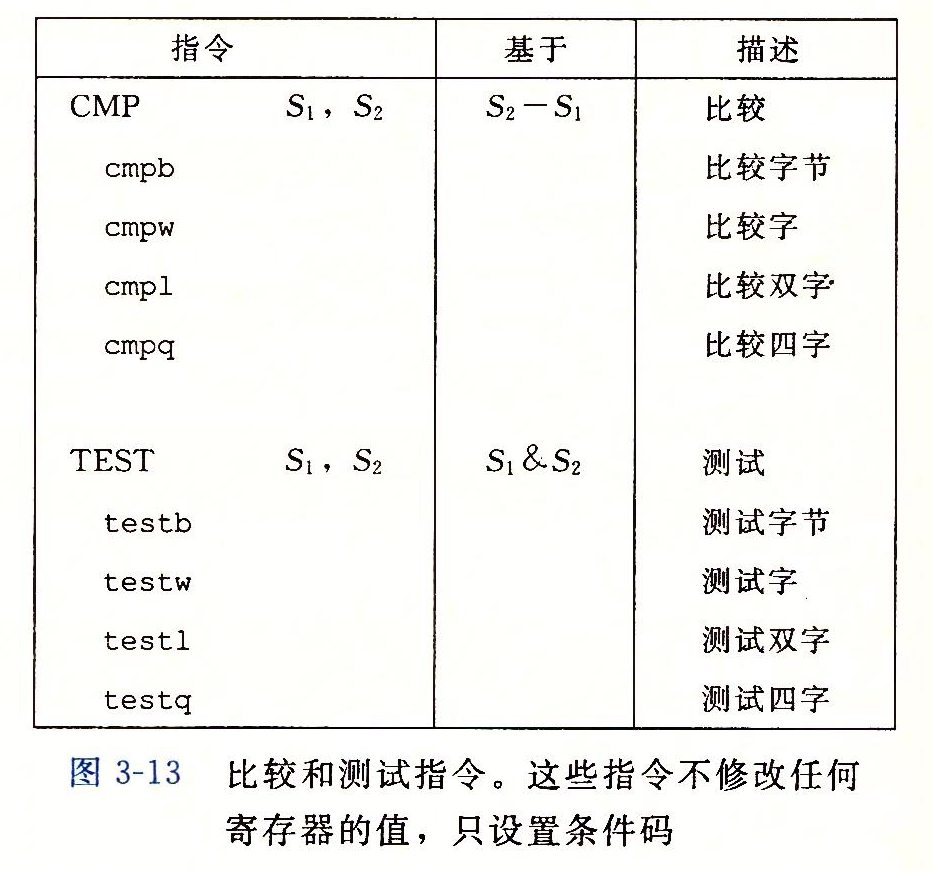
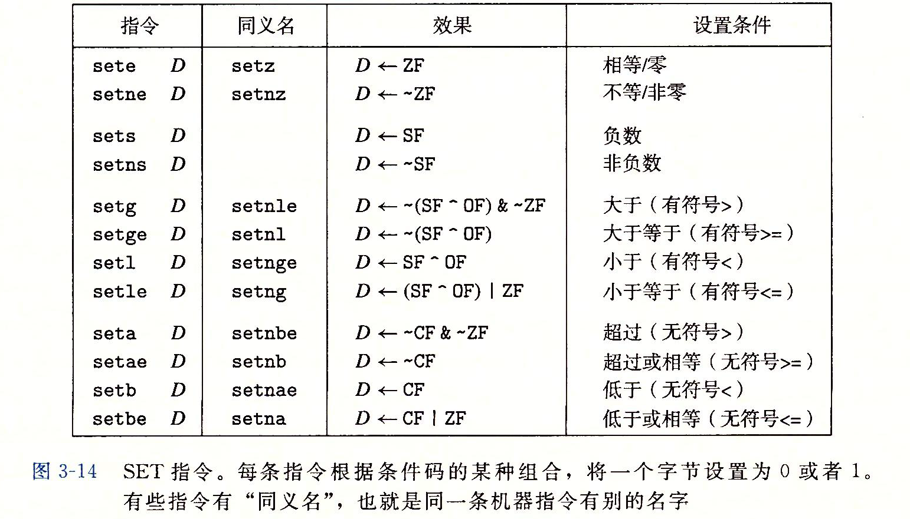

# Assembly language

16位-字；32位-双字；以此类推，1 byte-8 bit

大多数汇编代码指令之后会有字符后缀，表示操作数的大小，例如：movb（传送字节），movw（传送字），movl（传送双字），movq（传送四字）

IA32的CPU包含一组8个32位寄存器，用来存储整数数据和指针。大多数情况下，前六个寄存器可看做通用寄存器，使用无限制，但存在指令有特定的源/目标寄存器。前三个寄存器(`%eax, %ecx, %edx`)保存和恢复的做法不同于接下来3个(`%ebx, %esi, %edi`)。

S原先的IA32寄存器扩展到8个64位寄存器，从`%rax`到`%rsp`，另外新增8个寄存器，从`%r8`到`%r15`。

字节操作指令可以独立地读或写前4个寄存器的低2位字节。

<center>
</img>
</center>

## 操作数指示符

大多数指令有一个或多个操作数，指示执行一个操作要引用的源数据值，及放置结果的目标位置，

源数据值：常数，寄存器/存储器中
结果存址：寄存器/存储器中

操作数类型：
1. 立即数，常数值，`$`+标准C表示法的整数，如`$-577`, `$0x1F`
2. 寄存器，对四字：`%rax`，对双字：`%eax`，对字：`%ax`，对字节：`%al`。$E_{a}$任意寄存器，$R[E_{a}]$其值，将寄存器集合看作数组，标识符为索引。
3. 存储器，根据有效地址访问存储器。使用$M_{b}[Addr]$表示从$Addr$开始的b个字节值的引用。

寻址模式有多种，最常用形式：$Imm(E_{b},E_{i},s)$，四个部分：$Imm$-立即数偏移，$E_{b}$-基址寄存器，$E_{i}$-变址寄存器，$s$-比例因子（必须是1,2,4或8），于是有效地址计算：$Imm+R[E_{b}]+R[E_{i}]\times s$


错误寻址情况：
- `movl	4(,%esp,2),%eax`	`%esp`不能做index
- `movl %eax, %bx`			操作数大小不匹配
- `movl %eax, $4`			立即数不能为目的操作数
- `movb bytevar, 4(%ebx)`		太多内存操作数


为了区分开三种类型的操作数才有$\$Imm$,$(E_{a})$，M与R可以看作数组，代表`memory `与`register`，带()往存储器想

### 数据传送指令

<center></img></center>


注意图3-5中没有`movzlq`指令，即零扩展双字到四字，但可以通过`movl`将双字（4字节值）送到寄存器中，这样高4字节会补0，而后再复制到存储器。

`cltq`指令没有操作数

MOV类指令将源操作数的值复制到目的操作数中，IA32规定存储器内值复制到存储器中需要两条指令，先复制到寄存器中，再从寄存器复制到存储器。

`movb, movsbl, movzbl`之间差别即扩展方式，分别为不扩展、符号扩展、零扩展：

```S
假定 %dh=CD,%eax=98765432
movb %dh,%al        %eax=987654CD
movsbl %dh,%eax     %eax=FFFFFFCD
movzbl %dh,%eax     %eax=000000CD
```


`movb`不改变其他位的值，`movsbq`将其他位改为符号位（根据源字节最高位），`movzbq`将其他位改为0

### 压栈与弹出指令

`pushq, popq`将数据压入或弹出程序栈，在IA32中，程序栈位于存储器某一位置。栈向下增长，栈顶地址是最低的，栈指针`%rsp`保存栈顶元素的地址，从栈顶进行压入弹出操作。

注意在某些S中，若需要访问`%rsp`，需要将其存入`%rbp`，即后者用来获取栈指针快照：

```S
pushq	%rbp
movq	%rsp,%rbp
```

栈的压入操作：将栈指针减8，将值写入新的地址，因此指令`pushq $8,%rsp`等价于：

```S
subq $8,%rsp        指针值减8
movq %rsp,(%rsp)    将值存入指针位置
```

弹出操作相反，即`popq $8,%rsp`等价于：

```S
movq (%rsp),%rax    先移除到寄存器
addq $8,%rsp        后将栈顶地址加8
```

因为栈、程序代码、程序数据总是放在同样的存储器中，程序可以用标准的存储器寻址方式访问栈内任意位置，如`movq 8(%rsp),%rdx`

### 算术与逻辑操作

指令有扩展表示操作数大小的变种，指令及操作如下：


算术右移考虑符号位，逻辑右移左边补零。

下面是详细说明：

#### 加载有效地址

加载有效地址指令`leaq`(load effective address)，事实上为`movq`的变形，指令是从内存读数据到寄存器，但事实上根本未引用内存，而是为后面的内存引用产生指针，即并未读取数据，而是将有效地址写入目的操作数。

此外，还可以更简洁地进行算术运算：

```C
long scale(long x, long y, long z)
{
    long t = x + 4 * y + 12 * z;
    return t;
}
```

```S
scale:
	leaq	(%r8,%r8,2), %rax
	addq	%rdx, %rax
	leaq	(%rcx,%rax,4), %rax
	ret
```

即`(z*3+y)*4+x`

前面的操作直接根据$Imm(E_{b}+E_{i}\times s)$对应计算

#### 一元和二元操作

第三组为二元操作，第二个操作数既是源又是目的。例如，指令`subq %rax,%rdx`为从`%rdx`中减去`%rax`。

例：

```C
long arith(long x, long y, long z)
{
    long t1 = x ^ y;
    long t2 = z * 48;
    long t3 = t1 & 0x0F0F0F0F;
    long t4 = t2 - t3;
    return t4;
}
```

```S
arith:
	leal	(%r8,%r8,2), %eax
	sall	$4, %eax
	xorl	%edx, %ecx
	andl	$252645135, %ecx
	subl	%ecx, %eax
	ret
```

先是`(z*3)*(2^4)`，而后是`x^y, t1 & 0x0F0F0F0F, t2-t3`。

#### 移位操作

先给出位移量操作数，第二项为移位目标目标，移位量可以是立即数或存放在单字节寄存器`%cl`中。移位量若有$\omega$位，而操作所需为$m$位，则低$m$位有效（$2^{m}=\omega$）。例如当`%cl`中数据为`0xFF`，则指令`salb`移动7位，`salw`移动15位，以此类推。

#### 特殊运算操作

两个64位成绩运算将产生128位，因此扩展16字节的数为`八字`，以下为指令：


一对寄存器`%rax`和`%rdx`组成128位的八字。

`imulq`指令有两种形式：
- 一种为双操作数乘法指令，64位操作数乘积，且结果截取到64位；
- 另一种为单操作数，计算两个64位值全128位乘积，提供无符号乘法`mulq`与有符号乘法`imulq`，两指令都要求一个参数必须在`%rax`中，另一个作为源操作数给出，然后乘积结果分别存放在`%rdx`（高64位）和`%rax`（低64位）中。

例子：

```C
#include <inttypes.h>
typedef unsigned __int128 uint128_t;
void store_uprod(uint128_t *dest, uint64_t x, uint64_t y)
{
    *dest = x * (uint128_t)y;
}
```

```S
store_uprod:
	movq	%rdx, %rax
	mulq	%r8
	movq	%rax, (%rcx)
	movq	%rdx, 8(%rcx)
	ret
```
目标为`(%rcx)`地址的储存器，生成的高64位在`%rdx`中到目标`%rcx+8`，低64位在`%rax`中，对应为小端法机器（高位字节存储在大地址）

除法指令`idivl`将寄存器`%rdx`（高64位）和`%rax`（低64位）作为被除数，除数作为操作数给出，商存储在`%rax`中，余数在`%rdx`中。

例：

```C
void remdiv(long x, long y, long *qp, long *rp)
{
    long q = x / y;
    long r = x % y;
    *qp = q;
    *rp = r;
}
```

```S
remdiv:
	movq	%rcx, %rax
	movq	%rdx, %r10
	cqto
	idivq	%r10
	movq	%rax, (%r8)
	movq	%rdx, (%r9)
	ret
```

第一步将`x`移动至`%rax`作为除数，第三步使用`cqto`扩展。
第二步：需要将`%rdx`中的数copy至其他（`%r10d`），作为除数。

> 关于`cqto`，当被除数为64位，且在`%rax`中时，应将`%rdx`设置为全0（无符号运算）或按符号位拓展，按符号位拓展操作可用`cqto`实现。无需操作数，隐含读出`%rax`符号位并复制到`%rdx`中的操作。

第四步用`%r10`中的`y`去除128位的`%rdx,%rax`，然后将结果的商存到`%r8`地址的存储器，余数存到`%r9`地址的存储器

## 控制

### 条件

#### 条件码[一周目]

CPU还维护着一组单个位的条件码寄存器，描述最近的算术或逻辑操作的属性，通过检测其值来执行条件语句，最常用的有：

- CF(Carry)：最高位进位标志，可检测无符号操作的溢出
- ZF(Zero)：零标志，最近的操作结果为0
- SF(Sign)：符号标志，最近操作结果为负数
- OF(Overflow)：溢出标志，最近操作导致补码溢出，正或负溢出

IA-32中还有2个：AF/PF(parity，奇偶)

以及控制标志位
- DF：方向标志，控制串指令的数据传输方向，为1时地址递减，为0时地址递增


以`t=a+b`为例，条件码分别代表：

条件码|对应情况的C代码|解释
:-:|:-:|:-:
`CF`|`(unsigned) t < (unsigned) a`|无符号溢出
`ZF`|`(t==0)`|零标志
`SF`|`(t<0)`|符号变化标志
`OF`|`(a<0 == b<0) && (t<0 != a<0)`|溢出标志

`leaq`指令不会改变条件码，其余所有指令都设置条件码。
例如：
- `XOR`，进位与溢出标志会设置为0。
- 对于移位操作，进位标志设置为最后一个被移出的位，溢出标准设置为0
- `INC,DEC`指令设置溢出和零标志，但不会改变进位标志。

有两类指令只设置条件码不改变其他寄存器：

<center></img></center>

`CMP`指令类似`SUB`，`TEST`指令类似`AND`，但前者都不改变目标寄存器的值。而是通过结果改变条件码。

#### 访问条件码

条件码通常不能直接读取，间接方法有：

1. 可以根据条件码某种组合将一个存储字节设置为0或1；
2. 可以条件跳转到程序的某个其他部分；
3. 有条件传送数据

对1，可以使用`SET`类指令，指令后缀指明其对应的条件码组合，**即不同的条件，而非操作数大小**。



`SET`指令的目的操作数为低位单字节寄存器元素之一，或是1字节的内存位置，指令会将该字节设置为0或1。而后移动至32位或64位寄存器中得到结果时必须对高位清零。
如：

```S
int comp(data_t a,data_t b)
a in %rdi, b in %rsi
comp:
	cmpq	%rsi,%rdi
	setl	%al
	movzbl	%al,%eax
	ret
```
注意的是`cmpq`执行的是$S_{2}-S_{1}$，`movzbl`会将`%eax`和`%rax`高字节全部清零

指令`setg`$\equiv$`setnle`

各个`SET`指令都适用的情况是执行比较命令，根据`t=a-b`设置条件码。

- `sete`：相等时设置，零标志置位(`set 1`)；
- `setl`：有符号比较。
	- 没有溢出时（即`OF`为0），
		- `a<b`则`SF set 1`，
		- `a>=b`则`SF reset 0`；
	- 发生溢出时，
		- 负溢出时`OF set 1, SF reset 0`，此时有`a<b`；
		- 正溢出时`OF set 1, SF set 1`，此时有`a>b`；

#### 跳转指令

```S
	movq	$0,%rax
	jmp		.L1
	movq	(%rax),%rdx
.L1:
	popq	%rdx
```

直接跳转为`jmp .标号`作为跳转目的，间接跳转，`jmp *操作数`，例：`jmp *%rax`。

<center>
</img>
</center>

注意到以上指令都是有条件的，并且条件、指令后缀和`set`类相匹配

跳转指令最常用PC-relative编码，即会将目标指令地址与紧跟的指令地址之差作为编码，地址偏移量占1、2或4字节。第二种编码方式为绝对地址，用4个字节直接指定目标指令。

#### 条件控制实现分支（通过改变条件码而后条件跳转）

普通`if`条件和`if,goto`实现的等价条件：

```C
long long lt_cnt = 0;
long long ge_cnt = 0;
long long absdiff_se(long long x, long long y)
{
    long long result;
    if (x < y)
    {
        lt_cnt++;
        result = y - x;
    }
    else
    {
        ge_cnt++;
        result = x - y;
    }
    return result;
}
long long gotodiff_se(long long x, long long y)
{
    long long result;
    if (x >= y)
    {
        goto x_ge_y;
    }
    lt_cnt++;
    result = y - x;
    return result;
x_ge_y:
    ge_cnt++;
    result = x - y;
    return result;
}
```
对应的汇编代码（一模一样）：

```S
absdiff_se:
	cmpq	%rdx, %rcx
	jge	.L2
	addq	$1, lt_cnt(%rip)
	movq	%rdx, %rax
	subq	%rcx, %rax
.L1:
	ret
.L2:
	addq	$1, ge_cnt(%rip)
	movq	%rcx, %rax
	subq	%rdx, %rax
	jmp	.L1

gotodiff_se:
	cmpq	%rdx, %rcx
	jge	.L7
	addq	$1, lt_cnt(%rip)
	movq	%rdx, %rax
	subq	%rcx, %rax
.L4:
	ret
.L7:
	addq	$1, ge_cnt(%rip)
	movq	%rcx, %rax
	subq	%rdx, %rax
	jmp	.L4

ge_cnt:
	.space 8
lt_cnt:
	.space 8
```

#### 通过数据的条件传输实现条件分支（更优）

直接计算两种可能值，而后根据条件是否满足判断是否选择其中一个。例子是上面条件判断的变体：

```C
long long cmovdiff(long long x, long long y)
{
    long long rval = y - x;
    long long eval = x - y;
    long long ntest = x >= y;
    if (ntest)
    {
        rval = eval;
    }
    return rval;
}
```
对应汇编代码：

```S
cmovdiff:
	movq	%rdx, %r8
	subq	%rcx, %r8
	movq	%rcx, %rax
	subq	%rdx, %rax
	cmpq	%rcx, %rdx
	cmovg	%r8, %rax
	ret
```

> 为何该种方法更优，回到指令流水线，为保持高性能运转，机器在运算前一条指令的过程中需要取后一条指令，使用跳转的做法机器需要预测后一条指令（处理器非常精密的分支预测逻辑），错误预测将导致程序性能严重下降。

**控制流不依赖数据，可以使指令流水线始终是满的**

**条件传送指令：**

<center>
</img>
</center>

两个操作数：源寄存器或内存地址(S)，目的寄存器(R)，是否赋值取决于条件码的值。源和目的值可以16，32，64位长，不支持单字节条件传送。

简单的理解如下：
若要实现：`v=test-expr ? then-expr : else-expr`；
标准方法：
```C
	if(!test-expr){
		goto false;
	}
	v=then-expr;
	goto done;
false:
	v=else-expr;
done:
```
而更好的方式是：
```C
v=then-expr;
ve=else-expr;
t=test-expr;
if(!t) v=ve;
```

### 循环

#### do-while循环

通用形式为：

```C
do{
	body-statement
}while(test-expr);
```
用`goto`表达：
```C
loop:
	body-statement;
	t=test-expr;
	if(t){
		goto loop;
	}
```
有以下示例：
求阶乘的函数，`do-while`版及`goto`版：

```C
long long fact_do(long long n)
{
    long long result = 1;
    do
    {
        result *= n;
        n--;
    } while (n > 1);
    return result;
}
long long fact_do_goto(long long n)
{
    long long result = 1;
loop:
    result *= n;
    n--;
    if (n > 1)
    {
        goto loop;
    }
    return result;
}
```
对应的汇编指令分别为，事实上一样：

```S
fact_do:
	movl	$1, %eax
.L2:
	imulq	%rcx, %rax
	subq	$1, %rcx
	cmpq	$1, %rcx
	jg	.L2
	ret

fact_do_goto:
	movl	$1, %eax
.L5:
	imulq	%rcx, %rax
	subq	$1, %rcx
	cmpq	$1, %rcx
	jg	.L5
	ret
```

#### while循环

通用形式：
```C
while(test-expr){
	body-statement;
}
```
针对此有两种翻译方法：

##### 第一种跳转到中间执行

实现方式是`gcc -O0 -S xx.c`
```C
	goto test;
loop:
	body-statement;
test:
	t=test-expr;
	if(t){
		goto loop;
	}
```
仍用阶乘作例子：
```C
long long fact_while(long long n)
{
    long long result = 1;
    while (n > 1)
    {
        result *= n;
        n--;
    }
    return result;
}
long long fact_while_jmp_goto(long long n)
{
    long long result = 1;
    goto test;
loop:
    result *= n;
    n--;
test:
    if (n > 1)
    {
        goto loop;
    }
    return result;
}
```
汇编：
```S
fact_while:
	pushq	%rbp
	.seh_pushreg	%rbp
	movq	%rsp, %rbp
	.seh_setframe	%rbp, 0
	subq	$16, %rsp
	.seh_stackalloc	16
	.seh_endprologue
	movq	%rcx, 16(%rbp)
	movq	$1, -8(%rbp)
	jmp	.L9
.L10:
	movq	-8(%rbp), %rax
	imulq	16(%rbp), %rax
	movq	%rax, -8(%rbp)
	subq	$1, 16(%rbp)
.L9:
	cmpq	$1, 16(%rbp)
	jg	.L10
	movq	-8(%rbp), %rax
	addq	$16, %rsp
	popq	%rbp
	ret
```
##### 第二种翻译

实现方式是`gcc -O1 -S xx.c`，若开始不满足条件，跳出循环，若满足，则可照搬`do while`结构。
转换成`do-while`和`goto`:
```C
	t=test-expr;
	if(!t){
		goto done;
	}
	do{
		body-statement;
	}while(test-expr);
done:

	t=test-expr;
	if(!t){
		goto done;
	}
loop:
	body-statement;
	t=test-expr;
	if(t){
		goto loop;
	}
done:
```

```
fact_while:
	cmpq	$1, %rcx
	jle	.L10
	movl	$1, %eax
.L9:
	imulq	%rcx, %rax
	subq	$1, %rcx
	cmpq	$1, %rcx
	jne	.L9
.L7:
	ret
.L10:
	movl	$1, %eax
	jmp	.L7
```

#### for循环

通用形式：

```C
for(init-expr; test-expr; update-expr){
	body-statement;
}
```
与下面`while`循环形式相同：
```C
init-expr;
while(test-expr){
	body-statement;
	update-expr;
}
```

两种翻译方法：

跳转中间策略：

```C
	init-expr;
	goto test;
loop:
	body-statement;
	update-expr;
test:
	t=test-expr;
	if(t){
		goto loop;
	}
```

`guarded-do`策略：
```C
	init-expr;
	t=test-expr;
	if(!t){
		goto done;
	}
loop:
	body-expr;
	update-expr;
	t=test-expr;
	if(t){
		goto loop;
	}
done:
```

### switch语句

开关数量多，值的范围小时，通过使用跳转表更加高效。
跳转表为一个数组，表项`i`为一个代码段的地址，该代码段实现当开关索引值等于`i`时程序采取的动作。
代码段的地址用字符在代码段前标注（类似`goto`），在数组中使用`&&`加字符，能够指向代码段的地址。
例子：

```C
void switch_eg(long x, long n, long *dest)
{
    long val = x;
    switch (n)
    {
    case 100:
        val *= 13;
        break;
    case 102:
        val += 10;
    case 103:
        val += 11;
        break;
    case 104:
    case 106:
        val *= val;
        break;
    default:
        val = 0;
    }
    *dest = val;
}

void switch_eg_impl(long x, long n, long *dest)
{
    static void *jt[7] = {&&loc_a, &&loc_def, &&loc_b, &&loc_c, &&loc_d, &&loc_def, &&loc_d};
    unsigned long index = n - 100;
    long val;
    if (index > 6)
    {
        goto loc_def;
    }
    goto *jt[index];
loc_a:
    val *= 13;
    goto done;
loc_b:
    val += 10;
loc_c:
    val += 11;
    goto done;
loc_d:
    val *= val;
    goto done;
loc_def:
    val = 0;
done:
    *dest = val;
}
```
汇编代码：

```S
switch_eg:
	.seh_endprologue
	subl	$100, %edx
	cmpl	$6, %edx
	ja	.L8
	movl	%edx, %edx
	leaq	.L4(%rip), %r9
	movslq	(%r9,%rdx,4), %rax
	addq	%r9, %rax
	jmp	*%rax
	.section .rdata,"dr"
	.align 4
.L4:
	.long	.L7-.L4
	.long	.L8-.L4
	.long	.L6-.L4
	.long	.L5-.L4
	.long	.L3-.L4
	.long	.L8-.L4
	.long	.L3-.L4
	.text
.L7:
	leal	(%rcx,%rcx,2), %eax
	leal	(%rcx,%rax,4), %ecx
	jmp	.L2
.L6:
	addl	$10, %ecx
.L5:
	addl	$11, %ecx
.L2:
	movl	%ecx, (%r8)
	ret
.L3:
	imull	%ecx, %ecx
	jmp	.L2
.L8:
	movl	$0, %ecx
	jmp	.L2
	.seh_endproc

//严格跳转表的汇编形式
switch_eg_impl:
	.seh_endprologue
	subq	$100, %rdx
	cmpq	$6, %rdx
	ja	.L10
	leaq	jt.1986(%rip), %rax
	jmp	*(%rax,%rdx,8)
.L11:
	movl	$0, %eax
	jmp	.L12
.L13:
.L14:
	movl	$21, %eax
	jmp	.L12
.L15:
	movl	$0, %eax
	jmp	.L12
.L10:
	movl	$0, %eax
.L12:
	movq	%rax, (%r8)
	ret
	.seh_endproc
	.section .rdata,"dr"
	.align 32
jt.1986:
	.quad	.L11
	.quad	.L10
	.quad	.L13
	.quad	.L14
	.quad	.L15
	.quad	.L10
	.quad	.L15
```

数组的声明叫做`.rodata`（只读数据, read-only）

## 过程

设过程P调用过程Q，过程Q执行完毕返回P，该系列动作包含下面一个或多个机制：

- 传递控制——调用时，程序计数器设置为Q的地址，返回时，程序计数器设置为P在调用Q之后的地址
- 传递数据——P必须向Q提供一个或多个参数，Q必须能够向P返回一个值？？？
- 分配和释放内存——Q开始时需要为局部变量分配空间，在返回时需要释放这些空间

<center>
</img>
</center>

### 传递控制
程序用栈来管理过程所需存储空间，当过程需要的存储空间超出寄存器能够存放的大小时，就会在栈上分配空间，即栈帧，当前帧在栈顶。

当P调用Q时会将返回地址压栈，指明Q返回时继续执行的地址。

`call Q`将返回地址A（紧跟的指令地址）压栈，调用Q，`ret`会弹出返回地址并设置程序计数器(PC)

<center>
</img>
</center>

会有`callq`

### 数据传送

大部分过程间的数据传送通过寄存器实现，通过寄存器可以传递至多6个整型参数（整数和指针）。寄存器使用区分大小和顺序：


如果超出6个参数，超出部分需要用栈来传递，参数1\~6复制到寄存器，参数7\~n放于栈，7位于栈顶。通过栈传递时，所有数据大小向8的倍数对齐。参数布置完毕，程序`call Q`。
调用其他过程前需要在自己栈帧上为超出6个的参数分配空间

### 栈上的局部数据存储

有时局部数据必须存放在内存中：

- 寄存器不足够
- 对局部变量使用`&`，为其产生一个新地址
- 局部变量为数组或结构，通过数组或结构引用才能够被访问

一般，过程通过减小栈指针在栈上分配空间。分配结果作为栈帧的一部分，*标号为局部变量*

### 递归过程

每个过程在栈中都有自己的私有空间，多个未完成调用的局部变量不会互相影响

当过程调用时分配局部存储，当返回时释放存储

例：
```C
long rfact(long n)
{
    long result;
    if(n<=1){
        result=1;
    }
    else{
        result=n*rfact(n-1);
    }
    return result;
}
```

## 数组分配与访问

### 简单数组

简单访问：E为int型数组，计算E[i]，E在`%rdx`，i在`%rcx`，则可用`movl (%rdx,%rcx,4),%eax`来访问E[i]。

指针运算类似的方法访问：


### 高维数组

`T D[R][C];`
声明数组，其元素`D[i][j]`的内存地址：
$$\&D[i][j]=x_{D}+L(C\cdot i+j)$$
T的大小为L bytes

将`A[i][j]`复制到`%eax`中：

```S
leaq	(%rsi,%rsi,2),%rax
leaq	(%rdi,%rax,4),%rax
movl	(%rax.%rdx,4),%eax
```

C语言变长数组在函数参数传递声明时，长度应位于数组前。

## 其他C的数据结构

### struct

结构所有组成部分都存放在内存中一段连续的区域内，指向结构的指针是结构第一个字节的地址。

因此可根据结构各元素的位宽直接进行偏移访问。

### Union

大小按照成员中空间需求最大的元素分配。

## gdb


