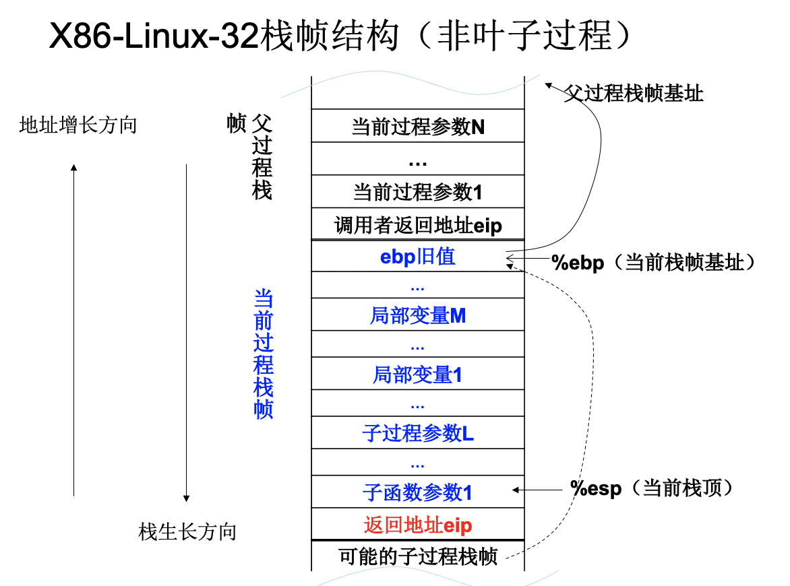

# 汇编

## quickstart

### 基础运行环境

寄存器|特定用法|16位|8位高|8位低
:-:|:-:|:-:|:-:|:-:
EAX|Accumulator|AX|AH|AL
EBX|Base|BX|BH|BL
ECX|Loop Counter|CX|CH|CL
EDX|Data|DX|DH|DL
ESP|Stack Pointer|SP|-|-
ESI, EDI|Index|SI,DI|-|-
EBP|Frame pointer|BP|-|-
CS|Code segment
DS|Data segment
SS|Stack segment
ES, FS, GS|Additional
EIP|Instruction Pointer
EFLAGS|Status and control Flags

注意`-`表示不可访问，去掉前缀表示16位，H为高8位，L为低8位

- 乘除指令默认使用`EAX`，扩展累加器
- `CPU`默认使用`ECX`作为循环计数器
- `ESP`用于寻址堆栈数据，一般用于算术运算与数据传输，扩展堆栈指针寄存器
- `ESI`和`EDI`用于高速存储器传输指令，扩展目的变址寄存器

E开头32位，S结尾16位段寄存器

- 8个64位`MMX`寄存器，物理上与浮点寄存器相同
- 8个128位`XMM`寄存器为8个256位`YMM`寄存器低128位

### 数据结构

Intel|ASM|Bytes|C
:-:|:-:|:-:|:-:
byte|b|1|[unsigned] char
word|w|2|[unsigned] short
double word|l|4|[unsigned] int
quad word|q|8|[unsigned] long int
single|s|4|float
double|l|8|double
extended|t|10/12/16|long double

- 数组：连续的相同时数据类型的数的排列
- 多维数组：行优先排列，A[i]含C个元素，每个元素K bytes，于是A[i]起始地址$A+i\times(C\times K)$，访存形式(offset,index,bytes)，index为前标号，offset为后偏移量

```C
// 编译时知道N大小
#define N 16
typedef int fix_matrix[N][N]
int fix_ele(fix_matrix a, int i, int j){
    return a[i][j];
}

// 传统
#define IDX(n,i,j) ((i)*(n)+(j))
int vec_ele(int n, int *a, int i, int j){
    return a[IDX(n,i,j)];
}

// 神奇
int var_ele(int n, int a[n][n], int i, int j){
    return a[i][j];
}
```

由神奇方法引出汇编：

```C
// 神奇
int var_ele(int n, int a[n][n], int i, int j){
    return a[i][j];
}
```
```S
    movl    8(%ebp), %eax    # n
    sall    $2, %eax         # n*4
    movl    %eax, %edx       # n*4
    imull   16(%ebp), %edx   # i*n*4
    movl    20(%ebp), %eax   # j
    sall    $2, %eax         # j*4
    addl    12(%ebp), %eax   # a+j*4
    movl    (%eax,%edx), %eax   # *(a+j*4+i*n*4)
```

struct，连续地址空间分配不同数据类型
遵循对齐时要求对应类型的data(k bytes)必须排在k整数倍开始的位
注意double类型不同机器的要求不尽相同，x64/IA-32 Windows: 8位，IA-32 Linux：4位

union，取最大空间元素分配空间，每次只能使用一个域


### 汇编程序构成

```S
.section .data
    <initialized data>
    # 注意数据区变量按照对齐进行顺序编址
.section .bss
    <unintialized data>
.section .text  #必不可少
.globl _start#默认程序入口
_start:
    <instruction code>
```

### 执行汇编

使用shell脚本：编写_sh文件

```sh
$ vi asm_sh
echo as -o $1.o $1.S
as -o $1.o $1.S
echo ld -o $1 $1.o
ld -o $1 $1.o
echo running $1
./$1
$ chmod +x asm_sh
```

运行程序：

```sh
$ ./asm_sh hello
```

### hello world
```S
#hello.S
.section .data
    #数据区
    output  .ascii "hello world\n"

#编译指导指令
.section .text
.globl _start
_start:
#output like printf
    movq    $1,%rax
    movq    $1,%rdi
    movq    $output,%rsi
    movq    $12,%rdx
    syscall
    #系统调用，进行输出
#exit
    movq    $60,%rax
    movq    $0,%rdi
    syscall
```

```S
.section .data
    output  .ascii "hello, world!\n"

.section .text
.globl _start
_start:
    movl $4, %eax # 系统调用号，4为写文件
    movl $1, %ebx # 文件描述符，1为终端
    movl $output, %ecx # 缓冲区
    movl $12, %edx # 输出字节数
    int $0x80

    movl $1, %eax
    movl $1, %ebx
    int $0x80

```
系统调用号：1为写文件，80为程序退出
- 写文件：
    - `%rbx`文件描述符，1表示终端
    - `%rsi`输出缓冲区地址
    - `%rdx`输出的字节数

数据类型：

类型名|描述
:-:|:-:
.ascii  |非空字符'\0'(即:二进制0)结束的字符串
.asciz  |以空字符'\0'(即:二进制0)结束的字符串
.string |以空字符'\0'(即:二进制0)结束的字符串
.byte   |定长1字节整型,8位
.short  |定长2字节整型,16位
.word   |定长2字节整型,16位
.hword  |定长2字节整型,16位
.int    |定长4字节整型,32位
.long   |定长4字节整型,32位
.quad   |定长8字节整型,64位
.octa   |定长16字节整型,128位
.uleb128|变长无符号整数,最多128位(16字节)
.sleb128|变长有符号整数,最多128位(16字节)
.single |定长单精度浮点数,4字节(32位)
.float  |定长单精度浮点数,4字节(32位)
.double |定长双精度浮点数,8字节(64位)

data段定义数组后使用时，`$+数组名`表示数组起始地址，赋值给寄存器相当于指针

立即数，负数：$-xx

### instructions
#### mov
AT&T中，mov参数前一个为源，后一个为目标
$+data中数据为其内存地址

指令格式（Intel syntax）|说明
:-:|:-:
mov r, r|通用寄存器->通用寄存器
mov r, m|内存单元->通用寄存器
mov m, r|通用寄存器->内存单元
mov r/m, imm|立即数->通用寄存器或内存单元

##### 扩展指令

指令格式（Intel syntax）|说明
:-:|:-:
movzx r16, r/m8|8位数据零扩展为16位数据
movzx r32, r/m8|8位数据零扩展为32位数据
movzx r32, r/m16|16位数据零扩展为32位数据
movsx r16, r/m8|8位数据符号扩展为16位数据
movsx r32, r/m8|8位数据符号扩展为32位数据
movsx r32, r/m16|16位数据符号扩展为32位数据

x64见[note]({{/post/Study/Language/Program/Assembly/CourseNotes/index.md}})

#### xchg

指令格式（Intel syntax）|说明
:-:|:-:
xchg r, r|通用寄存器与通用寄存器交换（有一个操作数为累加器时是单字节指令）
xchg r, m|内存单元与通用寄存器交换
xchg m, r|通用寄存器与内存单元交换

不可交换立即数

#### 加减

自增自减`inc`,`dec`
加减`add`,`sub`
取反`NEG`

注意AT&T中sub指令:`subx src, dest`，计算过程为：`dest = dest - src`
`negx dest`，计算过程：`dest = 0 - dest`，只有`dest = 0`时`CF`为0，否则为1

- `ADC`：带进位加法
    - `adcx src, dest`：dest = dest + src + CF
- `SBB`：带借位的减
    - `sbbx src, dest`：dest = dest - (src + CF)

#### loop

trick:

将`.rept`和`.endr`之间行序列重复`count`次

```S
.rept count
...
.endr
```

sys_read系统调用：

系统调用|系统调用号|参数1:文件描述符|参数2:输入缓冲区地址|参数3：最多输入字节数
:-:|:-:|:-:|:-:|:-:
sys_read(32位)|3|unsigned int fd|char *buffer|size_t count
sys_read(32位)|eax|ebx|ecx|edx
sys_read(64位)|0|unsigned int fd|char *buffer|size_t count
sys_read(64位)|rax|rdi|rsi|rdx

系统调用返回值：`%eax(%rax)`，读入字符数，包含换行符，可用字符串末尾内存地址减去初址得到字符串长

x86中counter位于`%ecx`中，
```S
mov  $5,%ecx

L1:
    ...
    loop L1
```

#### 条件处理

##### 条件码设置
- 二进制算术指令
- 逻辑运算指令
    - AND, OR, NOT, XOR (OF=CF=0)
    - TEST
- 比较指令
    - CMP

$\leqslant$条件码：$ZF=1$ || $SF\neq OF$，前者表示结果为0，后者分情况表示小于

###### test指令：逻辑比较

语义：temp <- src1 & src2

CF=OF=0, SF, ZF, PF根据结果设置，AF未定义

TEST指令用于为条件转移指令设置标志位

一般用于与零比较的操作：等于0，大于0，小于0

指令格式（Intel syntax）|说明
:-:|:-:
test r/m, imm|寄存器或内存单元与立即数比较（8/16/32位）<br>（r是累加器时为单字节操作码）
test r/m, r|寄存器或内存单元与寄存器比较（8/16/32位）

###### cmp指令：大小比较

`cmpx   src1, src2`类似sub

AT&T语义：temp <- src2 - SignExtend(src1)

如SUB指令一样设置标志位CF, OF, SF, ZF, AF, PF，但不产生计算结果，不会赋值到src

CMP指令用于为条件转移指令设置标志位,用于任意的条件比较


> 短跳转：相对偏移量为8位有符号数，-128～127
> 近跳转：跳转至相同代码段内一条指令
> 远跳转：跳转到与当前代码段位于不同段但具有相同特权级别的指令

##### Jcc指令

指令格式（Intel syntax）|说明
:-:|:-:
Jcc  rel8|短跳转（相对偏移量为8位有符号数）
Jcc  rel16|近跳转（相对偏移量为16位有符号数）
Jcc  rel32|近跳转（相对偏移量为32位有符号数）

Jcc是相对跳转指令，跳转偏移量由汇编器计算，汇编指令只需要提供”Jcc  label”

可使用数字标号+b/f：

对于局部标号N，如果N是一个正整数，则标号N可以在同一段代码中多次出现

- Nb：紧邻的后一个标号N，’b’表示backward
- Nf： 紧邻的前一个标号N，’f’表示forward


##### JMP指令

指令格式（Intel syntax）|说明
:-:|:-:
JMP|rel8/rel16/rel32|相对地址跳转（相对偏移量为8位、16位或32位有符号数）
JMP|r/m32|绝对地址间接跳转（绝对地址为寄存器或内存单元的值）
JMP|ptr16:16<br>JMP  ptr16:32<br>JMP  m16:16<br>JMP  m16:32|远跳转（地址：seg：offset）

相对地址跳转，汇编指令格式：”JMP  label”，相对地址偏移量由汇编器自动确定

绝对地址是指在段内的偏移地址，注意寄存器前要加*：`jmp   *%edx`

```S
    mov $L1,%edx
    jmp *%edx
    ...
L1:
```

同样可以使用数字+b/f的相对地址跳转

##### switch_case

大规模使用跳转表

注意跳转表的指令字长，为了寻址到正确的指令，需要对`switch(x)`中`x`进行左右位移动（sal/shl/sar）

不使用跳转表也可以使用二叉搜索树方式处理，二分搜索

##### for

三段：
```S
#for_loop
    <initialize>
    jmp .L2
.L3:
    <step>
.L2:
    <operation>
    Jcc .L3
    <ending for_loop>
    ret
```

比较代码在后但是先跳转进行比较

##### while

三段：

```S
#while_loop
    <initialize>
    jmp .L2
.L3:
    <operation>&<step>
.L2:
    Jcc .L3
    <ending for_loop>
    ret
```

和for基本一样，step位置事实上可变

##### do_while

三段：

```S
#for_loop
    <initialize>
    Jcc .L2
    <operation>
    Jcc .L3
.L2:
    <operation>&<step>
    Jcc .L2
.L3:
    ret
```

循环主体都在L2中，L2自循环

gcc以goto预处理循环

##### CMOVcc条件传输

CFLAG决定是否mov

### 过程

x86_linux_32的程序栈为自顶向下生长的栈，地址向上增长，栈向下生长

栈顶地址`0xbffffxxx`，栈顶指针`%esp`，栈单元大小为32位

程序栈的作用：

- 传递函数的参数、返回值等
- 存放函数的局部变量、返回地址等
- 保存寄存器的旧值以备将来恢复使用

- 由操作系统在创建进程时创建

栈帧：分配给一个过程使用的栈空间

包括：

- 过程的局部变量
- 子过程的形参地址单元
- 调用子过程的返回地址
- 临时保存的寄存器

当前的栈空间为由嵌套调用的一系列过程的栈帧组成，栈帧依次向下增长

栈帧的分配：

- 栈桢的主体是局部变量和形参
- 栈桢以16字节为单位分配
- 以容纳所有局部变量和形参数量最多的子函数的形参为限
- 局部变量（内部变量）分配在栈桢底部，形参（参数）分配在栈桢的顶部

可将函数`%esp`赋值到`%ebp`，后者充当栈顶指针，因此在访问当前过程（函数）参数的时候使用(%ebp)的正偏移量，注意在过程初始需要`push %ebp`，最后需加`leave`

而后可以将`%esp`减去栈帧size，开辟当前栈帧，而后也可在内调用子过程

开辟当前栈空间后，%ebp的负偏移量可视作将数字存储到栈中

若不赋值，无需调用子过程，则可直接使用`%esp`来访问参数。

注意有push进栈的`%esp`就要自减



#### 过程调用指令

##### call

`call dest`，将下指令地址压栈，跳转到dest所指目标地址执行

等价于：

- `push(eip):eip=eip+dest`相对地址
- `push(eip):eip=dest`绝对地址

指令格式（Intel syntax）|说明
:-:|:-:
CALL rel8/rel16/rel32|相对地址跳转（相对偏移量为8位、16位或32位有符号数）
CALL r/m32|绝对地址间接跳转（绝对地址为寄存器或内存单元的值）
CALL ptr16:16<br>CALL ptr16:32<br>CALL m16:16<br>CALL m16:32|远跳转（地址：seg：offset）

- 相对跳转调用，汇编指令格式为`CALL label`，相对地址偏移量由汇编器确定，相对`CALL`的下一调指令计算
- 绝对地址指在段内的偏移地址

例：
```S
#相对
    call    FUNC

FUNC:

#绝对
    mov $FUNC,%eax
    call    %eax
```

##### ret

- `ret`
- `ret    src`

从过程返回，等价于`eip<-pop()`,`src`立即数`Imm16`，再退栈`src`字节，`esp=esp+src`，跳到返回地址执行。

##### push

`push src`

栈指针下移一个单元，将操作数`src`值压入该栈单元

操作数可为符号扩展的立即数，寄存器内容（包括数据/单字节指令），段寄存器内容

##### pop

`pop dest`

将栈顶单元内容传输到`dest`所在单元，栈指针上移一个单元格

##### leave

释放当前栈帧

将`%ebp`寄存器的值传给`%esp`，等价于：`esp=ebp; ebp=pop()`，因此有用到ebp时最初需push，最后的pop隐含在leave

注意调用过程时候会将返回地址（下地址）压栈，因此不能直接pop，而要参照`%esp`的位置进行操作

函数标准进入退出：

```S
function:
    # enter
    pushl   %ebp
    movl    %esp, %ebp
    # subl    $16, %esp
    # 开辟栈帧，局部变量与子过程星灿占据的内存单元，以16字节为单位分配
    # 叶子函数（不调用子过程的函数）无需开辟栈帧

    # function body

    # exit
    leave
    ret
```

#### .CFI指导

> .cfi_startproc : 函数入口，初始化一些内部数据结构。函数进入时CFA的寄存器是sp

> .cfi_def_cfa_offset offset : 定义CFA的计算偏移为offset, 即CFA = sp + 8
> .cfi_offset register, offset : register的旧值保存在CFA + offset, 即ebp保存在CFA -8处
> .cfa_def_cfa_register register : CFA的寄存器更改为register，即ebp
> .cfi_restore register : 将register的值恢复到函数开始时, 即恢复ebp的旧值
> .cfi_def_cfa register, offset : CFA的值为register + offset，即CFA=esp + 4

> .cfi_endproc : 恢复到.cfi_startproc之前的状态

叶子函数可以不分配栈帧

> 在一些机器上，一个叶子函数（即，不做任何调用的函数），如果其不创建自己的寄存器窗口，则可以运行的更加有效。 通常这意味着，其需要通过调用者传递参数的寄存器来接收它的参数，而不是它们通常到达的寄存器。

#### ABI

应用程序二进制接口

约定寄存器的使用方式，保存/恢复的义务，参数与返回值的传递方式，栈帧的格式/维护义务

x86-linux-32

1. 参数/返回值约定：
    - 参数通过栈传递
    - 参数的传递顺序是从右向左
    - 参数由调用者维护，属于调用者栈帧
    - 返回值存放在的eax寄存器
    - 返回地址存放调用者的栈桢顶部
2. 寄存器使用约定
    - eax保存返回值
    - 调用者需要保存eax、edx、ecx寄存器
        - 以便被调用者自由使用
    - 被调用者保存ebx、esi、edi寄存器（pushl进栈，最后popl出）
        - 以便调用者自由使用
    - ebp和esp是栈帧指针和栈顶指针
3. 栈桢的约定
    - 栈桢的布局
        - ebp旧值寄存器
        - 其他要保存的寄存器、局部变量
        - 形参
        - 返回地址
    - 栈帧主体部分以16字节为单位分配
    - 栈单元大小是32位

x86-linux-64

1. 参数与返回值约定
    - 前6个参数通过寄存器传递
    - 第7个参数起通过栈传递，传递顺序是从右向左
    - 参数由调用者维护，属于调用者栈帧
    - 返回值存放在的rax寄存器
    - 返回地址存放调用者的栈桢顶部
2. 寄存器使用约定
    - rax保存返回值
    - 被调用者保存rbp, rbx, r12~r15寄存器
        - 调用者自由使用
    - 调用者保存其他寄存器
        - 被调用者自由使用
    - rsp是栈顶指针，rbp是栈桢指针
3. 栈桢结构
    - 栈帧主体部分16（32，64）字节对齐
    - 栈单元大小是64位
    - Red zone区域可以用于临时数据

简表：

name|i386|x86-64
:-:|:-:|:-:
instruction|int $0x80|syscall
syscall #|eax|rax
retval|eax|rax
arg1|ebx|rdi
arg2|ecx|rsi
arg3|edx|rdx
arg4|esi|r10
arg5|edi|r8
arg6|ebp|r9

### 其他指令

#### 移位

- SAL/SHL
- SAR，按最高位符号位补充
- SHR，补0

指令格式：`sxx  count, dest`，dest移动count次

双精度移动：`shld   count, src, dest`，右侧低位补充src的count个高位

#### 乘除

- `mulx src`：无符号乘法，src与操作数累加器(AL/AX/EAX)相乘，结果存放在(`AX`(`[AH:AL]`),`[DX:AX]`,`[EDX:EAX]`)，高位存放在`AH/DX/EDX`
- `divx src`:无符号除法，隐含dest(`AX`(`[AH:AL]`),`[DX:AX]`,`[EDX:EAX]`)除src，结果放在dest，商在低位寄存器，余数位于高位寄存器
- `imulx src`, `imulx src, dest`, `imulx dest, src1, src2`
    - 单操作数与上相同
    - 双操作数，src与dest相乘，结果截断后放在dest
    - 三操作数，src1与src2相乘，结果截断后放在dest
- `idic`

#### 扩展

convert

- `CBW`(`CBTW`, AT&T)
    - 字节扩展为字，AX<- signed-extend(AL)
- `CWDE`(`CWTL`,AT&T)
    - 字扩展为双字，EAX<- signed-extend(AX)
- `CWD`(`CWTD`,AT&T)
    - 字扩展为双字，[DX:AX]<- signed-extend(AX)
- `CDQ`(`CLTD`,AT&T)
    - 双字扩展为四字，[EDX:EAX]<- signed-extend(EAX)

#### 装载有效地址

- `leax dest, src`，dest <- effective address(src)
    - 方便，常用来直接计算

#### nop

#### SETcc

- `setcc    dest`，若条件码满足，则dest=1，否则dest=0

### x87浮点

#### 运行环境

浮点数存储在8个80位寄存器（`R0`~`R7`），1位符号位，15位指数（阶码），64位尾码

16位控制寄存器、状态寄存器、`tag`寄存器，末x指令指示，操作数指示，11位操作码

寄存器按栈的方式存储：

1. `TOP`为栈顶指针，初始位置为ST(0)
2. 寄存器寻址相对栈顶位置，环形回绕

标号|FPU数据寄存器|`TOP`指针
:-:|:-:|:-:
7|ST(4)|-
6|ST(3)|-
5|ST(2)|-
4|ST(1)|-
3|ST(0)|$\leftarrow$`TOP` [011B]
2|ST(7)|-
1|ST(6)|-
0|ST(5)|-

栈增长方式：向下

#### 数据类型

数据类型|指数位数|尾数位数|尾数小数位数|隐含整数1|例子
:-:|:-:|:-:|:-:|:-:|:-:
单精度|8|24|23|是|0x3f80000
双精度|11|53|52|是|0x3ff0 0000 0000 0000
扩张双精度|15|64|63|否，第63位为1|0x3fff 8000 0000 0000 0000

x86浮点在内存单元中little endian存放，符号位为最高位，尾数最后一位为最低位

##### 舍入模式

- 取更接近真实值
- 不超过精确值
- 不小于精确值
- 绝对值不大于精确值绝对值

#### 浮点指令

指令助记符以字母F开头

指令助记符的第二个字母指明内存操作数类型

- B = bcd
- I = integer
- P = pop back
- no letter: floating point

浮点装载常数

- FLD1 –  Load +1.0
- FLDZ –  Load +0.0
- FLDPI –  Load π
- FLDL2E –  Load log2e
- FLDLN2 –  Load loge2
- FLDL2T –  Load log210
- FLDLG2 –  Load log102

浮点指令操作数：

- 操作数个数：0, 1, 2
- 没有立即数操作数
- 没有通用寄存器操作数 (EAX, EBX, ...)
- 2个操作数时至少1个操作数为浮点寄存器

常用指令：

- 浮点数据传输指令

FLD 、FST 、FSTP 、FXCH 、FCMOVcc
FLD1 、FLDZ 、FLDPI、FLDL2E 、FLDLN2 、FLDL2T 、FLDLG2 

- 浮点算术指令

FADD 、FADDP 、FSUB 、FSUBP 、FSUBR 、FSUBRP  
FMUL 、FMULP 、FDIV 、FDIVP 、FDIVR 、FDIVRP  
FCHS 

- 浮点比较指令

FCOMI 、FUCOMI 、FCOMIP 、FUCOMIP

- `FLD`：格式`FLD src`，将`src`的值压入浮点寄存器栈
    - load常数的时候无操作数，直接压入浮点寄存器栈
- `FST`/`FSTP`：格式`FST dest`/`FSTP dest`，将浮点栈顶寄存器ST(0)存入dest，后者还要进行弹栈
    - 操作数可以是`m32fp`(单精度浮点存入32位内存单元),`m64fp`,`m80fp`(仅限fstp),`st(i)`(将ST(0)存入ST(i))
- `FXCH`：格式：`FXCH ST(i)`-交换ST(0)和ST(i)内容；`FXCH`-交换ST(0)和ST(1)内容
- `FADD`：格式：`FADD src`时默认`dest`为ST(0)；`FADD src, dest`

注意AT&T中为`%st`

#### 向量计算浮点指令

末尾加SS/SD，转换指令CVT+(SS/SI/SD)2(SS/SI/SD)

操作数为xmm/m64

- 数据传输指令

MOVSS、MOVSD

- 运算指令

ADDSS、SUBSS、MULSS、DIVSS、SQRTSS、MINSS、MAXSS
ADDSD、SUBSD、MULSD、DIVSD、SQRTSD、MINSD、MAXSD

- 比较指令

COMSS、COMISS、UCOMISS

- 转换指令

CVTSS2SD、CVTSD2SS
CVTSD2SI、CVTSI2SD、CVTTSD2SI
CVTSS2SI、CVTSI2SS、CVTTSS2SI


- 向量指令
    - 一条指令同时计算多个数据(SIMD)
    - `MMX, SSE, SSE2, SSE3, SSE4, AVX`等
- 标量指令
    - 一条指令计算一个数据

SSE2向量计算与标量计算

- 向量计算：两个寄存器同时运算
- 标量计算：只有一个寄存器参与运算

#### x64浮点ABI

- 参数传递
    - 前8个浮点参数通过%XMM0~%XMM7传递
    - 超出的浮点参数通过栈传递
- 返回值
    - %XMM0，%XMM1
- 其它寄存器
    - %XMM8~%XMM15为临时寄存器，由调用者保存

### MIPS

#### 对比x86

`x86`|`mips`
:-:|:-:
变长|定长
基于内存寻址|基于寄存器，只有Load/Store指令访问内存
通常双操作数|通常三操作数

通用寄存器使用约定：

寄存器编号|助记符|使用说明
:-:|:-:|:-:
0|zero|永远返回0
1|at|汇编器的暂时变量
2-3|v0-v1|子函数调用返回值
4-7|a0-a3|子函数调用的参数
8-15(24-25)|t0-t7(t8-t9)|暂时变量，子函数使用时不需要保存和恢复
16-23|s0-s7|子函数寄存器变量，子函数必须保存和在返回之前恢复寄存器的值
26-27|k0-k1|通常被中断或异常处理程序使用作为保存一些系统参数
28|gp|全局指针，一些运行系统维护这个指针来更方便的存取static和extern变量(caller-saved)
29|sp|堆栈指针
30|s8/fp|第9个寄存器变量，子函数可以用来做栈指针
31|ra|子函数返回地址

Mips指令特点：

- 固定指令长，二进制文件/内存占用空间>x86
- 32通用寄存器，每个32位
- 所有运算针对32位，没有对字节/半字的运算
- 立即数只有16位，加载32位值需要2条指令
- 只有一种内存寻址方式，基址+16位地址偏移
- 无单独栈指令，所有对栈的操作统一内存访问方式
- 返回地址存放在`$31(ra)`寄存器，非栈
- 无标志寄存器，比较与分支功能通过同一指令实现
- 跳转指令只有26位目标地址，2位位对齐，只可寻址28位的空间，256M
- 条件分支指令只有16位偏移量，2位对齐位，18位寻址空间，256K
- 分支延迟


Mips O32系统调用参数约定：

instruction|syscall
:-:|:-:
syscall #|v0
retval|v0
arg1|a0
arg2|a1
arg3|a2
arg4|a3
arg5|user stack
arg6|user stack

#### Coprocessor

Mips最多支持4个协处理器，`CP0`起到控制CPU的功能，异常处理、乘除法等功能依赖协处理器。

opcode|Description
:-:|:-:
LWCz|Load word to Coprocessor z
SWCz|Store word to Coprocessor z
MTCz|Move to Coprocessor z
MFCz|Move from Coprocessor z
CTCz|Move control to Coprocessor z
CFCz|Move control from Coprocessor z
COPz|Coprocessor Operation z
BCzT|Branch on Coprocessor z True
BCzF|Branch on Coprocessor z False

## 嵌入式汇编

### 基本型

`asm [volatile] (Assembler Instructions)`
`_asm_ [volatile] (Assembler Instructions)`

- `asm`: keyword
- `volatile`: 汇编语句不可被C编译器优化删除，基本型默认`volatile`
- `Assembler Instructions`: 参数，以字符串形式表示汇编指令，多条指令之间通过换行符隔开，也可以直接拆行加引号，自动cat字符串，注意每行指令最后有`\n\t`

基本型不能访问局部变量

- 局部变量为栈单元，无全局标号
- 全局变量可直接通过名称访问对应存储位置

`.comm symbol, length, alignment`（变量名，大小[字节为单位]，对齐位置[字节为单位]）
`.comm`: 定义未初始化的变量，位于`.bss`段，不占用可执行文件空间

函数声明之后用基本型，可直接写独立函数的汇编

### 扩展型

参见[gnu文档](https://gcc.gnu.org/onlinedocs/gcc/Extended-Asm.html)

可看作由输入变量产生输出变量的一组汇编指令

#### 基本格式

```C
//_asm_
asm [volatile]( Assembler Template
    :Output Operands
    [:Input Operands
    [:Clobbers]]
);
```

- 指令模版：将需使用的C变量寄存器用引用记号`%num`（num指数字，从%0开始，输入输出操作数统一编号，因此输出总在前）代替，而后在之后的操作数中进行选择，按序填充，C编译器负责将操作数的引用记号替换为分配的寄存器或内存单元。
- 输入输出变量为以逗号分隔的C变量
- clobbers中为以逗号分隔的寄存器等值，被指令模版修改但不再输出变量中

##### 输出操作数格式

`[[asmSymbolicName]] “constraint” (C Variablename)`

- asmSymbolicName
    - 操作数的符号名（可选），可在汇编模板中用于引用对应的操作数，引用格式为%[asmSymbolicName]，有效范围是汇编模板
- constraint
    - 字符常数，如“r”, “m”, “=r”等，指定操作数存放位置的限制，即存放寄存器或者存放内存单元
- C Variablename
    - 保存输出结果的C变量名，括号不能省略

在指令模板可直接使用指定寄存器，注意寄存器名前2个%，在输入、输出、clobber操作数用对应寄存器限定符指定

在指令模版中使用`%[变量名]`也可指代，在输出操作数中使用`:[变量名]"xx"(变量名)`，输入操作数中使用`:"[变量名]"(变量名)`

###### 常用限定符

限定符|描述
:-:|:-:
r|寄存器操作数
m|内存操作数
i|立即数
g|由编译器决定最优选项
x86限定符|x86_32使用
a|eax
b|ebx
c|ecx
d|edx
S|esi
D|edi
A|eax and edx
=|操作数被修改，表示C变量只接受嵌入式汇编程序的输出，初始内容不输入给汇编
+|操作数既读又写，(因此在输出操作数无需重复给出该变量)
&|操作数不要分配与输入操作数相同的单元，输出操作数在输入操作数介入前就被修改
x86|字节、字、双字寄存器分配(x表示第几个输入输出操作数)
b|byte，使用：%bx, 效果%al
h|high byte，使用：%hx, 效果：%ah
w|使用：%wx, 效果：%ax
k|使用：%kx, 效果：%eax
q|使用：%qx, 效果：%rax

修饰符可以使用多个，不分配相同寄存器：`=&`

##### 输入操作数格式

`[[asmSymbolicName]] constraint (C expression)`

与输出操作数类似，`constraint`中没有`+,=,&`修饰符，`Constraint`可以是数字（操作数位置），表示与对应位置的`output operand`存放在相同的存储单元

可输入C-表达式，只是将值作为参数引用

##### clobbers

C在分配寄存器时不使用clobber列出的寄存器，clobbers中寄存器无需加`%`

## 代码优化

### 常规优化

#### 代码外提

循环内重复执行的代码且结果相同的代码移到外面

比如乘法

循环判断时调用的函数（编译器会将过程看作黑盒，很难优化）`strlen`

访存优化，编译器保守处理，消除内存别名，将中间结果存在寄存器，减少访存

```C
for
    for
        b[i] += a[xxx];

// ----------convert------------
for
    int val = 0;
    for
        val += a[xxx];
    b[i] = val
```

#### 强度削弱

用简单操作代替复杂操作

如：用移位操作代替乘除操作

#### 共享公共子表达式

公共子表达式用临时变量替换，实现复用

#### 循环展开

在一个循环内多做几次相邻操作，分支预测少，利于并发执行

#### Cache

访问局部性分为三种基本形式

- 时间局部性指的是，程序在运行时，最近刚刚被引用过的一个内存位置容易再次被引用，比如在调取一个函数的时候，前不久才调取过的本地参数容易再度被调取使用。
- 空间局部性指的是，最近引用过的内存位置以及其周边的内存位置容易再次被使用。空间局部性比较常见于循环中，比如在一个数列中，如果第3个元素在上一个循环中使用，则本次循环中极有可能会使用第4个元素。
- 第三种为循序局部性。

以矩阵乘法为例：

即等价于行优先策略

循环内寄存器优化

循环展开+局部性，计算顺序，固定目标C(i,j)，遍历A的行A(i,\*)和B的列B(\*,j)

矩阵分块，提高一级cache命中率

调整计算顺序，固定A(i,k)，遍历B的行B(k,\*)，计算C的行C(i,\*)，循环顺序/k,i,j/和/i,k,j/差别不大，但万不可/k,j,i/，破坏局部性

## EFL，链接，库

### EFL

Executable and Linkable Format

符号表|解释
:-:|:-:
ELF header|Word size, byte ordering, file type, machine type
Program header table|page size, virtual address, memory segments, segment size
.text section|Code
.rodata section|Read-only data: Jump tabel
.data section|Initialized global variables
.bss section|未初始化全局变量
.symtab section|符号表
.rel .txt section|.text section重定位
.rel .data section|.data section重定位
.debug section|gcc -g
section header table|offsets and sizes of each section

### 链接

`unix> gcc -static -O2 -g -o target main.c swap.c`

由C源文件经过Translators分别编译，产生可重定位的目标文件.o，通过Linker链接为可执行的目标文件，包含main.c和swap.c所有函数的代码和数据

#### 链接过程

1. 符号解析

由编译器将程序定义与引用符号储存在符号表中

符号分为：全局符号，外部符号，局部符号

强符号：已定义全局变量，弱符号：未定义全局变量

- 不允许同名变量被多个强符号定义，Linker error
- 同名变量被一个强符号和多个弱符号定义，选择强符号
- 若被多个弱符号定义，任选

尽可能避免使用全局变量

否则：

- 使用static
- 在定义全局变量的时候初始化
- 使用extern如果该变量为外部全局变量

2. 重定位

将不同.o文件的代码段和数据段分别合并为单一代码段和数据段

重定位引用符号，映射到新位置上

### 库

对通用函数包，根据链接器，可将函数放在单个或多个源文件中

静态库(static library)：

- 将相关的可重定位的目标文件.o链接成一个又索引的单一.a文件(archive)
- 连接器在一个或多个.a文件中寻找解析程序中出现的未定义的外部引用符号
- 若某个.a文件的一个.o成员文件解析了符号引用，则只将.o链接入可执行目标文件

常用库文件：`libc.a`，C标准库；`libm.a`，C数学库

有静态库链接过程：

- 由多个.o文件连接到Archiver，生成.a文件，由之前生成的.o文件联通.a文件一同进入链接器，生成可执行文件

连接器解析外部引用符号的算法：

- 按照命令行提供的顺序扫描.o文件和.a文件。（因此若命令行输入不正确则不对）
- 在扫描过程中，保持一个当前未解决的引用列表。
- 当遇到每个新的.o或.a文件obj时，尝试根据obj中定义的符号来解决列表中的每个未解决的引用。
- 如果在扫描结束时未解决的列表中有任何条目，就会出现错误。

共享库(shared library)

动态链接库，dll, .so文件

动态链接(dynamic linking)过程：

- main.c与vector.h进入Translator后生成main.o
- .so文件与.o文件进入linker后部分链接生成可执行文件，此时.so文件参与的只有重定位和符号表信息
- 而后由loader和.so剩余的code和data输送进动态linker生成完整的可执行文件

## x86启动

### BIOS

Basic Input Output System

- POST
    - Power On Self Test
- 引导硬件初始化
- 搜索操作系统进行启动
    将找到的有效设备的第一个引导扇区内容拷贝到0x00007c00物理地址的内存空间，跳转到该地址执行

### OS初始化

- 第一个引导扇区，bootsect
    - 实模式的工作模式
    - 拷贝后续启动代码(setup)
- 启动代码
    - 实模式切换到保护模式
    - 保护模式下完成后续代码的准备
    - 转入执行

磁盘由扇区和轨道组成

段式存储

段寄存器(16位)

- CS: code segment
- DS: data
- SS: stack
- ES, FS, GS: additional

实地址模式的段式存储

- 实地址模式为x86处理器的启动模式
    - 1MB的可寻址内存空间，程序可访问内存任意位置
- 线性地址等于16为段地址与16为偏移量的组合

线性地址 = 段地址值$\times$ 16 + 偏移量

### IO地址空间

独立的64K地址空间

- 0x0000~0xFFFF

IO Port用于访问硬件设备

### makefile

#### 组成

- 文件名: Makefile
- Rule:
    - Target: 编译目标，通常是文件名
    - 依赖文件
    - 编译动作
        - 注意每个行动作前面只能为tab
        
例：

```makefile
target xxx: prerequisites ...
    recipe1
    recipe2
    ...
```

- 变量
    - 可重复替换的字符串
        - 如：CC = gcc
- 执行
    - make
        - 生成makefile的第一个target
    - make -f file target

### ld script

将链接是命令集中在一个文件中执行

格式：

```
OUTPUT_FORMAT("binary")
OUTPUT_ARCH("i386")

ENTRY(_main);
SECTIONS(
    . = 0;
    .bootsect : (*(.bootsect))
    .setup : (*(.setup))
    .memtest: (
        _start = .;
        *(.data)
        _end = .;
    )
    _syssize = (_end - _start + 15) >> 4;
)
```

.bootsect行表示可执行文件的.bootsect节由所有.o文件.bootsect节组成

### 实模式中断处理程序

- IRET
    - interrupt return，从中断处理程序返回被中断的程序，相当于`popx eip,cs,eflags`

一般中断处理程序：

```
Inthandler:
    保护寄存器
    中断处理程序主体
    恢复寄存器
    iret
```

## 安全攻击

### 缓冲区溢出

- 数据读写拷贝时
    - 写入数据大小超过目标缓冲区大小(Buffer Overflow)
    - 读出数据大小超过源缓冲区的大小(Buffer Over-Read)

Stack buffer overflow

```C
int myfunc(){
    char buf[12];
}
```

当buf[]接收的字符超过12个时会覆盖ebp的值，无法ret addr

Buffer over-read

设heap中相邻有`int buf0[64]`,`char buf1[64]`

```C
int myfunc(char *dest, int size){
    memcpy(dest,buf1,size);
}
```

若size超过64，dest将额外获得buf0[]的内容

很多C库函数不检查buffer大小：

gets，strcpy, scanf, fscanf, sscanf, when given %s conversion specification 

安全：

fgets, strncpy, scanf with %ns

solution:

- 使用安全库函数限制串长
- 编译时加入`-fno-stack-protector`编译选项
- 改变控制流，在buf超出size位置加入函数指针，若被攻击则触发对应函数

### 侧信道攻击

- 通过间接手段获取cache内容
- 通过cache获得限制访问地址内容

原理：

- 利于cache访问带来的时间差
- 通过测量数据访问时间判断是否在cache中