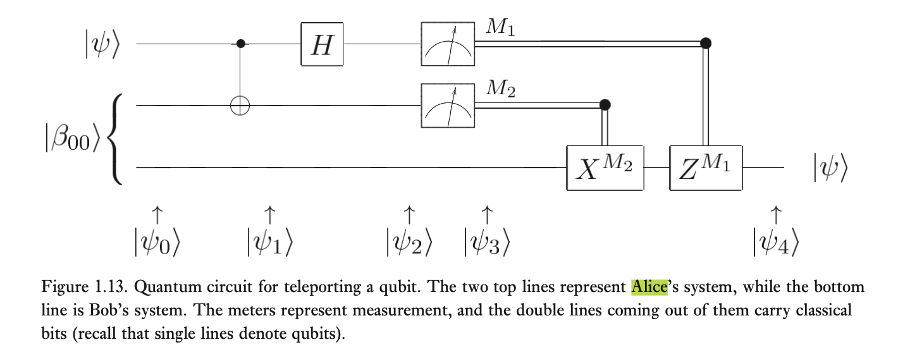

### 第一课
- 量子信息论：Holevo定理-Schumacher定理-HSW定理

- 量子力学的基本假设
1. **波函数假设**  系统状态为$\Psi(\mathbf{r},t)$ ，或记为$|\Psi \rangle$ 。对于孤立系统，波函数为完全描述，并有几率波解释
2. **算符假设**  力学量可用线性厄密算符表示。共轭力学量算符的不可对易性是量子力学的基本特征
3. **测量假设**  对力学可观测量的测量是系统随机落入该力学量的一个本征态$|\phi_{m}\rangle$，概率为$|\langle \phi_m|\Psi\rangle|^2$
4. **态演化假设**  量子态所遵循的演化方程为Schrodinger方程
5. **全同性假设**  全同粒子体系的波函数对于任意两粒子的交换是对称的（玻色子情形）或反对称的（费米子情形）【不可区分】，即自然届存在的$|\psi\rangle$必须是所有交换算符的本征态

- L.Vaidman的光敏炸弹问题
	- 光敏炸弹：光学窗口吸收到光子则爆炸
	- 问题：有没有办法在这些炸弹中辨识出一些可爆弹，而不引起所有可爆弹发生爆炸？
	- 可叠加原理-单光子干涉仪-25%的未失效炸弹
- 延迟选择实验（惠勒，1981演讲）
- 信息-Rolf Landauer
- Stern-Gerlach实验-自旋
- 布拉赫球
	
	- 1 qubit可以存储无限经典比特信息（无法提取，但还是有意义的）
- S. J. Wiesner's quantum bank card & quantum money
- QKD：BB84协议
- 保密通信系统的物理模型
	
- 量子号-京沪干线
- 主动防御问题
	- 量子计算机的物理局限性-对量子计算机内部结构和工作原理深入研究
	- 发展抗量子攻击的密码算法的意义-可以对抗未来构造的任何量子算法的攻击
- Entanglement
	- 纯态（pure states）-受限纠缠态（bound entangled，distillable）-不纠缠（unentangled）
	- teleportation
		
- 量子图灵机-David Deutsch