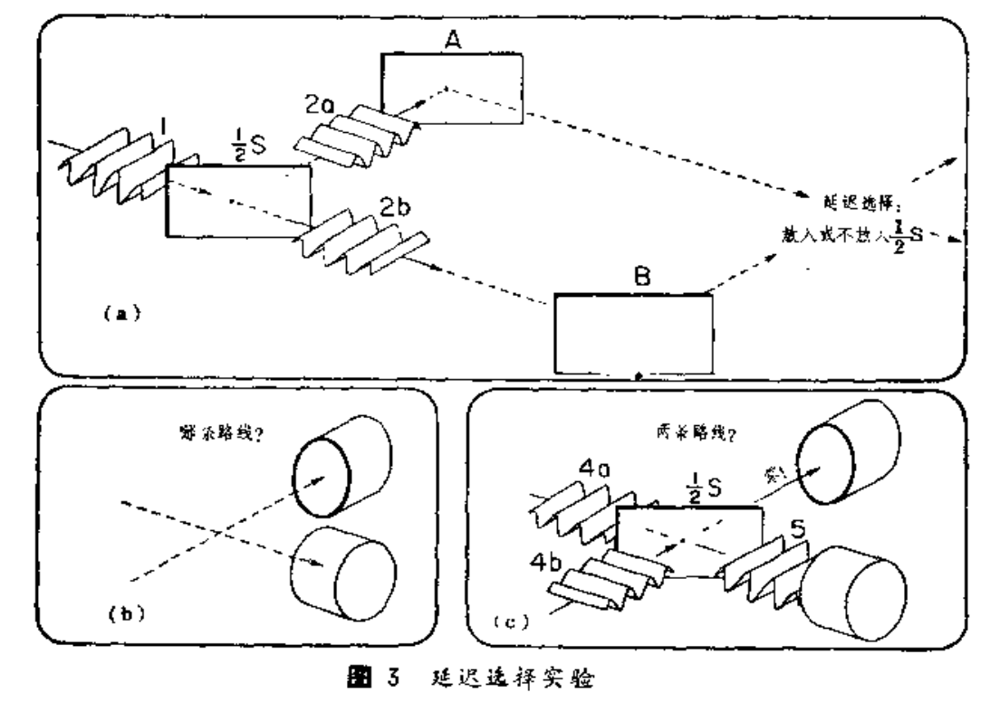
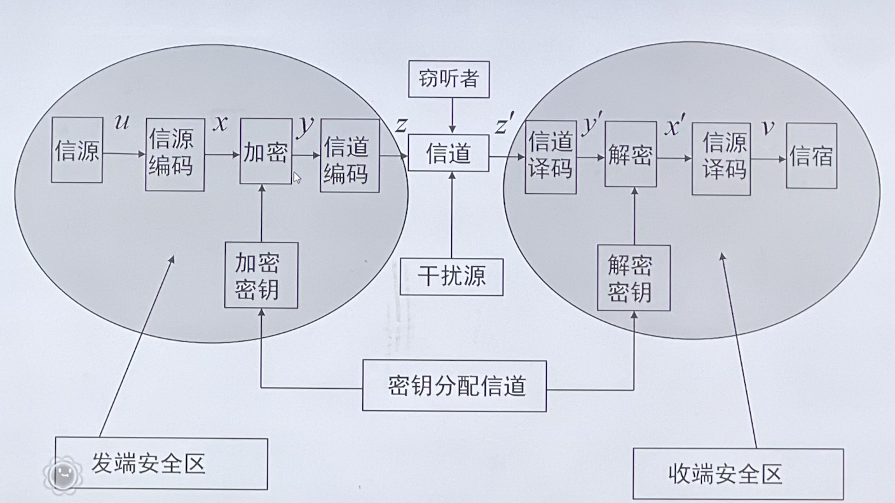

## 第一课
- 量子信息论：Holevo定理-Schumacher定理-HSW定理

- 量子力学的基本假设
1. **波函数假设**  系统状态为$\Psi(\mathbf{r},t)$ ，或记为$|\Psi \rangle$ 。对于孤立系统，波函数为完全描述，并有几率波解释
2. **算符假设**  力学量可用线性厄密算符表示。共轭力学量算符的不可对易性是量子力学的基本特征
3. **测量假设**  对力学可观测量的测量是系统随机落入该力学量的一个本征态$|\phi_{m}\rangle$，概率为$|\langle \phi_m|\Psi\rangle|^2$
4. **态演化假设**  量子态所遵循的演化方程为Schrodinger方程
5. **全同性假设**  全同粒子体系的波函数对于任意两粒子的交换是对称的（玻色子情形）或反对称的（费米子情形）【不可区分】，即自然届存在的$|\psi\rangle$必须是所有交换算符的本征态

- L.Vaidman的光敏炸弹问题
	- 光敏炸弹：光学窗口吸收到光子则爆炸
	- 问题：有没有办法在这些炸弹中辨识出一些可爆弹，而不引起所有可爆弹发生爆炸？
	- 可叠加原理-单光子干涉仪-25%的未失效炸弹
- 延迟选择实验（惠勒，1981演讲）
- 信息-Rolf Landauer
- Stern-Gerlach实验-自旋
- 布拉赫球
	
	- 1 qubit可以存储无限经典比特信息（无法提取，但还是有意义的）
- S. J. Wiesner's quantum bank card & quantum money
- QKD：BB84协议
- 保密通信系统的物理模型
	
- 量子号-京沪干线
- 主动防御问题
	- 量子计算机的物理局限性-对量子计算机内部结构和工作原理深入研究
	- 发展抗量子攻击的密码算法的意义-可以对抗未来构造的任何量子算法的攻击
- Entanglement
	- 纯态（pure states）-受限纠缠态（bound entangled，distillable）-不纠缠（unentangled）
	- teleportation
		
- 量子图灵机-David Deutsch

#### 冷离子阱方案
#### 线性光学方案
#### 约瑟夫森结方案
#### 硅基方案
#### 核磁共振方案
## 第二课：
### 线性代数
#### 矩阵的分解
$n$阶hermitian阵$A$可以酉对角化$A=U^{\dagger}DU$
- 怎么样的两个矩阵可以同时对角化-力学量可以同时测量
##### 矩阵的奇异值分解
- 定理（1939）:任意一矩阵都可以分解成一个两个酉矩阵和一个对角阵

##### 极式分解
$$A=UJ=JK$$
$U$为酉矩阵、$J、K$为半正定矩阵
##### Schmidt 分解定理
*区别于Schmidt正交化*
- 矩阵 A 的秩即是两体纯态的 Schmidt 数，大于1即为纠缠态
#### 矩阵的直积

#### 矩阵的酉对角化
- 酉变换：保持内积不变的变换
- 酉矩阵：U变换在标准正交基下的矩阵
- 定理：酉矩阵$U$可以相似于对角矩阵的充分必要条件是$A^{\dagger}A=AA^{\dagger}$
#### 谱分解定理
#### 两矩阵同时酉对角化
- 两个可交换的正规矩阵可以同时酉对角化
#### 算子函数
### 量子力学基础
#### 基本假设
1. **波函数假设** 坐标表项$\psi(\mathbf{r}, t)$
	- 波函数的引入必然导致叠加态原理和纠缠态问题
2. **算符假设**
3. **测量假设**
4. **态演化假设**
	- 薛定谔方程的哈密顿算符
5. **全同性假设**
#### 基本概念
- 量子力学独立于波动力学和矩阵力学的表述方式: 费曼量子最小作用量原理。