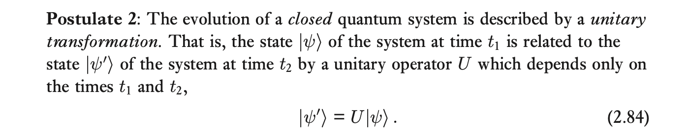
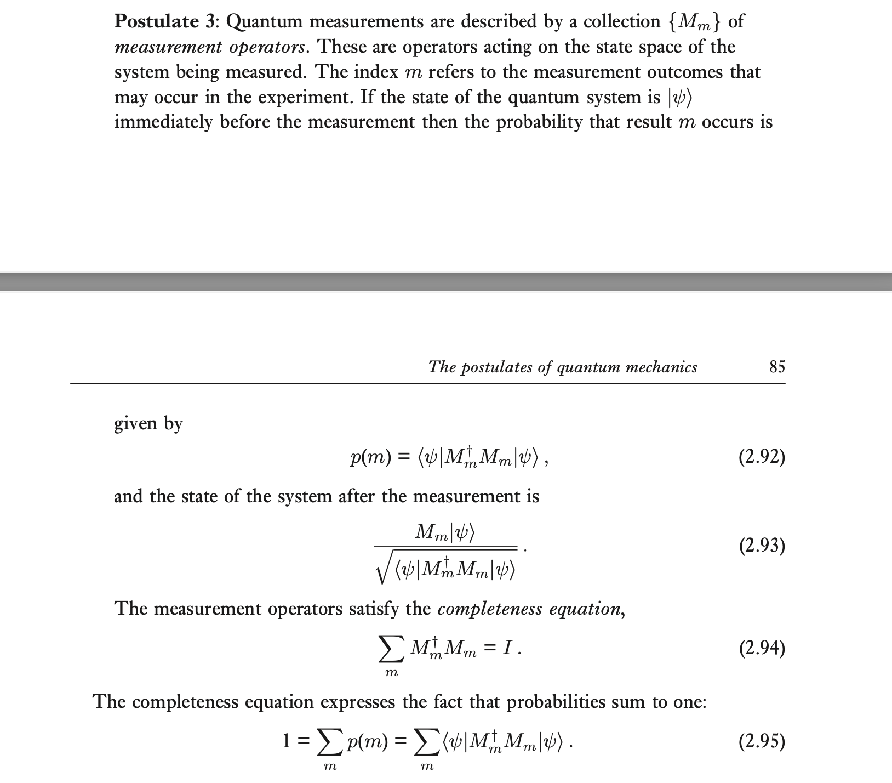
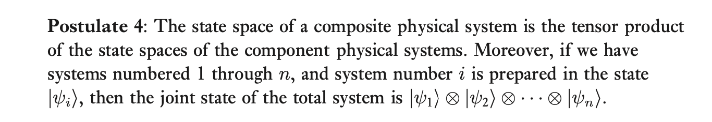
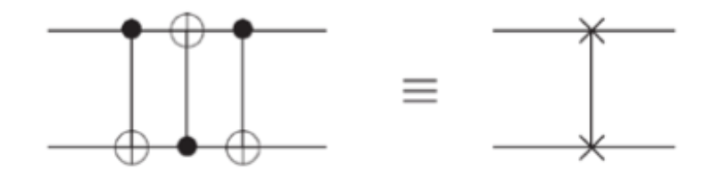
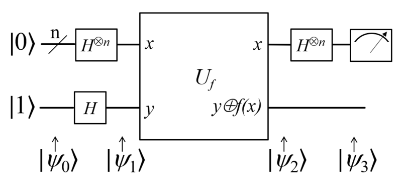
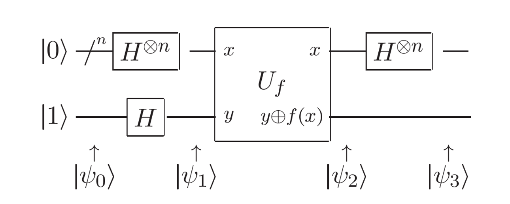

## Class I
### Outline
#### Course overview
- Background
- Course content
- Course arrangement
#### Quantum mechanics under algebra
- Postulates of quantum machanics
- Qubit: Vector
- Gate: Operator
### Back Ground

| Quantum algorithm       | Problem                                                    | Speed up       |
| ----------------------- | ---------------------------------------------------------- | -------------- |
| Deutsch-Jozza algorithm | Determine balanced or constant 判断布尔函数是否为平衡函数（01相等）或常数函数 | exp (经典复杂度) |
| Shor's algorithm        | Factorization 大数分解问题                                    | exp            |
| Grover's algorithm      | Searching                                                  | Quadratic      |
| HHL algotithm           | Linear system of equations                                 | exp            |
- 量子并非粒子，而是一种微观粒子的特性（非经典的物理特性）
- entanglement|superposition
- 超导-保真度-经典
#### Dirac notation
- $|\psi\rangle$ 列向量 $\langle \psi|$行向量
	- 内积
	- 张量积
#### Postulates of quantum mechanics
3-经典编码-11-量子编码（例如光子自旋的角度）
$x^2+1$-量子操作（例如对光子的自旋进行操作）
- P1 sets the area for quantum mechanics
- P2 tells the dynamics of a closed quantum system
- P3 describes how to extract information from quantum systems
- P4 shows how to combine different quantum systems to generate a composite one
##### Superposition(Schrodinger's cat)
- $\frac{1}{\sqrt2}|0\rangle+\frac{1}{\sqrt2}1\rangle$
- $|\psi\rangle = \alpha|0\rangle+\beta|1\rangle$
- normalized（归一化向量）
- [[Study/QS/量子信息与量子密码/index|Block Sphere]]：一个好的qubit表示形式
	- 过球心的任何一个直径正交
##### Area for quantum mechanics \[inner product\]
- **Postulate 1**： Associated to any isolated physical system is a complex vector space with inner product (that is, a Hilbert space) known as the state space of the system. The system is completely described by its state vector, which is a unit vector in the system’s state space.

	- Computational basis states:$\{|0\rangle, |1\rangle\}$
	- Qubit Qutrit Qudit\[**Pure state**(确定性的知道其态)\]
	- **mixed states**: $\rho = \sum_i p_i |\psi_i\rangle \langle \psi_i |$ 
		- Trace condition（归一）
		- Positivity condition（正定）
	- $|+\rangle$&$\frac{1}{2}(|0\rangle\langle0|+|1\rangle\langle1|)$
		- Vector and Matrix
		- Mixed为确定性的
		- 纯态的矩阵rank为1，mixed为2
		- 纯态为最大相干态，混合态为无相干（量子纯态、量子混态）
##### Dynamics of closed quantum system \[outer product\]
- 
	- Closed:系统必须封闭
	- e.g.
		- Bit flip $X = \begin{bmatrix} 0 & 1 \\ 1 & 0 \end{bmatrix}$
		- Phase flip $Z = \begin{bmatrix} 1 & 0 \\ 0 & -1 \end{bmatrix}=|0\rangle\langle 0| - |1\rangle\langle 1|$
		- Hadamard gate $H = \frac{1}{\sqrt2}\begin{bmatrix} 1 & 1 \\ 1 & -1 \end{bmatrix}=|+\rangle\langle 0| + |-\rangle\langle 1|$
	- Outer product $$(|w\rangle\langle v|)|v^{'}\rangle = =\langle v | v'\rangle |w\rangle$$
		- 从V空间向W空间转变
##### How to extract information from quantum systems
- 
- "量子态一测就没了"->应当是量子态坍缩或到了另外一个量子态上了
- 非正交的状态无法完美区分 **Proof!!!!**
- 正规算子 $A^{\dagger} = A\quad AA^{\dagger} = A^{\dagger}A$（所有量子计算的算子都是正规的）
	- 特征值模为1-酉算子
	- 特征值为实数-hermitian算子-非负-半正定-正-正定
- POVM
##### How to combine different quantum systems\[tensor product\]
- 
- n-qubit state is $2^n$-dim vector
#### Quantum entanglement
- 不能被表达为两个态的直积
#### Three important theorems
- Schmidt decompostion

## Class II
### 1-qubit operation and the relationships
- Hadmard gate
- Pauli-X
- Pauli-Y
- Pauli-Z
- Phase
- $\frac{\pi}{8}$
#### Rotation
- Operation function:$f(A) = \sum_i f(\lambda_i)|\psi_i \rangle$,where $A = \sum_i \lambda_i |\psi_i\rangle$
	- $A^2 = I, e^{i\alpha A}=\cos \alpha I + i \sin \alpha A$
- Rotation operations about 𝑥, 𝑦, 𝑧
在量子计算中，旋转操作是通过特定的量子门来实现的，这些门可以绕着布洛赫球的x、y、z轴旋转量子态。这些旋转操作的矩阵表示如下：

##### 绕x轴的旋转$(R_x(\theta))$

$$ R_x(\theta) = \begin{pmatrix} \cos(\frac{\theta}{2}) & -i\sin(\frac{\theta}{2}) \\ -i\sin(\frac{\theta}{2}) & \cos(\frac{\theta}{2}) \end{pmatrix} $$

##### 绕y轴的旋转$(R_y(\theta))$

$$ R_y(\theta) = \begin{pmatrix} \cos(\frac{\theta}{2}) & -\sin(\frac{\theta}{2}) \\ \sin(\frac{\theta}{2}) & \cos(\frac{\theta}{2}) \end{pmatrix} $$

##### 绕z轴的旋转$(R_z(\theta))$

$$ R_z(\theta) = \begin{pmatrix} e^{-i\frac{\theta}{2}} & 0 \\ 0 & e^{i\frac{\theta}{2}} \end{pmatrix} = \begin{pmatrix} \cos(\frac{\theta}{2}) - i\sin(\frac{\theta}{2}) & 0 \\ 0 & \cos(\frac{\theta}{2}) + i\sin(\frac{\theta}{2}) \end{pmatrix} $$

### Controlled operations
#### CNOT & SWAP
- $|c\rangle |t\rangle\to |c\rangle|t\oplus c\rangle$
- $|a\rangle|b\rangle \to |b\rangle|a\rangle$
- 3 CNOT = SWAP

#### Controlled-𝑈
$|c\rangle |t\rangle \to |c\rangle U^c |t\rangle$

## Class 3
### Deutsch Algorithm
**UF映射**

$|x,y\rangle \to |x, y\oplus f(x)\rangle$
- 初始化状态: $|\psi_0 \rangle = |01\rangle$
- H门
- $U_f |x\rangle \frac{(|0\rangle-|1\rangle)}{\sqrt 2}$
- 
*辅助比特-局部相位-改变原有比特的相位从而蕴含信息*
### Deutsch-Jozsa Algorithm
- 问题推广-$\{0,1\}^n$

