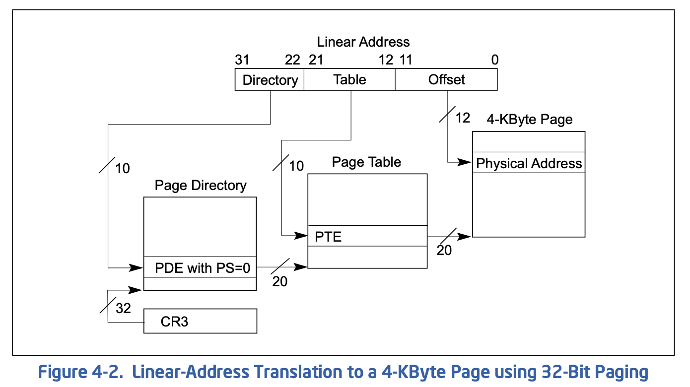
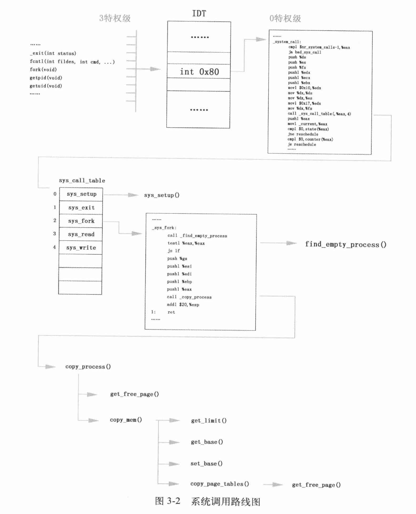

# Linux内核设计的艺术

## 启动

实模式：8086/80x86兼容的cpu操作模式，特性是一个20位的存储器地址空间，1MB

加电后入口：0xFFFF0 - BIOS

BIOS程序在内存最开始的位置(0x0000)用1KB的内存空间(0x0000~ 0x003FF)构建中断向量表，在紧挨着它的位置用256字节的内存空间构建BIOS数据区(0x00400~0x004FF)，并在大约57KB以后的位置(OxOE05B)加载了8KB左右的与中断向量表相应的若干中断服务程序

Linux 0.11，分三批加载内核代码，第一批由BIOS中断`int 0x19`将第一扇区bootsect加载到内存，而后第二、三批由bootsect指挥加载4/240个扇区至内存

`int 0x19`指向`0x0E6F2`，加载bootsect扇区的中断服务程序入口地址

### 整体技术策略

执行`main`之前，需要先执行三个由汇编代码生成的程序，即`bootsect`, `setup`, `head`，前两者是分别加载、执行的，但head,S加载方式不同，被包含在system模块中，在内存中占有$25KB+184B$空间，启示位置`0x0`，`main`程序起始位置`0x64B8`

### 流程

1. [`BIOS`] 加载bootsect
2. [`bootsect`] 加载setup被
    1. bootsect对内存规划
    2. bootsect将自身从0x7c00复制到0x90000
    3. 将setup程序加载到内存
    4. 借助BIOS提供(bootsect执行)的`int 0x13`中断向量指向的中断服务程序完成
3. [`bootsect`] 加载system模块
    1. 仍然是`int 0x13`中断
4. [`bootsect`] 设置根设备
5. [`bootsect`] `jmpi 0 SETUPSEG`跳转到0x90200执行setup程序
6. [`setup`] setup程序利用BIOS中断服务程序从设备上提取内核运行所需的机器系统数据，包括光标位置、显示页面等，加载的部分数据会覆盖bootsect程序，而且不能被覆盖，0x90000~0x901fd，510字节
7. [`setup`] 向32为模式转变（实模式$\rightarrow$保护模式）
    1. 关中断(EFLAGS IF位clear，命令`cli`，开中断`sti`)，将位于0x10000的system代码移动到内存起始位置0x0，覆盖BIOS中断向量表和BIOS数据区
    2. 设置中断描述符表(IDT, IDTR)和全局描述符表(GDT, GDTR)，GDT是系统中唯一存放段描述符的数组，为所有进程的总目录表，存放每个任务LDT和TSS地址，GDT可位于任意位置，地址在GDTR中。此时内核尚未运行，GDT第一项为空，第二/三项位内核代码/数据段描述符，而IDT是空表。两步进行：
        1. 设计内核代码时，将表写好，数据填写完成
        2. 将IDTR/GDTR指向表
    3. 打开A20`mov al,#0xdf`，实现32位寻址，最大寻址空间4GB，实模式下`0~0xfffff`，1MB寻址空间，需要20根地址线，保护模式后使用32根地址线，因此选通21(A20)~32根地址线
        1. 程序寻址超过`0xfffff`时，cpu回滚至内存地址起始处寻址，A20地址线选通意味着关闭该机制
        2. 段寄存器最大允许地址为`0xffff`，IP最大允许段内偏移`0xffff`，因此两者确定最大绝对地址为`0x10ffef`，实模式下寻址范围比1MB多出64KB，后续将利用此特点验证A20地址线打开与否
    4. 为保护模式下执行`head.s`做准备
        1. 对可编程中断控制器8259A编程，因为保护模式下`int 0x00 ~ int 0x1f`被Intel保留作为内部例外，若不重新编程，则`IRQ0x00 ~ IRQ0x0f`这部分原先的中断号将被覆盖
            1. 能管理8级向量优先级中断，最多级联成64级向量中断优先级系统
        2. 将cpu工作方式设为保护模式，CR0第0位(PE)置1，使用`lmsw`指令。cpu变为保护模式重要特征是根据GDT决定后续执行程序
        3. 跳转到head.S，`jmpi 0,8`
8. [`head`] 建立内核分页机制，`0x0~0x4fff`20KB建立页目录表
9. [`head`] 一切都是为适应保护模式做准备
    1. 本质是让CS的用法从实模式转变为保护模式。实模式下，CS本身是代码段基址，保护模式下是代码段选择符段选择符
    2. DS, ES, FS, GS等其他寄存器从实模式转变为保护模式，值都为`0x10`，即参考GDT中第二项内核数据段描述符的信息
    3. SS转变为栈段选择符，栈顶指针也变为`esp`，使用`lss _stack_start, %esp`，栈顶指针指向`user_stack`数据结构最末位置，内核栈起始位置为`0x1E25C`
    4. 重建保护模式中断服务体系，设置IDT，基址`0x54AA, idt_descr`，长度`2KB`
    5. 废除重建GDT，设置`gdtr`，原先是`setup`模块设置的数据，将来会在设计缓冲区时被覆盖，GDT段限长变为`16MB`，需要对段选择符重新设置
    6. 确认A20地址线打开
    7. 准备执行`main`，将`envp, argv, argc`，`L6`标号与`main`入口地址压栈，`main`应该不会退出，退出后将执行`L6`循环
    8. 跳转至`setup_paging`开启分页机制
        1. 将页目录表和4个页表放在物理内存起始位置
        2. 清零内存起始开始的5页
        3. 设置页目录表
        4. 从高至低填写4个页表，依次指向内存高地址向低地址方向的各个页面
        5. 设置`CR3`指向页目录表，将`CR0`最高位置1，即PG(Paging)标志
    9. 通过`ret`的方式调用`main`，事先模拟`call`指令完成压栈

### 关键解释

#### 实模式/保护模式

参考[这篇博客](https://www.junhaow.com/2018/08/27/037%20%7C%20CPU%20的两种工作模式：实模式和保护模式/)

实模式下`段基址:段内偏移`：

$$physical\ address = segament\ base \ll 4 + segment\ offset$$

保护模式下段基址变为了段选择子，指向GDT/LDT表项，表项中定义了段基址、限长、属性

#### 7.4.1


#### 7.4.2-7,4,3

```asm
mov     ax, 0x1
lmsw    ax
jmpi    0, 8

gdt:
.word 0,0,0,0 ; dummy

.word 0x07FF ; 8Mb - limit=2047 (2048*4096=8Mb)
.word 0x0000 ; base address=0
.word 0x9A00 ; code read/exec
.word 0x00C0 ; granularity=4096, 386

.word 0x07FF ; 8Mb - limit=2047 (2048*4096=8Mb)
.word 0x0000 ; base address=0
.word 0x9200 ; data read/write
.word 0x00C0 ; granularity=4096, 386
```


> 16/32位中断机制对比：16位使用位于0x0的中断向量表，32位使用中断描述符表，位置不固定

#### 8

Linux x86分页是在分段的基础上的，意味着逻辑地址需要先由分段翻译成线性地址，再由分页翻译成物理地址。分页并不是RISCV纯粹的分页。

32位4K分页示意图：



#### 9.3

`ls`指令设置段寄存器，将内存单元的一个低字传送给指令中16位寄存器，而后把高字传送给对应的段寄存器

#### 9.4


## 初始化

为系统能够随时响应用户激励：初始化设备环境，激活进程0

1. 初始化根设备、硬盘
2. 规划物理内存格局，设置主存区、缓冲区和虚拟盘，缓冲区为$\frac{1}{3}$总内存大小，之后为虚拟盘区，之后为主内存区
3. 内存管理结构`mem_map`初始化（位于内存低端内核数据区，通过`mem_init`函数），对1MB以上的内存分页进行管理，记录一个页面的使用次数，先将所有内存页面计数设置为`USED`(100)，再将主内存中所有页面计数清零，后续只将计数为0的页面视为空闲
4. 异常处理中断服务程序挂接IDT（`trap_init`）
5. 初始化块设备请求项(`blk_dev_init`)
6. 初始化串口设备(`tty_init`)
7. 初始化显示器
8. 设置键盘，键盘中断服务程序(`con_init`, `console.c`)
9. 开机启动时间设置(`time_init`)，从主板cmos采集时间数据，计算开机UNIX时间戳
10. 初始化进程0(`sched_init`)
11. 初始化缓冲区管理结构(`buffer_init(buffer_memory_end)`)
    - 通过`hash_table[NR_HASH], buffer_head`双向环链表组成的复杂哈希表管理缓冲区
    - 从内核末端和缓冲区末端同时开始相对增长、配对实现`buffer_head`、缓冲块，直到无法分配，`buffer_head`使用`free_list`串成双向环链表
12. 初始化硬盘(`hd_init`)
    - 将硬盘请求项服务程序`do_hd_request`与`blk_dev`控制结构挂接，将硬盘中断服务程序`hd_interrupt`与IDT挂接，最后复位8259A int2屏蔽位，允许中断请求，复位硬盘中断请求屏蔽位，允许硬盘控制器发送中断请求信号
13. 初始化软盘(`floppy_init`)
14. 开中断，`sti`指令，`EFLAGS`中`IF`为1
15. 进程0进入3特权级，成为真正进程
    - 使用`move_to_user_mode`模仿中断返回，压栈`ss, esp, eflags, cs, eip`，`ss, cs`都是三特权级、LDT，分别指向数据段、代码段

### 异常处理中断服务程序

```c
#define _set_gate(gate_addr,type,dpl,addr) \
__asm__ ("movw %%dx,%%ax\n\t" \
    "movw %0,%%dx\n\t" \
    "movl %%eax,%1\n\t" \
    "movl %%edx,%2" \
    : \                                                    // output
    : "i" ((short) (0x8000+(dpl<<13)+(type<<8))), \        // %0
    "o" (*((char *) (gate_addr))), \                       // %1
    "o" (*(4+(char *) (gate_addr))), \                     // %2
    "d" ((char *) (addr)),"a" (0x00080000))                // %edx, %eax

#define set_trap_gate(n,addr) \
    _set_gate(&idt[n],15,0,addr)
```


### 初始化进程0

- 进程0`task_struct`中的`LDT, TSS`与`GDT`连接，对进程调度相关寄存器初始化
- 设置时钟中断
    - 8253定时器设置，`#defineLATCH (1193180/HZ)`，每10ms发生一次中断
- 通过`set_system_gate`将`system_call`与IDT挂接
    - `system_call`挂接`int 0x80`中断描述符表项

## 进程1

### 进程0通过`fork`创建第一个子进程

fork执行过程：



`_sys_fork`是汇编实现的，`int 0x80`软中断使`ss, esp, eflags, cs, eip`寄存器按顺序压入进程0内核栈

参数使用栈传递，`_system_call`中，系统调用ABI参考[Assembly ABI]({{/post/Study/Language/Program/Assembly/CourseNotes/index.md#ABI}})

### `sys_fork`

1. `find_empty_process`
2. `copy_process`
3. 进程1先分段再分页
    1. 设置代码段数据段(`copy_mem`)
    2. 创建第一个页表，设置页目录项
4. 进程1共享父进程文件
5. 设置进程1在GDT中的表项
6. 进程1就绪

### 内核第一次进程调度

进程切换情况：

- 允许进程允许的时间结束
- 进程运行停止

`schedule` $\rightarrow$ `switch_to`

x86 `switch_to`采用`ljmp`自动切换任务，使用临时数据结构`__tmp`组建远跳转操作数，4字节偏移+2字节段选择符，在任务切换时偏移无用，`ljmp`会根据传入的新任务TSS选择符加载新任务TSS，并且跳转到新任务`eip`(`fork`操作下一条指令)

### 准备安装硬盘文件系统

1. 进程1设置硬盘`hd_info`，根据机器系统数据中的`drive_info`(`sys_setup`系统调用)
    - 根据机器系统数据设置硬盘参数，柱面、磁头、磁道、扇区
    - 一个物理磁盘最多可分为4个逻辑盘，共5个
2. 读取硬盘引导块(0号逻辑块)到缓冲区
    - 加载分区表
    - 缓冲块的寻找需要查找哈希表
    - 缓冲块鱼请求项挂接
3. 从引导块获取信息，读盘操作如下：
    1. `bread`
    2. `getblk`: 缓冲区中申请空闲缓冲块
        - `get_has_table`查找哈希表，`find_buffer`查找缓冲区中是否有指定设备、块号的缓冲块
        - 在空闲表中申请新的空闲缓冲块
    3. `ll_rw_block`: 将缓冲块与请求项结构挂接，请求项即请求磁盘磁头、扇区、柱面等信息的数据结构
        1. `make_request`加锁，建立关系
        2. `add_request`向请求项队列加载请求项，调用硬盘请求项处理函数`dev->request_fn`，即`do_hd_requst`
    4. 读硬盘(`do_hd_requst`): `hd_out`函数下达硬盘操作指令，`read_intr`读操作对应的中断服务程序，`write_intr`写
    5. `wait_on_buffer`挂起等待硬盘返回，切换至进程0执行
    6. 硬盘中断服务程序响应
        - `read_intr`将已经读到硬盘缓存中的数据复制到刚才被锁定的缓冲块
        - `end_request`: 更新缓冲块标志为可用
        - `unlock_buffer`解锁缓冲块，`wake_up`唤醒进程1
    7. 进程1读完缓冲块后使用`brelse`释放
4. 根据引导块中的分区表设置`hd[]`数组

### 格式化虚拟盘并作为根设备替代软盘

虚拟盘格式化所需的信息在boot OS的软盘上，1个扇区`bootsect`，4个扇区`setup`，240个扇区包含`head`的system模块，从256个扇区开始时格式化虚拟盘的信息，通过这些信息使得虚拟盘成为一个块设备

通过`breada`预读函数读连续数据块，super block位于257块

加载根文件系统到虚拟盘

虚拟盘设置为根设备：

```C
ROOT_DEV = 0x0101;
```

### 加载根文件系统

文件系统可以组成树形结构，加载文件系统：把一个逻辑设备上文件系统的根结点关联到另一个文件系统的inode上，inode通过`mount`指定。

唯一的根、不可被挂载在其他文件系统：根文件系统，挂载在`super_block[8]`(数组)，每个super block管理一个逻辑设备

加载根文件系统(`mount_root`)步骤：

1. 复制根设备super block到`super_block[8]`中(`read_super`)，将根设备根inode挂在`super_block[8]`中根设备的超级块上(`iget`，虚拟盘读取根inode)
    - `iget`从`inode_table[32]`(控制同时打开不同文件的最大数)，申请空闲节点位置
2. 挂接inode map, block map
3. 将当前进程`pwd/root`指针指向根节点


## 进程2(Shell)

### 打开中断设备文件

#### 打开stdio文件

进程1通过`open`函数打开`/dev/tty0`，创建输入设备，通过`duo(0)`创建标准输出设备，再使用`dup(0)`创建标准输出设备

`filp[20]`进程所持有的文件句柄，进程最多打开20个文件，`file_table[64]`全局打开的文件，操作系统最多可以打开64个文件

- 将进程1的`filp[20]`空闲项(第0项)与`file_table[64]`空闲项(第0项)挂接
- 确定绝对路径的起点，并遍历解析路径，读虚拟盘上对应目录项的逻辑块

### 创建进程2

依然用`fork`，返回后进程1会使用`wait`等待进程2返回

#### 加载shell程序

关闭stdio文件，用`/etc/rc`文件替换

```C
execve("/bin/sh", argv_rc, envp_rc);
```

#### 为shell程序执行做准备

##### 加载参数和环境变量

##### 调整进程2`task_struct`管理结构

解除与父进程共享的文件、页面，准备私有LDT、代码段、数据段、栈段等

##### 设置`eip/esp`准备执行shell

#### 执行shell程序

shell线性地址空间程序内容未加载，会产生page fault，调用缺页中断处理程序加载一页shell程序(`do_no_page`)

`do_no_page`判断缺页原因：

- 如果不是加载程序导致的，比如压栈缺页，直接申请页面并返回
- 尝试与其他进程共享程序
- 为shell申请一页新内存，读取1页进入
- 清空一页中超出进程数据空间范围的部分
- 将加载页的内容映射到进程线性地址空间内

### 系统怠速

#### 创建Updata进程

`/etc/rc`脚本命令：

```sh
# ...
/etc/updata &
# ...
echo "/dev/hdl /" > /etc/mtab
```

updata进程任务：将缓冲区的数据同步到外设上，内核只写缓冲区，使用进程定期同步到外设

#### 切换到shell进程执行

shell读取完`/etc/rc`后退出，执行`exit()`，释放页面、内存、文件，子进程由父继承，给父进程(1)发`SIGCHLD`，父进程进入`waitpid`继续执行

#### 重建shell

关闭所有打开的文件，重新打开标准输入输出文件，加载shell进程，识别打开的是`tty0`字符设备文件，进入`rw_char`，设置shell进程可中断等待状态，切换到进程0执行，实现怠速

- 用户通过键盘输入信息，存储在指定的字符缓冲队列
- shell响应键盘中断不断读取/处理队列上的数据信息

## 文件操作

### 安装文件系统

Linux内核`super_block[8]`结构体中第0项为根设备虚拟盘super block、第1项为硬盘super block，根设备虚拟盘中含有根文件系统

1. 读取硬盘super block，加入系统`super_block[8]`中某项
2. 将虚拟盘上指定inode读出，加载到系统`inode_table[32]`中
3. 硬盘super block挂接到`inode_table[32]`指定的inode上

### 打开文件

本质是建立`*filp[20]/file_table[64]/inode_table[32]`三者之间的关系

一级一级解析路径，获取最后一级`inode`，而后遍历最后一级目录、找到文件，将文件inode(已在`inode_table[32]`中)与`file_table[64]`挂接

Linux文件`fd`也是在`file_table[64]`中的偏移量

### 读文件

`file_read`，通过`bmp`函数确定指定文件数据块在外设上的逻辑块号

inode通过`i_zone`结构管理文件数据块，文件数据小于7块时使用`io_zone[0:7]`，`io_zone[8:9]`分别是一级间址块、二级间址块

创建/写文件都类似

文件同步到外设：

1. 通过`sys_sync`，将改动过的文件节点写入缓冲区，遍历整个缓冲区，只要发现内容被改动过`b_dirt == 1`，同步到外设
2. 缓冲区满，强制同步

## 用户进程与内存管理

IA-32线性地址空间范围是`0~4GB`，Linux 0.11策略是将其分为64等份，每份64MB，每个进程1份，最多同时开启64个进程(`task[64]`)

### 段

#### 从一个进程非法跳转到另一个进程

LDT保护，每个LDT都有3项：空、进程代码段、进程数据段，`ljmp`指令后面的操作数是段内偏移:段选择子，所有CS都是`000f`，硬件无法识别是哪个进程的CS，无法选择段描述符，只能默认用当前LDT提供的段描述符

问题：LDT段和TSS段段限长是一样的，但LDT只有24B，若使用非法CS作为`ljmp`操作数，则有可能出错，但数据段/栈段没变

#### 从一个进程非法跨越到内核

GDT/LDT位于内核数据区，只有0特权代码能够修改

### 分页

页目录项和页表项最后三项`U/S, R/W, P`，页目录项/页表项与页面建立了映射关系，`P`为1，否则将产生缺页中断

Linux 0.11页目录表唯一，其中含有1024个页表，一个页表掌控1024个页面，一个页面4K，每个进程可以占用16个页目录项，16个页表，64MB物理页面

#### 进程共享页面

`U/S, R/W`位：

- `U/S`，若为0，则特权级为3的程序不可以访问该页面；若为1，所有程序都可以，隔离内核和用户程序
- `R/W`，若为0，则页面只读，若为1，则可读写，共享页面只读

copy on write

#### 内核分页

内核段基址为0，代码段/数据段段限长尾16MB，内核需要4个页目录项下辖4个页表管理这部分内存

内核采用线性地址到物理地址的恒等映射

对CR3的操作指令只能在特权级0的代码执行

### 用户进程从创建到退出

`copy_process`

1. 为str1进程管理结构找到存储空间
2. 复制`task_struct`
3. 个性化设置`task_struct`相关字段（时间片值、信号、TSS等）
4. 复制页表及页目录项
5. 建立str1进程与GDT关联，将TSS与LDT挂接在GDT指定位置处

`task_struct`结构中，关于信号的字段有三个: `signal`, `sigaction[32]`, `blocked`，表示信号位图、信号处理函数挂接点、信号屏蔽码

`do_execve`

解析可执行文件(lazy load)，进一步个性化设置`task_struct`，释放进程页表，重新设置代码段和数据段(LDT)，设置`eip, esp`

进程一执行便会产生缺页中断，进入内核加载对应页面

进程第一次压栈不会缺页，之前参数设置已经完成栈的分配；但栈大小与启动参数空间超过1页即会产生缺页中断

### 进程调度

时钟中断会削减当前执行进程时间片，若为0，则切换进程

所有进程时间片都用完时内核从`task[]`末端重新分配时间片，大小为$\frac{counter}{2} + priority$，

### 页写保护

通过`fork`产生出的两进程共享只读页面，受到页写保护，例如压栈操作将触发页写保护中断，服务程序是`un_wp_page`，申请空闲页面备份将要修改的页面，将原页面引用计数减1，修改当前进程页表指向新页面，修改新页面属性为可读写

另一个进程也开始写页面时，直接修改原页面为可读写

## 缓冲区和多进程操作文件

缓冲区是内存中的块设备cache，进程与缓冲区数据交互由`buffer_head`结构管理，确保数据交互正确的前提下让数据在缓冲区中停留的时间尽可能长；缓冲区与块设备数据交互使用`request`，及时将进程修改过的缓冲块数据同步到块设备

```C
struct buffer_head {
    char * b_data;            /* pointer to data block (1024 bytes) */
    unsigned long b_blocknr;    /* block number */
    unsigned short b_dev;        /* device (0 = free) */
    unsigned char b_uptodate;
    unsigned char b_dirt;        /* 0-clean,1-dirty */
    unsigned char b_count;        /* users using this block */
    unsigned char b_lock;        /* 0 - ok, 1 -locked */
    struct task_struct * b_wait;
    struct buffer_head * b_prev;
    struct buffer_head * b_next;
    struct buffer_head * b_prev_free;
    struct buffer_head * b_next_free;
};

struct request {
    int dev;        /* -1 if no request */
    int cmd;        /* READ or WRITE */
    int errors;
    unsigned long sector;
    unsigned long nr_sectors;
    char * buffer;
    struct task_struct * waiting;
    struct buffer_head * bh;
    struct request * next;
};
```

`b_dev`/`b_blocknr`不仅保证正确性，而且是数据在缓冲区多停留一段时间的基础，停留在缓冲区的标志：缓冲块与硬盘数据块存在绑定关系

内核从哈希表中搜索缓冲块时只看设备号和块号

缓冲区与硬盘交互: `ll_rw_block`/`make_request`/`add_request`

`add_request`维护请求项队列，读写硬盘中断服务程序在执行完一对缓冲块和数据块交互后，都调用`end_request`和`do_hd_request`

请求项大小32: 数据在内存中交互比与硬盘交互快2个数量级，若请求项过大，则硬盘来不及处理、请求项闲置；若请求项过小，则进程找不到请求项将被频繁挂起，系统运行效率降低。因此需要平衡两种交互的频率

`b_uptodate`为1说明数据块时最新的，为0则表明不支持进程共享/使用，`b_dirt`为1说明缓冲块的内容应该呗同步到硬盘

`b_lock`缓冲块是否在与硬盘交互数据

为了让数据多在缓冲区停留，内核尽可能不申请新的缓冲块，沿用已经绑定关系的缓冲块

- 内核先搜索哈希表，比对`b_dev/b_blocknr`
    - 若不存在，则申请新块，从`free_list`表头开始搜索
        - `b_count`
            - 不为0，缓冲块被其他进程共享，无权使用，若找不到为0的块则当前进程挂起
            - 为0，则检查
                - `b_dirt/b_lock`，全0直接选，有一个为1，优先选择`b_lock`为1的块，等待缓冲块与硬盘交互完成即可使用，`b_dirt`为1后也会过渡到`b_lock`为1，多一个步骤的时间

## 进程间通信

### 创建管道

管道就是一页内存，但进程要以操作文件的方式对其进行操作，该页不能映射到用户的线性地址空间内

### 管道操作

若管道有未读数据，则读，否则就挂起；写同理。读写指针循环回滚

### 信号机制

局部中断机制，进程调度时若发现某个进程受到了信号，则打断现有进程的执行，转去执行对应进程的信号处理函数，而后返回继续执行打断的进程

