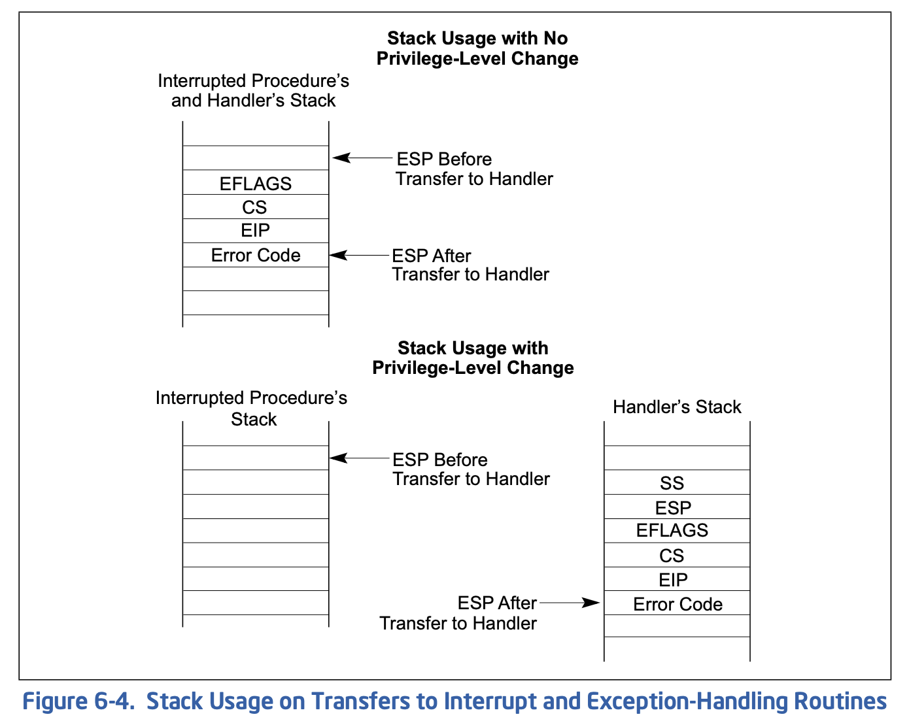
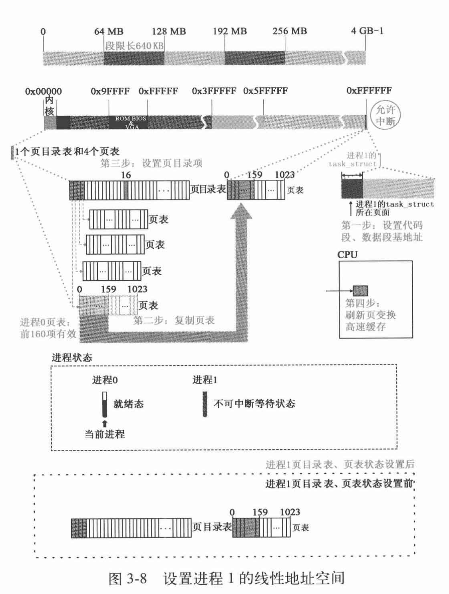

# Questions of Linux Art

## 进程2(Shell)

为何要提前打开stdio文件，然后再关闭

## IA32 Assembly

```asm
push
pop
cld;rep;stosl
std
```

# Homework Questions

## 第二次作业

{}
1. 为什么开始启动计算机的时候，执行的是BIOS代码而不是操作系统自身的代码？
{}

Answer: 刚启动计算机的时候内存里没有任何合法数据，需要从BIOS芯片开始执行，从磁盘搬运操作系统代码到内存之后才可以执行。

{}
2. 为什么BIOS只加载了一个扇区，后续扇区却是由`bootsect`代码加载？为什么BIOS没有直接把所有需要加载的扇区都加载？
{}

Answer: 不同操作系统的实现是不同的，`bootsect`之外的代码大小和位置都不容易确定，因此主板BIOS和操作系统遵循统一设计约定，只将最多一个扇区(512B)的`bootsect`放在起始位置，BIOS仅负责加载`bootsect`，剩下的操作系统内核程序由`bootsect`自行/自由加载

{}
3. 为什么BIOS把`bootsect`加载到`0x07c00`，而不是`0x00000`？加载后又马上挪到`0x90000`处，是何道理？为什么不一次加载到位？
{}

Answer: 

1. 内存起始处已经设置了中断向量表，将`bootsect`加载到`0x0`会引起冲突；
2. 操作系统可以自由决定内存布局，原先BIOS所在的`0x7c00`处将会有其他的数据结构占用，需要移往更高的安全地址，Linux选取的是`0x90000`；
3. 不一次加载到`0x90000`处是因为BIOS设计者向前兼容了内存只有640KB或更少内存的旧设备，将BIOS的寻址空间作了限制，而两段加载的方式给予操作系统设计者更加自由的内存安排选择。

{}
4. `bootsect`、`setup`、`head`程序之间是怎么衔接的？给出代码证据。
{}

Answer: 

`bootsect` $\rightarrow$ `setup`:

```asm
! after that (everyting loaded), we jump to
! the setup-routine loaded directly after
! the bootblock:

	jmpi	0,SETUPSEG
```

`jmpi`是过去的汇编指令，目前已经没有汇编器支持，当前能查到的手册里intel汇编指令直接使用`jmp [ptr/mem]:[ins]`，AT&T汇编采用`ljmp`，对比参见[此处](https://www.cs.mcgill.ca/~cs573/winter2001/AttLinux_syntax.htm)

AT&T汇编为：

```asm
    ljmp $SETUPSEG, $0
```

`setup` $\rightarrow$ `head`:

```asm
    jmpi 0,8 ! jmp offset 0 of segment 8 (cs)
```

AT&T汇编为：

```asm
				            # segment-descriptor        (INDEX:TI:RPL)
	.equ	sel_cs0, 0x0008 # select for code segment 0 (  001:0 :00) 
	ljmp	$sel_cs0, $0	# jmp offset 0 of code segment 0 in gdt
```

段选择子见[IA32 Manual]()，此处为GDT第二项

{}
5. setup程序的最后是`jmpi 0,8` ，为什么这个8不能简单的当作阿拉伯数字8看待，究竟有什么内涵？
{}

Answer: 见上题。

{}
6. 保护模式在“保护”什么？它的“保护”体现在哪里？特权级的目的和意义是什么？分页有“保护”作用吗？
{}

Answer: 保护模式开启：`setup.s`中使用

```asm
# Linus
	mov	ax,#0x0001	! protected mode (PE) bit
	lmsw	ax		! This is it!
```

保护内核/用户程序和地址空间不被其他用户程序非法执行或访问，通过硬件完成间接寻址、将虚拟地址映射到用户无法预估的物理地址、从而隐藏真实物理地址。

特权级的目的是限制用户对于系统关键组件的修改（例如GDTR/LDTR等），防止用户自定义数据结构覆盖内核指定的数据结构，引发非法访问的安全隐患。特权级影响范围是段，所有段选择符最后两位标识特权级。

分页也有保护作用，保证内核可以访问所有用户进程的空间，但用户进程不能够互相访问或访问内核。内核分页线性递增，能够知道虚地址实际对应的物理地址，用户程序的地址空间从高到低分配，进程的动态执行与临时分页使得页分配具有随机性，无法被预测。

{}
7. 在`setup`程序里曾经设置过`GDT`，为什么在`head`程序中将其废弃，又重新设置了一个？为什么设置两次，而不是一次搞好？
{}

Answer: `head`中在设计缓冲区时`setup`设置的`GDT`将被覆盖。

因为要在`setup`中开启保护模式，只能使用`jmpi`跨段跳转，所有需要提前设置好`GDT`，但此时`GDT`只是为了`setup`能够正确执行，所以只包含其代码段数据段的项是合理的。因为`setup`全局仅使用一次，因此Linux在此建立再废除、重新设置的方式是很合适的，能够充分利用内存资源。

后续`head`直接执行内核本身代码，防止`setup`设置的GDT干扰，两次GDT设置是必须的，位置移动是由于编码上由于`setup`模块单读编译，不便在`head`中复用`setup`中的标志，因此在`head`中重新使用标签设置GDT更加方便。

{}
8. 内核的线性地址空间是如何分页的？画出从`0x000000`开始的7个页（包括页目录表、页表所在页）的挂接关系图，就是页目录表的前四个页目录项、第一个页表的前7个页表项指向什么位置？给出代码证据。
{}

页目录表和页表放在物理地址起始位置，从最高地址空间(Linux 0.11保护模式下最大寻址地址`0xffffff`)，按照线性递减的方式设置页表项分配内核页面，方便内核能够直接以虚地址访问物理地址。

图省略，代码：

```C
.org 0x1000
pg0:

.org 0x2000
pg1:

.org 0x3000
pg2:

.org 0x4000
pg3:

.align 2
setup_paging:
	movl $1024*5,%ecx		/* 5 pages - pg_dir+4 page tables */
	xorl %eax,%eax
	xorl %edi,%edi			/* pg_dir is at 0x000 */
	cld;rep;stosl
	movl $pg0+7,_pg_dir		/* set present bit/user r/w */
	movl $pg1+7,_pg_dir+4		/*  --------- " " --------- */
	movl $pg2+7,_pg_dir+8		/*  --------- " " --------- */
	movl $pg3+7,_pg_dir+12		/*  --------- " " --------- */
	movl $pg3+4092,%edi
	movl $0xfff007,%eax		/*  16Mb - 4096 + 7 (r/w user,p) */
	std
1:	stosl			/* fill pages backwards - more efficient :-) */
	subl $0x1000,%eax
	jge 1b
	xorl %eax,%eax		/* pg_dir is at 0x0000 */
	movl %eax,%cr3		/* cr3 - page directory start */
	movl %cr0,%eax
	orl $0x80000000,%eax
	movl %eax,%cr0		/* set paging (PG) bit */
	ret			/* this also flushes prefetch-queue */
```

`cld;rep;stosl`向高地址移动，将`%eax`值存储到`%edi`起始的内存位置，存储长度为`%ecx`，即清除内存起始的5页

使用四个页表地址设置页目录表前四项，从`16MB`(Linux注释误导人)页面设置页表中对应项

最后设置`cr3`为`0x0`

{}
9. 根据内核分页为线性地址恒等映射的要求，推导出四个页表的映射公式，写出页表的设置代码。
{}

Linux 0.11保护模式最高支持16MB内存，分在4个页表里，共4K页，因此以[23:22]位索引页表、以[21:12]位索引页表项，以[11:0]表示页偏移找到具体的页。

公式：

$$physical\ addr = page\_directory\_entry\_table[virtual\ addr[23:22]][virtual\ addr[21:12]] + virtual\ addr[11:0]$$

代码见上题

{}
10. 为什么不用`call`，而是用`ret`“调用”`main`函数？画出调用路线图，给出代码证据。
{}

`call`说明会返回原函数执行流，但Linux此时并不需要返回，`head`只进行初始化处理，操作系统是作为持续执行的程序、除非强制下电不会退出，操作系统的主循环为调度函数、处理系统调用，且是永续循环，并没有涉及退出操作，即`noreturn main`

因此通过模拟退栈使用`ret`去无返回地“调用”`main`是合理的

## 第三次作业
  
{}
1、计算内核代码段、数据段的段基址、段限长、特权级。
{}

GDT第二项：`0x00c09a0000000fff`，根据[段描述符结构]()，[43:41]为`101`，即代码段，段基址0，段限长根据G(Granularity，粒度)位决定是否是字节为单位还是4KB为单位，此处G为1，因此段限长为$0x1000 \times 4KB = 16MB$，特权级为[46:45]，即0

GDT第三项：`0x00c0920000000fff`，[43:41]为`001`，为数据段，数据同上

{}
2、计算进程0的代码段、数据段的段基址、段限长、特权级。
{}

answer: 进程0 LDT位于`INIT_TASK`结构体:

```C
    { \
		    {0,0}, \
/* ldt */	{0x9f,0xc0fa00}, \
		    {0x9f,0xc0f200}, \
	}
```

在GDT中设置LDT/TSS代码：

```C
#define _set_tssldt_desc(n,addr,type) \
__asm__ ("movw $104,%1\n\t" \
	"movw %%ax,%2\n\t" \
	"rorl $16,%%eax\n\t" \
	"movb %%al,%3\n\t" \
	"movb $" type ",%4\n\t" \
	"movb $0x00,%5\n\t" \
	"movb %%ah,%6\n\t" \
	"rorl $16,%%eax" \
	::"a" (addr), "m" (*(n)), "m" (*(n+2)), "m" (*(n+4)), \
	 "m" (*(n+5)), "m" (*(n+6)), "m" (*(n+7)) \
	)

#define set_tss_desc(n,addr) _set_tssldt_desc(((char *) (n)),addr,"0x89")
#define set_ldt_desc(n,addr) _set_tssldt_desc(((char *) (n)),addr,"0x82")
```

运行中debug信息：

```sh
(gdb) p/x gdt[5]
$4 = {a = 0xa4300068, b = 0x8201}
```

可以印证GDT中所有项都是0特权级，表明只有内核能够访问GDT中的表项，利用GDT表项设置`LDTR`，而LDT中[46:45]位均为`0x11`即3特权级。

- 进程0代码段段基址0，段限长$0xa0 \times 4KB = 640KB$，特权级3
- 进程0数据段段基址0，段限长$640KB$，特权级3

{}
3、`fork`进程1之前，为什么先调用`move_to_user_mode()`？用的是什么方法？解释其中的道理。
{}

answer: 进程0和进程1怠速情况下都应该在用户态运行，与其他进程进行同样的调度，以支持系统以怠速状态运行。目前并没有引入内核进程/线程的概念，通过从用户态按照系统调用的方式调用`fork`操作也是更合理的操作。

```C
#define move_to_user_mode() \
__asm__ ("movl %%esp,%%eax\n\t" \
	"pushl $0x17\n\t" \
	"pushl %%eax\n\t" \
	"pushfl\n\t" \
	"pushl $0x0f\n\t" \
	"pushl $1f\n\t" \
	"iret\n" \
	"1:\tmovl $0x17,%%eax\n\t" \
	"movw %%ax,%%ds\n\t" \
	"movw %%ax,%%es\n\t" \
	"movw %%ax,%%fs\n\t" \
	"movw %%ax,%%gs" \
	:::"ax")
```

通过伪造中断上下文使用`iret`的方式硬件改变特权级，经过阅读x86 Manual，`iret`pop stack的顺序是`eip, cs , eflags`，因此在执行完`iret`后执行`1`标签后的代码，`cs`为`0x0f`，即`RPL`为3，则`iret`之后以3特权级执行代码，切换到用户态。

{}
4、根据什么判定`fork`之后的代码为进程0的代码。
{}

answer: 根据x86 ABI，使用`%eax`存储返回值，进程0 TSS中的设置为`p->tss.eax = 0;`，而父进程直接返回`return last_pid;`，`_sys_fork`会先调用`_find_empty_process`，将`last_pid`增加，因此父进程返回值一定为正，会与进程0区分开。

{}
5、进程0的`task_struct`在哪？具体内容是什么？给出代码证据。
{}

answer: 通过`sched_init`设置了进程0的TSS，具体内容：

```C
static union task_union init_task = {INIT_TASK,};
#define INIT_TASK \
    ... \
/*tss*/
    {0,PAGE_SIZE+(long)&init_task,0x10,0,0,0,0,(long)&pg_dir,\
	 0,0,0,0,0,0,0,0, \
	 0,0,0x17,0x17,0x17,0x17,0x17,0x17, \
	 _LDT(0),0x80000000, \
		{} \
	}
```

{}
6、在`system.h`里  

```C
#define _set_gate(gate_addr,type,dpl,addr) \  
__asm__ ("movw %%dx,%%ax\n\t" \  
    "movw %0,%%dx\n\t" \  
    "movl %%eax,%1\n\t" \  
    "movl %%edx,%2" \  
    : \  
    : "i" ((short) (0x8000+(dpl%%13)+(type%%8))), \  
    "o" (*((char *) (gate_addr))), \  
    "o" (*(4+(char *) (gate_addr))), \  
    "d" ((char *) (addr)),"a" (0x00080000))

#define set_intr_gate(n,addr) \  
    _set_gate(&idt[n],14,0,addr)

#define set_trap_gate(n,addr) \  
    _set_gate(&idt[n],15,0,addr)

#define set_system_gate(n,addr) \  
    _set_gate(&idt[n],15,3,addr)
```

读懂代码。这里中断门、陷阱门、系统调用都是通过`set_gate`设置的，用的是同一个嵌入汇编代码，比较明显的差别是dpl一个是3，另外两个是0，这是为什么？说明理由。
{}

answer: 防止用户手动调用中断门、陷阱门，应该由硬件直接调用执行，而用户是必须能够访问系统调用的。

{}
7、分析`get_free_page()`函数的代码，叙述在主内存中获取一个空闲页的技术路线。
{}

answer: 使用内联汇编实现：

```C
static unsigned char mem_map [ PAGING_PAGES ] = {0,};

unsigned long get_free_page(void)
{
register unsigned long __res asm("ax");

__asm__("std ; repne ; scasb\n\t"
	"jne 1f\n\t"
	"movb $1,1(%%edi)\n\t"
	"sall $12,%%ecx\n\t"
	"addl %2,%%ecx\n\t"
	"movl %%ecx,%%edx\n\t"
	"movl $1024,%%ecx\n\t"
	"leal 4092(%%edx),%%edi\n\t"
	"rep ; stosl\n\t"
	"movl %%edx,%%eax\n"
	"1:"
	:"=a" (__res)
	:"0" (0),"i" (LOW_MEM),"c" (PAGING_PAGES),
	"D" (mem_map+PAGING_PAGES-1)
	:"di","cx","dx");
return __res;
}
```

结合二进制dump的结果：

```dump
unsigned long get_free_page(void)
{
    a3e3:	57                   	push   %edi
    a3e4:	53                   	push   %ebx
	"rep ; stosl\n\t"
	" movl %%edx,%%eax\n"
	"1: cld"
	:"=a" (__res)
	:"0" (0),"i" (LOW_MEM),"c" (PAGING_PAGES),
	"D" (mem_map+PAGING_PAGES-1)
    a3e5:	bb df 05 02 00       	mov    $0x205df,%ebx
__asm__("std ; repne ; scasb\n\t"
    a3ea:	b8 00 00 00 00       	mov    $0x0,%eax
    a3ef:	ba 00 0f 00 00       	mov    $0xf00,%edx
    a3f4:	89 d1                	mov    %edx,%ecx
    a3f6:	89 df                	mov    %ebx,%edi
    a3f8:	fd                   	std
    a3f9:	f2 ae                	repnz scas %es:(%edi),%al
    a3fb:	75 1e                	jne    a41b <get_free_page+0x38>
    a3fd:	c6 47 01 01          	movb   $0x1,0x1(%edi)
    a401:	c1 e1 0c             	shl    $0xc,%ecx
    a404:	81 c1 00 00 10 00    	add    $0x100000,%ecx
    a40a:	89 ca                	mov    %ecx,%edx
    a40c:	b9 00 04 00 00       	mov    $0x400,%ecx
    a411:	8d ba fc 0f 00 00    	lea    0xffc(%edx),%edi
    a417:	f3 ab                	rep stos %eax,%es:(%edi)
    a419:	89 d0                	mov    %edx,%eax
    a41b:	fc                   	cld
	);
return __res;
}
    a41c:	5b                   	pop    %ebx
    a41d:	5f                   	pop    %edi
    a41e:	c3                   	ret
```

总体而言，Linux在`mem_map`处设置了一个bit map，用来指示内存页的空闲情况，通过检查是否存在为0的项来找到待分配的页面， 而后清空页面，将分配页面的起始地址返回，若所有页都被占用则返回0，汇编代码等价于：

```C
unsigned long get_free_page(void)
{
    unsigned long res = 0;
    for (int i = mem_map + PAGING_PAGES - 1; i >= mem_map; i++) {
        for (int j = 7; j >= 0; j--) {
            if (!(mem_map[i] & (0x1 << j))) {
                res = LOW_MEM + i << 12;
                memset(res, 0, 4092);
                return res;
            }
        }
    }
    return res;
}
```

是否存在为0项：`std ; repne ; scasb`中`std`设置方向标志`DF`为1，使得指令向低地址方向移动，`repne`重复执行之后指令直到`CX`为0或标志`ZF`为0，`scasb`扫描字节，比较`AL`和`ES:[DI]`指向的内存位置的值，并且根据`std`减小`DI`。根据内联汇编参数传入，`%ecx`为`#define PAGING_PAGES (PAGING_MEMORY >> 12)`即`0xf00`，`%edi`为`mem_map+PAGING_PAGES-1`即`0x205df`，`al`为0。总结：从空闲内存最高位置`%edi`寻址第一个为0的空闲地址

`rep`使用`%ecx`标识循环次数，`stosl`将`%eax`存储到`%es:edi%`位置，并将`%edi`自增4

{}
8、`copy_process`函数的参数最后五项是：`long eip, long cs, long eflags, long esp, long ss`。查看栈结构确实有这五个参数，奇怪的是其他参数的压栈代码都能找得到，确找不到这五个参数的压栈代码，反汇编代码中也查不到，请解释原因。详细论证其他所有参数是如何传入的。
{}

answer: 通过反汇编查看`copy_process`函数中使用这些参数的代码可得：

- `eip`: `0x70(%esp)`
- `cs`: `0x74(%esp)`
- `eflags`: `0x78(%esp)`
- `esp`: `0x7c(%esp)`
- `ss`: `0x80(%esp)`

> 系统调用内联汇编：
> 
> ```C
> __asm__ volatile ("int $0x80"
> 	: "=a" (__res)
> 	: "0" (__NR_##name));
> ```
>
> 只有输入操作数能够使用数字作为constrain，表示和第index个输出操作数使用同一寄存器，因此这里输出结果和输入系统调用号都使用`%eax`传递，满足x86调用约定。

根据x86手册，异常处理流程的栈安排如下：



由图可见，硬件已经在陷入时帮助将必要参数压栈，而且顺序正好是五个参数对应的顺序。需要注意的是`iret`时必须仍然保持这个栈，以便正确返回用户态执行。

{}
9、详细分析Linux操作系统如何设置保护模式的中断机制。
{}

answer: 首先在`head.S`中设置IDT，使用`lidt idt_descr`将256项idt数组位置等信息加载到`idtr`；

在`trap_init`设置IDT表项，即中断、系统陷入门，使得x86硬件能够正确识别并跳转对应的处理函数；

在各个处理函数正确处理栈，完成处理逻辑后使用`iret`返回。

{}
10、分析Linux操作系统如何剥夺用户进程访问内核及其他进程的能力。
{}

answer: 通过分段和分页、特权级机制，特权级使得用户不可设置分段、分页相关的关键硬件，从而保障内核设置的运行机制不被破坏，分段、分页机制与特权级协同，通过权限检查使得用户只能够访问允许访问的代码段、数据段、栈段，不同段的读写执行权限限制了使用方式，每个进程的相关页面只在每个进程的页表中，由硬件支持的寻址使得每个进程只能访问分配给自己的页。

{}
11、
```C
_system_call:  
    cmpl $nr_system_calls-1,%eax  
    ja bad_sys_call
```

分析后面两行代码的意义。
{}

answer: 检查传入的系统调用号是否超出了支持的系统调用数量，若超出了跳转报错

## 第四次作业

{}
1、分析`copy_page_tables()`函数的代码，叙述父进程如何为子进程复制页表。
{}

Answer: 代码如下：

```C
int copy_page_tables(unsigned long from,unsigned long to,long size)
{
	unsigned long * from_page_table;
	unsigned long * to_page_table;
	unsigned long this_page;
	unsigned long * from_dir, * to_dir;
	unsigned long nr;

	if ((from&0x3fffff) || (to&0x3fffff))
		panic("copy_page_tables called with wrong alignment");
	from_dir = (unsigned long *) ((from>>20) & 0xffc); /* _pg_dir = 0 */
	to_dir = (unsigned long *) ((to>>20) & 0xffc);
	size = ((unsigned) (size+0x3fffff)) >> 22;
	for( ; size-->0 ; from_dir++,to_dir++) {
		if (1 & *to_dir)
			panic("copy_page_tables: already exist");
		if (!(1 & *from_dir))
			continue;
		from_page_table = (unsigned long *) (0xfffff000 & *from_dir);
		if (!(to_page_table = (unsigned long *) get_free_page()))
			return -1;	/* Out of memory, see freeing */
		*to_dir = ((unsigned long) to_page_table) | 7;
		nr = (from==0)?0xA0:1024;
		for ( ; nr-- > 0 ; from_page_table++,to_page_table++) {
			this_page = *from_page_table;
			if (!(1 & this_page))
				continue;
			this_page &= ~2;
			*to_page_table = this_page;
			if (this_page > LOW_MEM) {
				*from_page_table = this_page;
				this_page -= LOW_MEM;
				this_page >>= 12;
				mem_map[this_page]++;
			}
		}
	}
	invalidate();
	return 0;
}
```

1. 首先检查是否是4K页对齐
2. 计算页目录项的内存地址，页目录项index占据虚拟地址[22]位及以上，内存地址按字节寻址，因此右移20位后清空后两位；对齐`size`，`size = ((unsigned) (size+0x3fffff)) >> 22;`是一个4K大小对齐操作
3. 按照`size`循环复制页表
    1. 检查`from`/`to`的位置页目录表项是否Present，理应从Present向非Present设置
    2. 从`from`的地址取出页表基址
    3. 为`to`页表申请新页，并且设置对应页目录表项
    4. 注意Linux注释中指出：若`from`为0，则待复制的是内核页表，只需复制160项
    5. Copy on Write: 将from中有效的项R/W位清空，变为只读，复制到to中
    6. Linux注释：内核低地址(1MB以内)，不使用copy on write机制，否则需要将原先页面也改为只读，并且将`mem_map`页映射记录表中该页对应项自增
4. 通过重写`cr3`刷新TLB

{}
2、进程0创建进程1时，为进程1建立了`task_struct`及内核栈，第一个页表，分别位于物理内存两个页。请问，这两个页的位置，究竟占用的是谁的线性地址空间，内核、进程0、进程1、还是没有占用任何线性地址空间？说明理由（可以图示）并给出代码证据。
{}

Answer: 使用内核的线性地址空间，位于函数`copy_mem`中，图示如下：



此时进程0通过`fork`系统调用进入内核态，内核以3特权执行代码，能够使用内核线性地址空间索引包括页表等的物理地址，内核通过`get_free_page`在整个线性地址空间中分配页面。进程1的页表是不能被进程1用户态访问的，一定不在进程1可访问的段和页中，不在进程1的地址空间。

由Linux分段机制，在`fork`操作`copy_mem`函数中，有如下代码：

```C
	new_data_base = new_code_base = nr * 0x4000000;
	p->start_code = new_code_base;
	set_base(p->ldt[1],new_code_base);
	set_base(p->ldt[2],new_data_base);
```

可见每64MB分段分给一个进程，不同进程所使用的页表完全隔离，进程1开始就不可能接触到起始位置为0的内存区域所在的页表，其中包括页目录表和页表。

{}
3、假设：经过一段时间的运行，操作系统中已经有5个进程在运行，且内核为进程4、进程5分别创建了第一个页表，这两个页表在谁的线性地址空间？用图表示这两个页表在线性地址空间和物理地址空间的映射关系。
{}

都在内核的线性地址空间，线性地址空间为`256MB~320MB`、`320MB~384MB`，此处只设置了两个页表，经过页目录表`0x40/0x50`项所引到页目录，而后根据[21:12]位索引页表，最后拼接上页内偏移即可。

{}
4、

```C
#define switch_to(n) {\  
struct {long a,b;} __tmp; \  
__asm__("cmpl %%ecx,_current\n\t" \  
    "je 1f\n\t" \  
    "movw %%dx,%1\n\t" \  
    "xchgl %%ecx,_current\n\t" \  
    "ljmp %0\n\t" \  
    "cmpl %%ecx,_last_task_used_math\n\t" \  
    "jne 1f\n\t" \  
    "clts\n" \  
    "1:" \  
    ::"m" (*&__tmp.a),"m" (*&__tmp.b), \  
    "d" (_TSS(n)),"c" ((long) task[n])); \  
}
```

代码中的`ljmp %0\n\t `很奇怪，按理说`jmp`指令跳转到的位置应该是一条指令的地址，可是这行代码却跳到了`m (*&__tmp.a)`，这明明是一个数据的地址，更奇怪的，这行代码竟然能正确执行。请论述其中的道理。
{}

Answer: 对于执行任务切换的远跳转，只有TSS选择符有用，偏移无用，对应于这里`__tmp.b`低2字节和`__tmp.a`，因此只要设置正确`__tmp.b`为新任务TSS选择符即可，类似`[CS:EIP]`，以6字节作为目的地址长指针

{}
5、进程0开始创建进程1，调用`fork()`，跟踪代码时我们发现，fork代码执行了两次，第一次，执行`fork`代码后，跳过`init()`直接执行了`for(;;) pause()`，第二次执行`fork`代码后，执行了`init()`。奇怪的是，我们在代码中并没有看到向转向`fork`的`goto`语句，也没有看到循环语句，是什么原因导致`fork`反复执行？请说明理由（可以图示），并给出代码证据。
{}

Answer: 内核与进程0开始分叉执行，Linux采用返回值来区分父子进程，内核先从`fork`系统调用返回，因为系统调用正常返回大于0的子进程`id`，通过`if`判断得到这是父进程，直接跳到`for(;;) pause()`，设置可中断让出cpu，而后进程0被调度，因为`copy_process`时将`%eax`设置为0：

```C
int copy_process(int nr,long ebp,long edi,long esi,long gs,long none,
		long ebx,long ecx,long edx,
		long fs,long es,long ds,
		long eip,long cs,long eflags,long esp,long ss)
{
    /* ... */
	p->tss.eax = 0;
    /* ... */
	return last_pid;
}
```

而进程0退出内核态后执行`fork`的下一行命令（这是`int`指令硬件压栈`eip`的结果：

```asm
    686a:	89 45 e4             	mov    %eax,-0x1c(%ebp)
```

将返回值`%eax`存入栈中变量位置，因此通过`if`判断这是进程0在执行，进入循环体执行`init()`

{}
6、详细分析进程调度的全过程。考虑所有可能（`signal`、`alarm`除外）
{}

在就绪态进程中选择剩余时间片最多的进程调度，若都不剩余时间片，则重新分配时间片，公式：$counter = \frac{counter}{2} + priority$

{}
7、分析`panic`函数的源代码，根据你学过的操作系统知识，完整、准确的判断`panic`函数所起的作用。假如操作系统设计为支持内核进程（始终运行在0特权级的进程），你将如何改进`panic`函数？
{}

源码如下：

```C
volatile void panic(const char * s)
{
	printk("Kernel panic: %s\n\r",s);
	if (current == task[0])
		printk("In swapper task - not syncing\n\r");
	else
		sys_sync();
	for(;;);
}
```

作用：打印错误信息，陷入死循环，在循环前将缓冲区同步到磁盘。配合条件判断可以有`assert`类似的效果，能够很及时地发现设计问题。

由于目前只支持用户态进程，不用担心`panic`在陷入死循环后被打断，但是若引入内核进程，则必须在前面输出和磁盘读写完成后关中断防止被抢占，即使用`cli`指令