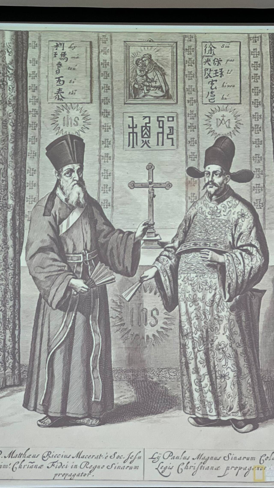

### 人文课
- 汪前进，1977级老学长
# 第一讲——\[世界的中心在哪里]
**——兼论不同文明世界中心关联**
## 问题的提出
- 什么是中心？地理的，人文的，实力的？
### 耶稣会传教士
- 明末耶稣会传教士来到中国
	- 西方世界地图大都将欧洲置于世界中心
	- 中国希望中文世界地图把中国绘制到世界中心
	- 利玛窦等颇有微词
	- 后来中外学者大都将此事作为中国古人愚昧落后的证据
	*世界各民族在绘制地图时实际上都会把自己放在中间*
	*利玛窦像在北京一个xx学校*
	*徐家汇和徐光启*
		
	- 中间大字为“耶稣”，IHS为耶稣会标志，徐光启教名为宝禄，上方为圣母圣子像
- 利玛窦与《中国札记》
	- 因为他们不知道地球的大小而夜郎自大，所以中国人认为所有各国中只有中国值得赞美
		- 汪：我是南蛮（四夷，只有荷兰陕西山西才算是正统的人）
		- 不能说马大哈，因为会得罪回人
	- 就国家的伟大、政治制度和学术的名气而论，他们不仅把别的民族都看作野蛮人，而且看成没有理性的动物
	- 他们认为天圆地方，国家在中央，不能理解大地是球形balabala
- 利玛窦与《坤舆万国全图》
#### 利玛窦的地图
- 奥特留斯《世界地图》（1587）
	- 椭圆投影
	- 欧洲中心
	- 制度学上转动一点角度并无问题，但在思想上天差地别
	- 把中国挪到旁边，雄鸡就表现不出来了
- Waldseemüller map with joint sheet（1507）
	- 欧洲人第一次把美洲放在世界地图上，具有重要意义（哥伦布没有意识到新大陆）
	- 美国：“我们的出生证” 默克尔 国会图书馆由德国买回美国
	- 1545、1532年等欧洲世界地图依然会把欧洲放在中间
#### 中世纪欧洲人绘制世界地图的中心都在耶路撒冷
- 1581， bunting clover leaf map——Bunting's world map
- 1390,1300年乃至于十三世纪的地图中耶路撒冷也居中
- 托勒密世界地图？*地理所制图院士讲错了，不是托勒密的* 耶路撒冷依然居中
- 十个天使（十个方位）\[中国是八个方位]
##### 中世纪最后的世界地图——毛罗修斯
### 世界其他民族的世界地图
#### 德尔斐（古希腊的中心）
- 根据希腊神话
- 宙斯为了确定世界的中心，从地球的相反两极放出两只鹰，相会之处即为“奥姆法诺斯”，阿波罗神庙利于此处
- 其为地球的“肚脐”；德尔斐神谕的起源
#### 犹太圣城“大巴列”
- 大巴列湖（加利利湖）西岸
#### 耶稣坟墓——圣墓
 - 基督徒称之为世界的中心，世界的肚脐
#### 死海
- 也被称作世界的肚脐，具有地理上的因素
- 亚拉巴海，世界最低的湖泊
#### 神山冈仁波齐
- 多个藏地宗教（包括印度教）称之为世界的中心
- 冈底斯山主峰，意为佛法永存
#### 艾尔斯岩石
- 澳洲北领地
#### 复活节岛
- 世界的肚脐
- 俯瞰确实像
- Te Pito o te Henua
#### 阿贡火山
- 巴厘岛
- 圣山
#### 厄瓜多尔基多的加拉加里镇
- 赤道
#### 谁统治了东欧，谁就统治了整个世界
- 麦金德
- 心脏地带是东欧到中亚的广大地区（政治）
- 《民主的理想与现实》
#### 巴比伦人的世界地图
- 《世界地图》，公元前600年
- 八个三角-巴比伦信仰的世界与天空相联的桥梁
#### 罗马
- 阿格里帕世界地图
- 托勒密世界地图
- 马赛克地图，马达巴，约旦
#### TO地图
     亚洲
欧洲            非洲
中心为耶路撒冷
#### 伊斯兰世界的制图术
- 中心为麦加
*莆田系控制了医院控制了寺庙，那些人都不是汉人，是阿拉伯人的后裔*
- 《世界地图》伊德里斯 1154年 上南下北
- 《突厥语大词典》 圆形地图
#### 曼陀罗坛城
#### 宋《佛祖统纪》
- 华藏世界海图（佛教世界和现在的世界概念不一样）
- 八热地狱图
- 东震旦地图
- 汉代西域诸国图（宋代绘制）
- 西土五印图
#### 朝鲜古代世界地图
- 中国为中心
- 《天下图》
**其实古代几乎任何一个民族（国家）绘制世界地图都是将自己置于世界中心**
## 中西古海图的重大差异及其文化与技术原因
- 中国地图没有画钓鱼岛、没有画南海，是不是中国的？
	- 有边无界
	- 地图上有的不一定是中国的，地图上没绘制的不一定不是中国的
### 特征与差异
- 西汉地形图——长沙马王堆
	- 在丝帛上
	- 上南下北
	- 出现海了（北部湾）
- 禹迹图碑
	- 宋代、西安碑林
	- 不让看（没台湾、钓鱼岛）
- 华夷图
	- 除了海南岛、没绘制别的；宋代
- 九域图
	- 宣和
- 舆地图拓片
	- 现存于日本的一个寺庙
	- 有舟山群岛
	- 冲绳岛-大琉球 台湾岛-小琉球（上不去）
- 海道指南图
	- 中国最早的航海专图
- 郑和航海图
	- 从宝船厂开船从龙江关出水直抵外国诸番图（第六次航海才绘制的）
	- 其中皇城为南京
	- 星图
	- 十二指测量维度
	- 22针路
- 中国海洋图（清代）
	- 陆地在上，海洋在下
	- 水下暗沙有说标注
- 大明混一图（洪武年间）
	- 有非洲欧洲
- 广舆图
	- 东南/西南海夷总图
#### 古航海图考释
### 西方海图
- 有玫瑰线（交叉斜线）-罗盘
	- 阿拉伯人也使用玫瑰线
- 经纬线（投影）海图
	- 直尺
	- 玫瑰线-相对位置 经纬线-绝对位置
		麦卡托世界地图
		球面转换成平面
		- 等角 等型 等距
			- 等角才能用作海图（麦卡托投影）
- 等深线（深度相同的点连线）
- 海兽海怪
	- 海土耳其人

**文化 观念 政治 技术**