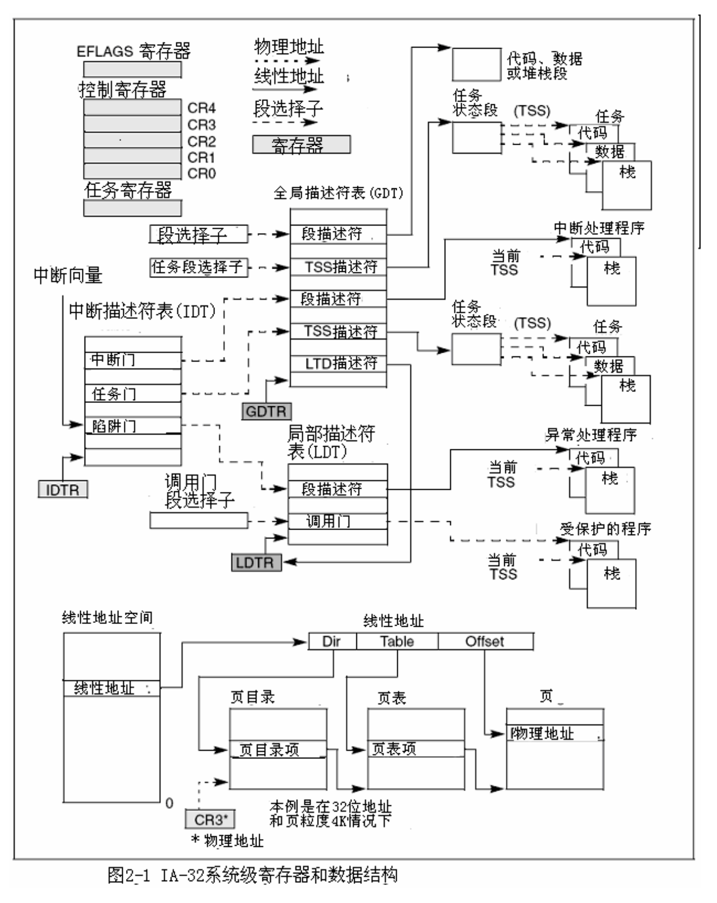

# IA-32 Manual

## Architecture

IA-32处理器在加电或者复位后首先进入实地址模式，而后由软件完成到保护模式下的切换。

寄存器与数据结构：

### 全局和局部描述符表

保护模式下，所有内存访问通过：

- 全局描述符表(GDT)
- 局部描述符表(LDT)

描述符表里的项为段描述符(riscv: PTE)，段描述符包含

- 一个段的基地址
- 访问权限
- 类型和用法信息

每个段描述符都有一个与之相关的段选择子(riscv: satp)。段选择子包含：

- 一个对GDT或LDT的索引
- 一个全局/局部标志
- 访问权限信息

访问段中的一个字节，必须同时提供一个段选择子和一个偏移，段选择子提供对段描述符的访问，处理器从段描述符中获取段在线性地址空间里的地址，而后加上偏移。根据处理器当前特权级(CPL)决定能否访问段。

### 系统段、段描述符和门

进程运行环境：

- 代码
- 数据
- 堆栈段
- 任务状态段(TSS)
- LDT

GDT不通过段选择子和段描述符访问

IA-32门：特殊描述符（意思是入口）

- 调用门：访问与当前代码段特权级更高或相同的代码段，若调用需要切换特权级，处理器就切换到对应特权级的堆栈（新堆栈的段选择子从当前任务的TSS中获得）
- 中断门
- 陷阱门
- 任务门

提供高于用户特权级的系统过程/处理程序来进行保护性访问

### 任务状态段和任务门

TSS(riscv: Context)定义任务执行环境的状态，包含：

- 通用寄存器
- 段寄存器
- EFLAGS
- EIP
- 段选择子
- 三个堆栈段（三个特全级各一个）指针
- LDT选择子
- 页表基地址

### 中断和异常处理

外部、软件中断和异常通过中断描述符表(IDT)处理，包含访问中断和异常处理程序门描述符的集合

IDT和GDT不是段，IDT线性基地址包含在IDT寄存器(IDTR)中

IDT中描述符可以是中断门、陷阱门或任务门，处理器从int/bound指令收到一个中断向量，才去访问中断或异常处理程序。中断向量是IDT中门描述符的索引。任务门：任务切换访问处理程序

### 内存管理

支持物理寻址也支持虚拟分页

页目录基地址保存在CR3

分页只有2级：页目录$\rightarrow$页表$\rightarrow$

### 系统寄存器

- EFLAGS寄存器：
	- 系统标志和IOPL域控制任务和模式的切换