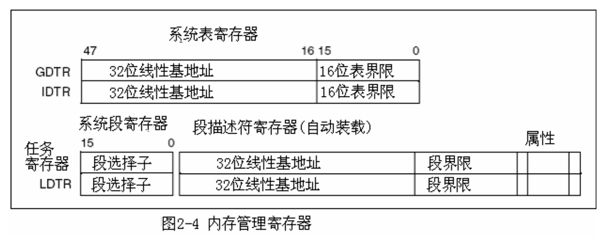
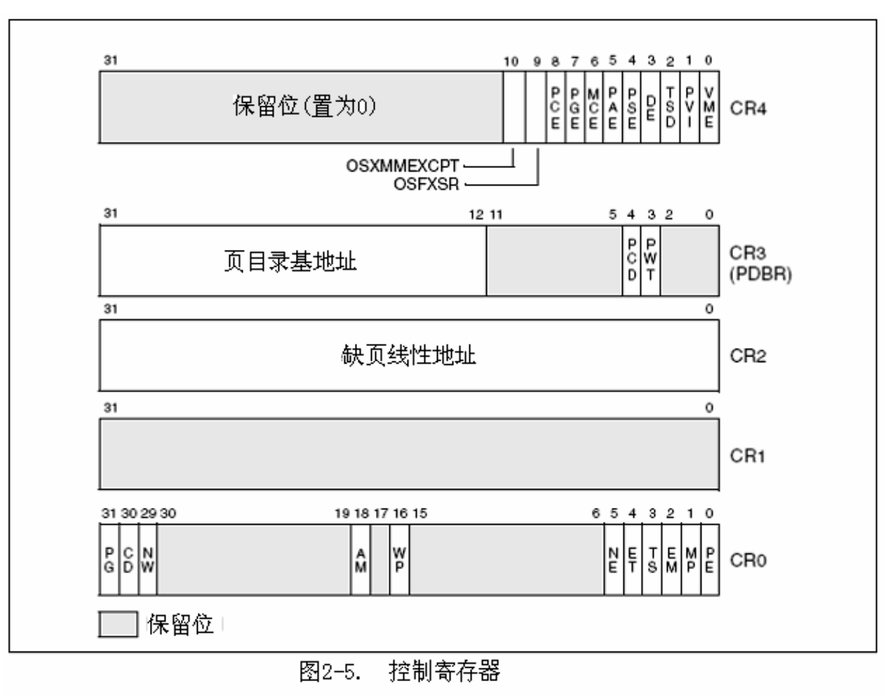
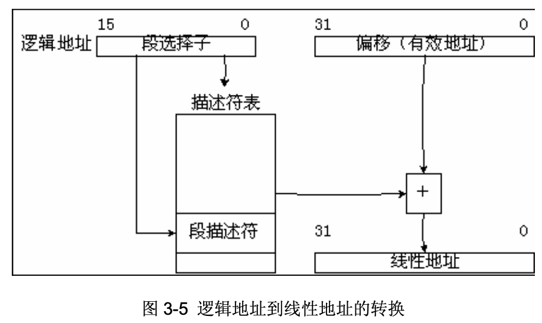

# IA-32 Manual

## Architecture

IA-32处理器在加电或者复位后首先进入实地址模式，而后由软件完成到保护模式下的切换。

寄存器与数据结构：

### 全局和局部描述符表

保护模式下，所有内存访问通过：

- 全局描述符表(GDT)
- 局部描述符表(LDT)

描述符表里的项为段描述符(riscv: PTE)，段描述符包含

- 一个段的基地址
- 访问权限
- 类型和用法信息

每个段描述符都有一个与之相关的段选择子(riscv: satp)。段选择子包含：

- 一个对GDT或LDT的索引
- 一个全局/局部标志
- 访问权限信息

访问段中的一个字节，必须同时提供一个段选择子和一个偏移，段选择子提供对段描述符的访问，处理器从段描述符中获取段在线性地址空间里的地址，而后加上偏移。根据处理器当前特权级(CPL)决定能否访问段。

### 系统段、段描述符和门

进程运行环境：

- 代码
- 数据
- 堆栈段
- 任务状态段(TSS)
- LDT

GDT不通过段选择子和段描述符访问

IA-32门：特殊描述符（意思是入口）

- 调用门：访问与当前代码段特权级更高或相同的代码段，若调用需要切换特权级，处理器就切换到对应特权级的堆栈（新堆栈的段选择子从当前任务的TSS中获得）
- 中断门
- 陷阱门
- 任务门

提供高于用户特权级的系统过程/处理程序来进行保护性访问

### 任务状态段和任务门

TSS(riscv: Context)定义任务执行环境的状态，包含：

- 通用寄存器
- 段寄存器
- EFLAGS
- EIP
- 段选择子
- 三个堆栈段（三个特全级各一个）指针
- LDT选择子
- 页表基地址

### 中断和异常处理

外部、软件中断和异常通过中断描述符表(IDT)处理，包含访问中断和异常处理程序门描述符的集合

IDT和GDT不是段，IDT线性基地址包含在IDT寄存器(IDTR)中

IDT中描述符可以是中断门、陷阱门或任务门，处理器从int/bound指令收到一个中断向量，才去访问中断或异常处理程序。中断向量是IDT中门描述符的索引。任务门：任务切换访问处理程序

### 内存管理

支持物理寻址也支持虚拟分页

页目录基地址保存在CR3

分页只有2级：页目录$\rightarrow$页表$\rightarrow$

### 系统寄存器

- EFLAGS寄存器：
	- 系统标志和IOPL域控制任务和模式的切换、中断处理、指令跟踪和访问权限
- 控制寄存器
- 调试寄存器
- (G/L/I)DTR寄存器包含表的线性地址和限长
- 任务寄存器包含当前任务TSS的线性地址和大小
- 模型相关寄存器

### 运行模式

- 保护模式
- 实模式
- 系统管理态(SMM)
- 虚拟8086模式

上电后位于实模式，由控制寄存器CR0中的PE标志决定

### EFLAGS

### 内存管理寄存器

限长以字节为单位

`lgdt`与`sgdt`分别装载和保存GDTR寄存器

### 控制寄存器

- CR0: 包含系统控制标志
- CR2: 包含页故障线性地址
- CR3: 页目录基地址寄存器(PDBR)，包含页目录表的物理基址和两个标志(PCD和PWT)
- CR4: 包含一组标志，控制扩展启用

CR0:

- PG (page): CR0[31]，分页
- CD (cache disable): CR0[30]，为1 disable cache
- NW (no-direct write): CR0[29]，写操作写回/写穿透
- AM (align mask): CR0[18]，对齐屏蔽
- WP (write protection): CR0[16]，管理程序能否写用户级的只读页；fork时COW依赖
- NE (number error)：CR0[5]，浮点错误
- PE (protection enable): CR0[0]，启用保护模式，启用段级保护

CR3:

- PCD (page cache disable): CR3[4]，禁用页级高速缓存
- PWD (page write transparent): CR3[3]，控制页目录表的写回/写穿透

CR4:

- VME
- PVI (protection-mode virtual interrupt)
- TSD (timestamp disable): RDTSC指令
- DE (debug extension)
- PSE (page size extension): 4K->4M
- PAE (physical address extension): 32->36位物理寻址
- MCE (machine check enable)
- PGE (page global enable)
- PCE (performance counter enable)

CR4的位能够通过CPUID指令获取

## 保护模式内存管理

分段隔离每个进程，分段功能不可关闭

只有逻辑地址（远指针）确定字节在特定段中的位置

逻辑地址：段选择子+偏移

保护模式，物理地址空间4GB：0~0xffffffff

逻辑地址中段选择子在段寄存器中，一个程序内所有访存共享；用户只提供偏移

段选择子16位，为段的标识码，并不直接指示段，而是指向定义段的段描述符

- 索引[3:15]：选择GDT或LDT中8192个描述符中的某个，处理器将索引值*8 + GDT/LDT base
- 表指示标记(TI)[2]：确定使用哪个描述符表，0 - GDT，1 - LDT
- 请求的特权级(RPL)[0:1]：确定选择子的特权级，0~3

GDT第一项无效，为空段选择子，装载至段寄存器时无异常，但用来访存时产生异常，但装载CS或SS产生一般保护异常(#GP)

### 段寄存器

- CS: 代码
- DS, ES, FS, GS: 数据
- SS: 堆栈

段寄存器有可见、不可见部分，段选择子可见，不可见称为描述符高速缓存/影子寄存器

### 段描述符

64位

- 段界限域：20位，根据段是向上扩展段/向下扩展段，偏移从0或段界限开始，到段界限或`0xffffffff`/`0xffff`结束；根据G(粒度)设置不同，解释方式不同：
	- 若G为0，则段大小从1字节到1M字节，增量单位为字节
	- 若G为1，则断大小从4K字节到4G字节，增量单位为4K字节
- S(描述符类型标志)：0 - 系统描述符，1 - 代码、数据段描述符
- DPL(描述符特权级)：0~3
- P(present)：是否在内存中，为0时装在段选择子则返回段不存在异常#NP，MM可通过改标志控制哪些段真正载入物理内存。
- D/B(默认操作数大小/默认栈指针大小/上限)：根据段类型，作用不同（32位代码和数据段，始终为1，16位为0）：
	- 可执行代码段：为D标志，指明指令的有效地址和操作符的默认位数，1 - 32位地址，32/8位操作符；0 - 16位地址，16/8位操作符
	- 堆栈段(SS所知数据段)：为B标志，为栈操作确定栈指针大小，1 - 32位栈指针，位于esp寄存器；0 - 16位栈指针，位于sp寄存器
	- 向下扩展的数据段：B标志，确定段地址上界，1 - `0xffffffff`，0 - `0xffff`

代码段一致性/非一致性，转入特权级更高的一致性代码段的进程能够以当前特权级继续执行；转入不同特权级的非一致性段会产生一般保护异常。不能被特权级更低程序访问的程序应该被载入非一致性代码段

进程不能够因为`call`或者`jump`转入一个特权级较低的代码段执行，否则会产生一般保护异常#GP

所有数据段都是非一致性的，数据段不能被更低特权级的进程访问；数据段可以被更高优先级的程序或过程访问，不需要使用特别的访问门

### 系统描述符类型

S位0时为系统描述符

- LDT
- TSS
- 调用门
- 中断门
- 陷阱门
- 任务门

分两类：

- 系统段描述符
- 门描述符

#### 段描述符表

长度可变，最多包涵8192($2^{13}$)个8字节描述符

系统必须定义一个GDT，以备所有进程或任务使用，也可以定义一个/多个可共享的LDT

GDT本身不是一个段，而是线性地址空间的一个数据结构，线性基地址和界限必须装入GDTR寄存器，基地址8字节对齐，界限应该总是8的整数倍-1

LDT位于类型为LDT的系统段内，GDT必须包含一个指向LDT段的描述符

当保存GDTR寄存器时，48位伪描述符存入内存，应该放入一个奇字地址上（地址对4取模为2）

### 分页

由处理器控制寄存器的3个标志控制：

- PG(分页)
- PSE(页尺寸)
- PAE(物理地址扩展)

需要4个数据结构：

- 页目录指针表（启用扩展时）
- 页目录表
- 页表
- 页

格式：

## 任务管理

### 任务结构

任务由两部分构成：任务执行空间和任务状态段

任务执行空间由代码段、栈段、一个或多个数据段组成，为每个特权级提供独立的栈

### 任务状态

- 任务的当前执行空间，由段寄存器(CS、DS、SS、ES、FS和GS)中的段选择子指定
-  通用寄存器的状态
-  EFLAGS寄存器的状态
-  EIP寄存器的状态
-  控制寄存器CR3的状态
-  任务寄存器的状态
-  LDTR寄存器的状态（段选择子）
-  I/O位图基地址和I/O位图(位于TSS中)
-  特权级0、特权级1和特权级2的栈指针(位于TSS中)
-  指向前一个执行过的任务的链接(位于TSS中)

任务调度之前，除任务寄存器状态外都要在TSS中设置

### 执行任务

调度任务执行：

- call
- jmp
- 隐式中断/异常处理程序
- iret

用指向任务门或TSS的段选择子来识别被调度任务，调度任务处理中断异常时，相应中断/异常IDT项必须包含一个任务门