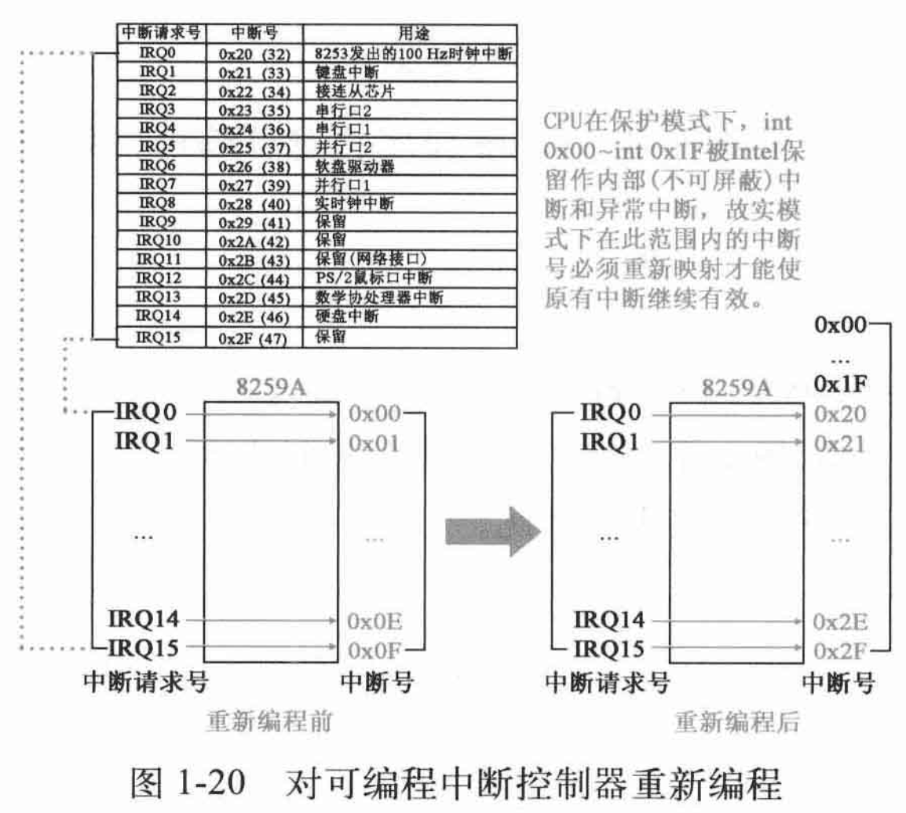
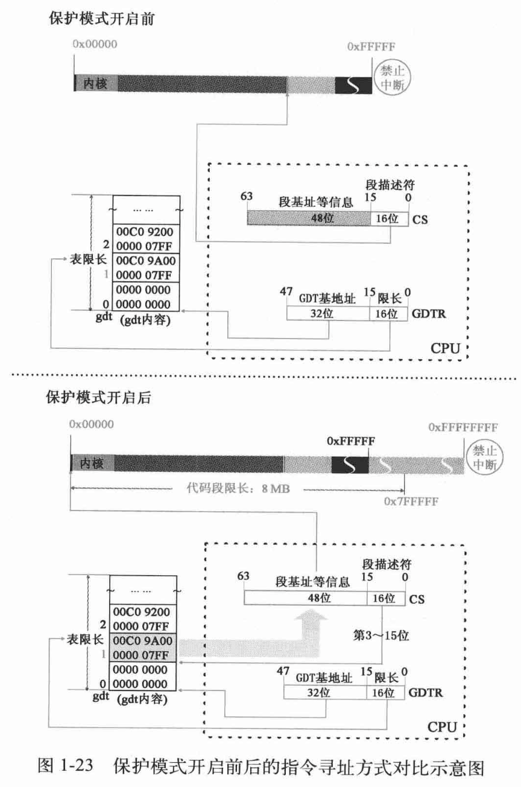
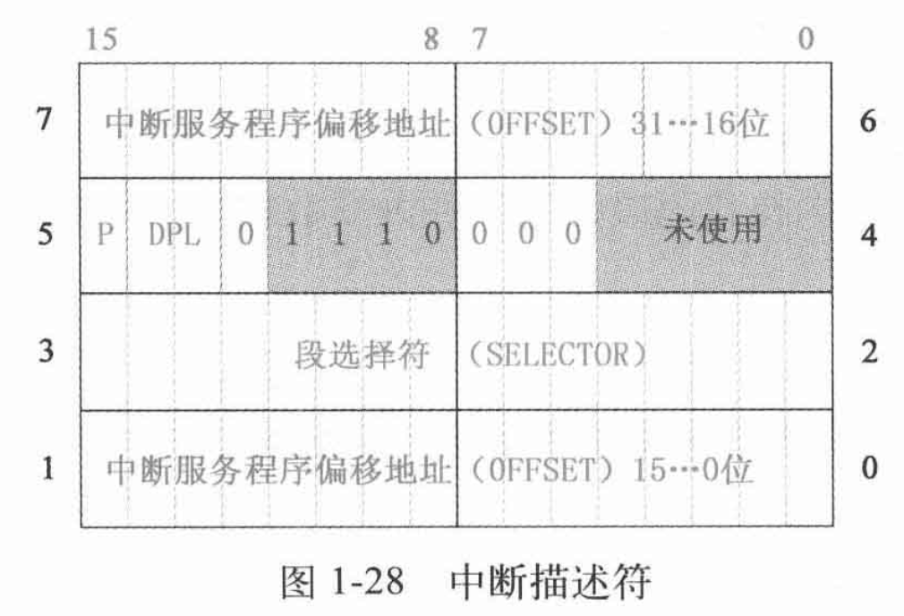

# Linux内核设计的艺术

## 启动

实模式：8086/80x86兼容的cpu操作模式，特性是一个20位的存储器地址空间，1MB

加电后入口：0xFFFF0 - BIOS

BIOS程序在内存最开始的位置(0x0000)用1KB的内存空间(0x0000~ 0x003FF)构建中断向量表，在紧挨着它的位置用256字节的内存空间构建BIOS数据区(0x00400~0x004FF)，并在大约57KB以后的位置(OxOE05B)加载了8KB左右的与中断向量表相应的若干中断服务程序

Linux 0.11，分三批加载内核代码，第一批由BIOS中断`int 0x19`将第一扇区bootsect加载到内存，而后第二、三批由bootsect指挥加载4/240个扇区至内存

`int 0x19`指向`0x0E6F2`，加载bootsect扇区的中断服务程序入口地址

### 整体技术策略

执行`main`之前，需要先执行三个由汇编代码生成的程序，即`bootsect`, `setup`, `head`，前两者是分别加载、执行的，但head,S加载方式不同，被包含在system模块中，在内存中占有$25KB+184B$空间，启示位置`0x0`，`main`程序起始位置`0x64B8`

### 流程

1. [`BIOS`] 加载bootsect
2. [`bootsect`] 加载setup被
    1. bootsect对内存规划
    2. bootsect将自身从0x7c00复制到0x90000
    3. 将setup程序加载到内存
    4. 借助BIOS提供(bootsect执行)的`int 0x13`中断向量指向的中断服务程序完成
3. [`bootsect`] 加载system模块
    1. 仍然是`int 0x13`中断
4. [`bootsect`] 设置根设备
5. [`bootsect`] `jmpi 0 SETUPSEG`跳转到0x90200执行setup程序
6. [`setup`] setup程序利用BIOS中断服务程序从设备上提取内核运行所需的机器系统数据，包括光标位置、显示页面等，加载的部分数据会覆盖bootsect程序，而且不能被覆盖，0x90000~0x901fd，510字节
7. [`setup`] 向32为模式转变（实模式$\rightarrow$保护模式）
    1. 关中断(EFLAGS IF位clear，命令`cli`，开中断`sti`)，将位于0x10000的system代码移动到内存起始位置0x0，覆盖BIOS中断向量表和BIOS数据区
    2. 设置中断描述符表(IDT, IDTR)和全局描述符表(GDT, GDTR)，GDT是系统中唯一存放段描述符的数组，为所有进程的总目录表，存放每个任务LDT和TSS地址，GDT可位于任意位置，地址在GDTR中。此时内核尚未运行，GDT第一项为空，第二/三项位内核代码/数据段描述符，而IDT是空表。两步进行：
        1. 设计内核代码时，将表写好，数据填写完成
        2. 将IDTR/GDTR指向表
    3. 打开A20`mov al,#0xdf`，实现32位寻址，最大寻址空间4GB，实模式下`0~0xfffff`，1MB寻址空间，需要20根地址线，保护模式后使用32根地址线，因此选通21(A20)~32根地址线
        1. 程序寻址超过`0xfffff`时，cpu回滚至内存地址起始处寻址，A20地址线选通意味着关闭该机制
        2. 段寄存器最大允许地址为`0xffff`，IP最大允许段内偏移`0xffff`，因此两者确定最大绝对地址为`0x10ffef`，实模式下寻址范围比1MB多出64KB，后续将利用此特点验证A20地址线打开与否
    4. 为保护模式下执行`head.s`做准备
        1. 对可编程中断控制器8259A编程，因为保护模式下`int 0x00 ~ int 0x1f`被Intel保留作为内部例外，若不重新编程，则`IRQ0x00 ~ IRQ0x0f`这部分原先的中断号将被覆盖
            1. 能管理8级向量优先级中断，最多级联成64级向量中断优先级系统
        2. 将cpu工作方式设为保护模式，CR0第0位(PE)置1，使用`lmsw`指令。cpu变为保护模式重要特征是根据GDT决定后续执行程序
        3. 跳转到head.S，`jmpi 0,8`
8. [`head`] 建立内核分页机制，`0x0~0x4fff`20KB建立页目录表
9. [`head`] 一切都是为适应保护模式做准备
    1. 本质是让CS的用法从实模式转变为保护模式。实模式下，CS本身是代码段基址，保护模式下是代码段选择符段选择符
    2. DS, ES, FS, GS等其他寄存器从实模式转变为保护模式，值都为`0x10`，即参考GDT中第二项内核数据段描述符的信息
    3. SS转变为栈段选择符，栈顶指针也变为`esp`，使用`lss _stack_start, %esp`，栈顶指针指向`user_stack`数据结构最末位置，内核栈起始位置为`0x1E25C`
    4. 重建保护模式中断服务体系，设置IDT，基址`0x54AA, idt_descr`，长度`2KB`
    5. 废除重建GDT，设置`gdtr`，原先是`setup`模块设置的数据，将来会在设计缓冲区时被覆盖，GDT段限长变为`16MB`，需要对段选择符重新设置
    6. 确认A20地址线打开
    7. 准备执行`main`，将`envp, argv, argc`，`L6`标号与`main`入口地址压栈，`main`应该不会退出，退出后将执行`L6`循环
    8. 跳转至`setup_paging`开启分页机制
        1. 将页目录表和4个页表放在物理内存起始位置
        2. 清零内存起始开始的5页
        3. 设置页目录表
        4. 从高至低填写4个页表，依次指向内存高地址向低地址方向的各个页面
        5. 设置`CR3`指向页目录表，将`CR0`最高位置1，即PG(Paging)标志
    9. 通过`ret`的方式调用`main`，事先模拟`call`指令完成压栈

### 关键解释

#### 7.4.1



#### 7.4.2-7,4,3

```assembly
mov    ax, 0x1
lmsw   ax
jmpi   0, 8

gdt:
.word 0,0,0,0 ; dummy

.word 0x07FF ; 8Mb - limit=2047 (2048*4096=8Mb)
.word 0x0000 ; base address=0
.word 0x9A00 ; code read/exec
.word 0x00C0 ; granularity=4096, 386

.word 0x07FF ; 8Mb - limit=2047 (2048*4096=8Mb)
.word 0x0000 ; base address=0
.word 0x9200 ; data read/write
.word 0x00C0 ; granularity=4096, 386
```




> 16/32位中断机制对比：16位使用位于0x0的中断向量表，32位使用中断描述符表，位置不固定

#### 9.3

`ls`指令设置段寄存器，将内存单元的一个低字传送给指令中16位寄存器，而后把高字传送给对应的段寄存器

#### 9.4

