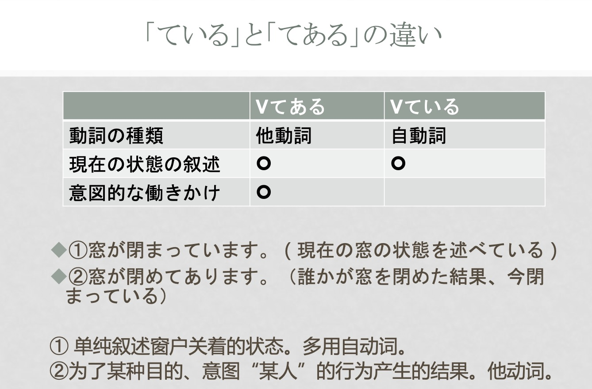

# 日语课程
## 第一课
### 教材
- 《标准日本语初级下册》
- MOJI辞書
### 课程安排
- 15周
- 期中小测-口试（绕口令+会话）
- 期末考试-笔试（闭卷，包括听力）

### 非评分作业
- 单元作业（选修选作）
- 安利

### 助词的问题
- 愛ちやん＿家　行って
	- と
	- の
	- が
*助词的问题*
## 25  これは 明日会議で使う資 料です\[动简修名]
これは*明日会議で使う*資料です
- 动词修饰名词
- 复句
#### 单词
##### 名词
公民　こうみん
体育　たいいく
専門　せんもん
専門家　せんもんか
専攻
女優
俳優　はいゆう
声優　せいゆう
役者　やくしゃ
エアポード
国際空港
lounge(ラウンジ)
ビル(building)
エレベーター
エスカレーダー
階段
自然　しぜん
給料　賃金　
夏のボーナス
給料日
怪我　けが
油断1秒,怪我一生
さんかんろ
##### 动词
**动词的几类型，课后去学学**
走ります　走り　口走る　悪事千里を走る
泊まります　泊まろ
結びます　結ぶ
取ります
倒産します
##### 形容词
おおきな
ちいさな
*连体，不可当谓语*
べつに

#### 课文
- V（简）+N（动简修名）
	小句+N
	- 基本型：习惯/将要发生
	- 过去：动作已经完成
	*さっき見た*映画は面白がた(一类型的简体过去)
	今は*日本語を習う*時間です
	昨日は日曜日でしたから、*普段サラリーマンで混雑する*銀行どおりも静かでた
	- 名词前不用敬体
	- 名词前不加の
	婚姻届は　夢をかなえる　ドラゴンボール　だって
- た＋名词表状态
	表示**状态**的动词、静态的动词的ta型+名词表示状态
	A： すみなせん。山田さんはどの人ですか
	B：あの　を
	固定搭配：優れた　枯れた花
 
- 动词小句修饰主语
	小句主语必须用**が**提示
	怪我をした人はもりさんです
	テレビを見ている人は誰ですか

- 动词小句修饰名词做主语以外的其他句子成分

- は和が的根本差异
	- は会先把句子断开，让は前面的内容孤立起来，随后可能会包含一些其他要素，但会跳过这些要素和句末联系（提示后面的重要性）
	- が会将前面的名词和后面的名词联系起来，使之成为一个完整的概念（只管一句）

#### 几个句子
- （准备）把在日本买的礼物送给朋友
	- 主句：礼物给朋友
		- 给：收受关系 あげます
		友達にあげます
- 要做车的人买了票
	- 要做电车-未发生-现在-基本型：電車に乗る人は
	- 要做电车的人　切符を買いました
	（个论个的）
- 最先到的人开一下锁呀
	- 最先到的人 最初につき他の人
- 合格的人入学
	- 规定-基本型
	- 合格-先发生-

### 小句（一类型/二类型/名词）+名
想要-欲しい-一类型-名词
- Nが一类型基本型
- Nが二类型な
- N1がN2の
**貴方の子供が好きな**料理はなんですか
**デザインが新しい**靴を買いたいです
**性格が明るい**女の子が好きです （此句出现了两个が）
> 为了使句子显得简洁或成分清楚，有时会把定语句的が替换成の

どうも君の言ったことが分からない（你说的话我不懂）
お茶飲みたい方は、隣の部屋へどうぞ（想喝茶的人去旁边的房间；方的判断）

で-范围（*で的用法*）
##### N+の所
のところ（の所）：将原本不表示场所的名词变为表示场所的词语
君の所へ今駆け出して行きます

##### 复习：のです、んです
- 所述内容与前项有关联，用来解释说明（走心，内心产生波动的用んです）
- にもらう・に貰う　涉及其可以把に换成から确定流向
##### でしたね
- 表示确认（从前知道但记得不太确定的事物进行确认）
- 当场突然想起来某事：**のだった**

> 日语修饰语排序长的在前短的在后

## 26 自転車に二人乗るのは危ないです\[形式名词\]
### 单词
大雨・おおあめ　小雨・こさめ　雨が上がる・雨があがる
桜・花見・はなみ・お花見・桜坊・さくらんぼう
手一杯・ていっぱい
色鉛筆・いろえんぴつ
豊作・ほうさく
仲・なか　仲直り　
忘れ物（我丢了）　落とし物（自然而然丢了）
 挙げる（含意广泛）：
 準優勝
 約束守る　約束破る
 **もしかしたら** 副词 也许->推测
 いけない・いけません　いけない子（坏孩子）　君のいけないか
 ### 小句（V简体）+の+はADJです
 - 动词小句名词化作主语，后面为表示性质，状态的形容词
 - 用こと不算错
	 - バスケは面白いです
	 - バスケをするのは面白いです
	 - バスケを見るのは面白いです
	 - 絵を描くのは楽しいです
- *こと和の的区别*
#### 注意：加表示好恶、擅长不擅长等形容词后加が
- 料理を作るのが下手です
- 負けるのが嫌いです
- 彼は朝早く起きることが苦手だ
##### は为引发话题

### 小句（V简体）+の+をV
- 小句名词化作宾语、大部分可以用こと替换の
	- 牛乳を買うのを忘れました
	- 明日試験があるのを知っていますか
#### 知りません　知りませんでした
- 提供信息的情景-未提供信息的情景
#### 注意
- 只能用こと的情况
	1. です・だ前面不能使用名词化的の　は　こと　です
	2. 句尾动词是知らせんます、話します、伝えました等表示语言行为的动词时，用こと
	3. 固定搭配
- 只能用の的情况
	1. 句尾动词是見ます、聞きます、感じます等感官动词
	2. 手伝います、やめます、防ぎます、待つ表示直接作用于动作对象的动词
- 更多使用の的情况
	- 感想、评价
	- 丝毫、能力
	- のを忘れました、のを知っていますか
### 小句（简体）でしょう（推测）
- 有判断依据

#### 天气预报
晴れ　曇り　雨　雪　晴れのち曇り　曇り時々雨　曇り所によって雨
台風　虹　雲　湿度　蒸し暑い　降水確率　
### 小句（简体）かもしれません
- 可能性较低（50%左右）
- 常与もしかしたら一起使用
- 可以在一个动作的肯定型和否定型后面并列使用两个かもしれません
- あの人はもしかすると木村さんの弟さんかしれません
### それで
- 表示因果，更强调**自然产生**
- 注意：后面不能是表示祈使或推测的句子
	- 此类情况应当改用だから、から（比较唯心）
- \[补充用法]：催促对方说成下文
#### 辨析：だから　それで　そこで
- だから：强烈个人意志，体现自身逻辑
- それで：表示因果，更强调**自然产生**
- そこで：强调解决问题时的对策和行为，动作主体不得为他者，后项一般是说话人已经完成的工作
	- 分からなく困った、そこで先生に尋ねた
### つい
- 不知不觉，无意中，非所意造成某种后果，感到不快，后悔（事与愿违）
#### ついに
- 终于
### 课文
- 日本**に**は握手の習慣がないんですね（存在句）
	- 为什么用んです：走心了
- それで、**つい**雑するのを惹れま
- 手を挙げ**たり**、握手し**たり**
## 第27课
**期末要求句子翻译成日语，课后练习每课三句**
### 单词
高齢者　高齢化　老人
ピンポン　シングルス　ダブルス　ミックス　ビリヤード
受賞　授賞式
赤信号　青信号　黄信号　信号無視
鋏
バイド　パート　正社員　派遣社員　契約社員　フリーター
醤油　塩　酢　味醂　調味料
喧嘩売る（挑衅）
### 小句（简）+時

*绝对时态，相对时态*

お*見合*（相亲）いはどうでしたか
写真を**見た**時は、素敵な人だと思いましたが、あって、がっかりしました
**表示一次性的，个别的情况可以用時に**

- 「時」前的动词为表示状态的的动词，如ある、いる时，且主句主语为过去式时，「時」的动词用非过去式和过去式表达同样的意义

- 主句为过去式时，「時」前的一类型、二类型、名词既可以用基本型也可以用过去型，若想强调「時」前的状态与现在不同，则使用过去式
	若い時、よく泳ぎました
	若かった時、よく泳ぎました

### Vながら
- **同一主体**同时进行两个事情
- 接续:ます体去掉ます加ながら
- **持续动词**才能用ながら，后一个动词是主要动作
	働きながら日本語を勉強しています
	音楽を聴きながら、勉強や仕事をするの人のことをながら族という
*ながら补充*
### 小句（简体型）でしょう？
- 升调：确认对方比自己更熟悉的事情，寻求信息
- 降调：自己和对方意见不同，叮问对方
### ています（反复、习惯）
私は毎朝ジョギングしています
私は先月から毎朝太極拳をしています
句子里有表示时间起点的形式不用します
*ている*
### Nで（原因，理由）
- 常用于表示自然灾害，事故，生病等不好的事情发生
交通工具 场所 工具手段原材料 数量 动作主体的样态 
二类型で二类型 N1でN2

*ていた*
*时和体*

## 中级复习
音楽を聞きながら部屋を掃除します
よく図書館で宿題をしている
台風で、電車が止まりました
## 28 馬さんは私に地図を**くれました**（授受关系）
*ホワイトデー*：白色情人节
- くれる（给出）　あぎる
### 单词
マフラー 帽子　ネクレス　手袋　小物
発音が綺麗です
大使館　在日本中国大使館（日用）、中華人民共和国駐日本国大使館（中用）
近所（限定）
孫娘　孫息子　孫の手（老头乐）
いきものがかり
就職　就職浪人　リクルート　就職活動　就活　終活（为死亡做准备） 婚活
英語に訳す
### 复习
#### N1(人)は/がN2(人)にN3(物)をあげます
**我给别人**
- 内给外，不能外给内
	友達は弟にペンをあげました。(×)
#### N1(人)は/がN2(人)にN3(物)をもらいます
**我从别人获得**
### N1(人)は/がN2(人)にN3(物)をくれます
**别人给我**
	内-自己
	外-自己
	外-内
母が**くれた**ゆびわをなくしてしまいました
*たら如果，万能，但有先后关系的语感*
**投射**
向听话人提问时用くれます。
ご主人(しゅじん)は、今年(ことし)の誕生日に(Bさんに)何をくれましたか
### N1は/がN2にVてあげる
- N1(己方)为N2做
- 含有恩赐对方的意思，不能面对面直接对尊长使用
私は、妹にお菓子(かし)を買ってあげました。
雨(あめ)が降(ふ)っ**てきたから（开始下）**、車(くるま)で駅(えき)まで送(おく)ってあげますよ

*期中考试-第八周？-周三？-4月17日*
*一分半日语-尽量脱稿*

### N1は/がN2のN3をVてあげます
- 当N3为N2所有物时
	弟（おとうと）の宿題（しゅくだい）を手伝（てつだ）ってあげました
	私は弟に宿題を手伝ってあげました
### N1は／がN2にVてもらいます
- N１为行为接收者 N2为动作主体
- 让N2为N1（己方）做
- 两层含义：1、说话人请别人做某事2、说话人承受了由于某人动作而带来的恩惠
A:だれかに手伝（てつだ）ってもらいますか。
B:そうですね。中田（なかた）さんにお願いしましょう。
（不确定感
（に前加体言
### N1は／がN2にVてくれます
- N1为动作主体，N2为动作接受方
- 他人为己方(N2)做
- 疑问句形式可以用于委托关系亲密的人为自己做某事
- 别人自主帮忙，我心怀感激（N2）
- *に*提示目的（移动的目的）
**外内**
	荷物を持ってくれて、*ありがとう*（すみません不能换）
- 委托别人帮自己做某事时，てくれませんか比てくれますか礼貌，客气。
	すみませんけど、ちょっと静（しず）かにしてくれませんか。今大事（だいじ）な用事（ようじ）で電話（でんわ）をしてるんです
- 使用もらう的委托别人帮自己做某事，てもらえますか、てもらえませんか。

### N1は／がN2のN3をVてくれます
- N3是N2的所有物或身体的一部分

### てもらう・てくれる
- 「～てくれる」：人の行為を受けて、感謝の気持ちを持っている時に使います。
- 「～てもらう」：人に行為を頼んで、その行為に感謝の気持ちを持っている時に使います
**最简单的区分方式是“我摆脱”这个行为有没有发生**
- 「（て）くれる」是由动作的主体作主语。与此相反，「（て）もらう」是由东西或动作的接受者作主语
	田中さんが私に本を（送って）くれた。
	私は田中さんに本を（送って）もらった。
**句式判断**
- 名词省略句子中，对不具有意志的无意识名词及具有意志的有生命名词的无意识的动作以恩惠的手法进行表达的场合：「てくれる」
	やっと春が来てくれた。🆗
	やっと春に来てもらった。🆖
	子供が寝ていてくれたので、買い物に行けた。🆗
	子供に寝ていてもらったので、買い物に行けた。🆖
- 着眼于承受方表达时：「てもらう」，以听话人为动作主体时，「てくれる」「てもらう」都可以使用。

#### 练习
- 东西的传递（外给内）- くれる
	- 田中さんは弟に本をくれた
- 内给外-あげる
- 别人为我做-くれる
- 我让别人做-てもらう

### 应用课文
森着、住む所はもう決まったの（订好了吗，自动词-结果，动作完成、他动词）
**それに**（而且，再说，是和前句累加的）、季さんや馬さんもいろいろと探してくれています
支社員、引っ越し先が決まりました
#### ~先
- 移动性动作的到达地点或归属
	- 引越し先（ひっこし先）
	- 出張先（しゅっちょうさき）
*日本租房一般是空房，所有的家具几乎都要自备，购买或者接受别人送礼*

## 29 電気を消せ（动词的变形，命令形う→え）
### 单词
鶏（にわとり）・焼き鳥（やきとり）・鳥肌（とりはだ）・鳥無き里の蝙蝠「山中无老虎，猴子称霸王」・雀（すずめ）・燕（つばめ）・鳩（はと）
ペーパードライバー（有本不开车）・マイナンバー（类似身份证号码）・マイナンバーカード
机　テーブル
刑事・警官
年上・年下
サボります
引く・風邪をひく・手を引く（带引指引指路）・辞書を引く（查字典）
お守り（御守り）
逃げるが勝ち
遠慮しない
取扱注意（轻拿轻放）
*在日本缺钱可以包卡拉OK过夜*

### 对词的复习
- 首先判断词性（动词名词）
	- 如何从基本型判断是动词-词尾一定是五段
	- 三类动词-する・します・くる・来ます
	- 二类型均以る结尾，最后一个音位于大部分い、え段
	- 一类动词く　ぐ　ぶ　む　
#### ない形
- 一类动词：把单词最后尾的う段变为同行的あ段
- 二类动词：去る或ます+ない
- 三类动词:勉强しない;来ない(こない)
### 动词命令形
- 一类动词:基本型最后一个音变成相应え段上的音
	-  書く→書け
- 二类动词:把基本形的“る”变成“ろ”
	- 食べるー食べろ
- 三类动词:来るー来い するーしろ
#### 缓和一些语气+よ
- 若是朋友之间使用命令形，加よ缓和语气。
	- 明日必ず来いよ。
	- ほら、あそこを見ろよ。
### 2、Vなさい
- 表示命令或指示，比命令形客气一些
- ます形去ます加なさい
	- うるさい。静(しず)かにしなさい。
	- 明日(あした)も学校(がっこう)が**あるん**だから、早く寝(ね)なさい。
	- *よしなさい*よ。そんな言い方するの。
**多由处于监督岗位的人使用:父母、老师等
家属和朋友等亲密关系使用**
### 3、V(基本形)な
- 表示禁止(命令)
	- してはいけないことをするな。
#### 补充:V(连用形)な
- 对关系亲密着的命令，なさい的省略
- ます形去ます加な
	- 早くしな。
	- さっさと起きな。
### 4、Vて/Vないで
- 祈使(命令、请求、劝诱)用法
- 一般用于亲密关系
	- もうちょっと急(いそ)いで。
	- 時間(じかん)を守(まも)って。
	- 友達(ともだち)と喧嘩(けんか)をしないで。
#### 复习:禁止的表达
- 基本形な
	- 勝手(かって)にゴミを捨てるな。
- Vてはいけない/てはだめだ
	- 食(た)べすぎ、飲(の)みすぎてはいけませんよ。
- Vないで
	- 子供(こども)が寝(ね)ているから、大(おお)きい声(こえ)で歌(うた)わないでね。
- Vないでください
	- すみません、ここではタバコを吸(す)わないでください。
- Vことができない
	- きょうは、バスケットボールの練習(れんしゅう)をすることができません。
#### 补充:てくれ
- 命令+please(くれ为くれる命令型)
- 强烈命令对方为自己办事，主要为男性用语。仅用于身份地位低于自己或平辈。
- 否定为ないでくれ
	- 謝(あやま)ってくれ。
	- すぐに来てくれ。
	- ほかの人には言わないでくれ。
### 5、N1というN2
- 提供对方不知道的新信息N1,N1是N2的具体名称。
- 叫做
	「ようかん」というお菓子(かし)をはじめて食(た)べてみました。とても甘(あま)かったです。
	村上春樹(むらかみはるき)という小説家(しょうせつか)を知っていますか?

	A: すぐ近(ちか)くに清水寺(きよみずでら)というお寺(てら)がありますよ。/すぐ近く に「清水寺」っていうお寺がありますよ。
	B: じゃ、昼(ひる)ごはんを食(た)べてから、そこへ行きましょう。

- 还可以用于介绍名字。
	わたしは、田中(たなか)といいます。どうぞ、よろしくお願いします。
	李と申(もう)します。 (「と申します」は「という」の謙譲語)
### 6、N1はN/小句というN2です
- 给N1下定义
- 小句为命令形、简体型、简体型＋な
	「アルバイト」は日本語では「勉強(べんきょう)しながら、仕事(しごと)をする」という意味です。

	A:「触(さわ)るな」と書(か)いてありますね。どういう意味ですか。
	B:「触ってはいけない」という意味です。
### 7、〜方をする
- 用这种方式进行动作
	知的(ちてき)な話方(はなしかた)をする。
	人間(にんげん)のような自然(しぜん)な歩(ある)き方(かた)をするロボット。

### と言っていました
- 说话人将过去从别人那里听到的内容向眼前的人转述

## 30 もう１１時だから寝よう
### 单词
宅配便（たくはいびん）　通信販売（mail order） インターネット通販
報告書ほうこくしょ
梅雨　つゆ　秋　あき　
ビクニック　picnic 
行楽地　こうらくち　景勝地　けいしょうち　観光スポット　かんこうすぽっと
終電　しゅうでん
待合室　まちあいしつ　患者　かんじゃ　病院　びょういん　医者　いしゃ
灰皿　はいざら　吸殻　すいがら
歯　は　歯ブラシ　はぶらし　歯を磨く　歯を磨き　ハミガキ
そろいます
寄ります
開きます
引っ越します
迎えます
壊れます
間違えます
出発します
転職します
パンクします
寂しい
楽しい
特別
### １、动词的意志形
- 一类动词：基本形最后一个音变成お段+う
- 二类动词：基本形る变成よう
- 三类动词：来よう、しよう

- 说话人的意志，多用于**自言自语**中
	もう12時だ。そろそろ寝（ね）よう。
- ましょう的简体形，表示**提议**
	私がご飯（はん）をつくろう
	一緒に買い物に行（い）こう
### ２、动（意志形）と思います
- 说话人向听话人表示自己要做某事的意志。（話し手が発話の時点で考えた計画や決心を述べる時に使う表現。）
- 比意志形更加礼貌
	あしたは早（はや）く起（お）きようと思（おも）います
	将来（しょうらい）、日本の経済（けいざい）を研究（けんきゅう）しようと思います

### ５、そろそろ
- 就要，快要
    A：あっ、もう9時ですね。そろそろ失礼しないと…。
    B：そうですか。気をつけて帰ってください。
- ~+ましょう或~意志形+か 提醒或催促对方和自己行动的一种说法。
	四時ですね。そろそろ出かけましょうか。

## 31 このボタンを押すと、電源が入ります
### 单词
特典：特别附赠（翻译成优惠不太合适）
階段
蕎麦　そば
白鳥　スワン　黒鳥　カラス
ただし（但是，但不单纯是转折，有补充信息的意思）
スイカ　藤

### 1、小句1(动词基本形/ない形)と、小句2
- 接续助词
- 小句1是小句2的条件
- 表述恒常性状态、真理、反复性状态、习惯等内容
- **前项发生，后项一定发生**
	春が来ると花が咲く
	お酒を飲むと顔が赤くなります
	お酒を飲むといつも頭が痛くなる
	僕がデートに遅れると、彼女は

	早く家を出ないと、間に合わないよ
	ちゃんと勉強しないと、卒業できなくなるよ

- *〜と的复句小句2不能是自己的意志、愿望或向听话人提出要求、劝诱等内容。*
	夜になると、食事に行きましょう。(x)

- 〜と可表示由于某种行为而发现了新情况
	デパートへ行くと、チョコレートが山積(やまづ)みになっていた
- 事实性表现：前后两项均为发生过的事情

- 同一人物的连续动作

#### と的特征
1. 时间上存在先后关系
2. 不使用意志表现（*客观性的体现：前句对后句的限制*）
3. 不作为终助词使用

##### 道を尋ねる
A さ ん:ちょっとすみません。山田病院(びょういん)に 行(い)きたいんですが、どう行 (い)けば いいですか。
通行人(つうこうにん): あ、山田病院(びょういん)ですか。 あのふたつめの信号(しん ごう)を 左(ひだり)に まがって， つぎの角(かど)を 右(みぎ)にまがるとすぐにありますよ。
A さ ん:ふたつめの信号(しんごう)ですね。
通行人(つうこうにん):そうです。あの信号(しんごう)のつぎの信号(しんごう)です。
通行人(つうこうにん):そうです。あの信号(しんごう)のつぎの信号(しんごう)です。
	
### 2、动(基本形/ない形)ことがあります。
- 有时会发生某种事态
- 和たまに、時々等副词呼应使用
	

### 3、形容词的副词性用法
- 修饰动词
- 一类:いーく 二类:に
	早く寝なさい。
	静かにしてください。
### 4、小句(简体)でしょうか
- 来表示疑问，礼貌程度较高
- V、一类形简体形后续でしょうか，二类形、Nだ换成でしょうか
### 5、数量词+ほど、ぐらい
- 大致的数量或分量
- 序列中的一点时，用ぐらい
- この、その、あの、どの后面+ぐらい
### 6、ただし

## 32 今度の日曜日に遊園地へ行くつもりです
### 1、动(基本形/ない形)つもりです
- 一般用于*第一人称*，指的是说话之前已经形成的意志、打算。
- 打算、准备

- と思っています」との違い:大体同じ意味だが、意志の強さが違う。つもりは強 い決意を述べるので、*日常の些細な事は×*
	×ちょっと休憩するつもりです。
	〇ちょっと休憩しようと思っています。

- 也可以用于第三人称，但由于他人意志、意图除当事人外很难明白，因此除了*明确知道当事人意图的情况*之外，以下表达更为合适。
	- リーさんはあした仕事を休むつもりです
	- リーさんはあした仕事を休むつもりのようです
		- 休むらしいです。
		- 休むつもりだ*と言っています*（转述）。

#### 「~ないつもりだ」 VS「~(る)つもりはない」
A:明日どうするの?行く?
B:私は行かないつもりだ。
A:えっ、行かないの?
B:うん。誰に何と言われても、私は行くつもりはないよ。
- 「つもりはない」は「ないつもりだ」より、より強く否定の意志を表します。
#### つもりではない
- 并不是有意要...(自分の行為や態度によって誤解を招いたときの弁明とし て用いる文型です。自分にそのような意志はないことを表します。)
	批判(ひはん)するつもりではないが、正直(しょうじき)あんまり好きじゃない。
	自慢(じまん)するつもりじゃないけど、最近焼肉行き過ぎて金欠(きんけつ)だ。
#### 补充:V基本形/Nの予定です
- 叙述预定的计划
	七月の終わりにドイツへ出張する予定(よてい)です
	旅行は一週間ぐらいの予定です。

### 2、动(基本形/ない形)ことにします・ことにしました
- 说话人自己决定实施某种行为**做决定**
- する表示说话人的意向、想法(これから〜することを、今決めた);した表示主观决定、决心已经做出(これから〜することを、もう決めた)
	あしたからジョギングすることにします
	これからは甘(あま)いものは食べないことにしよう。
	今日はどこへも行かないで勉強することにしたよ
	私は大学へ進学(しんがく)しないで、父の仕事を手伝(てつだ)うことにしました。
	浮気(うわき)ばかりするから、彼とは別れることにしました。

ことになる（外因做决定）

### 3、动(基本形/ない形)ことになりました
- 由于某种外在原因导致形成了某种决定(自分の意志に関係なく予定や計画が決まることを表す。)
- 注意:ことにします・ことになります中的こと不能替换为の
- ことになりました可用于委婉表示自己意志决定的事情。

### 4、小句(简体形)そうです(传闻)
- 将看到、听到的消息直接传递给他人。(話し手が見たり、聞いたりした情報をそのまま聞き手に伝える)
- N、二类形だそうだ 动词、一类形そうです
- 提示**消息来源**时用〜によると
- 没有过去、否定和疑问的形式

### 5、〜てほしい
- 表示对他人(听话人或其他人)的希望、要求。
- 礼貌程度较低
	A:今日は早く帰ってきてほしいんだけど。
	B:うん、わかった。
- NにVてほしい(盼望对象为人)
	あまり仕事が多いので、誰かに手伝ってほしいと思っている。
- がVてほしい(盼望对象为某种状态产生)
	寒い冬にはもうあきあきしてきた。早く春がきてほしい。
	彼の愛が永遠(えいえん)に変(か)わらないでほしいと思うのは贅沢(ぜいたく)でしょうか
- ないでほしい:ないでください(ストレートな表現)
	このことはほかの人には言わないでほしいのです

子供には漫画ばかり読むような大人になってほしくない。

亲属称呼：对外介绍/敬体场合　父　母； 对内介绍　お父さん　お母さん

### 6、〜って（〜と、〜という人は的缩略形式）
- と言います、と思います中的と
- という人は
	手伝ってほしいって言っていました
#### って表示主题
- とは、というのは
	A：P Cって何ですか。
	B：パソコンのことですよ。

	昔「大きいことっていいことだ」という言葉があった。
#### って名字
- NというN➡️～ってN、〜っていうN

## 33 電車が急に止まりました
### 单词
残念無念
相変わらず
**それにしても**
### 1、词形上有对应关系的自动词与他动词
- 他动词关注动作的发出者，为动作发出着者有意为之的动作，更关注行为本身;自动词关注动作的承受对象，不含有某种意志或意图，更关注行为的结果
- 自动词词尾aる、他动词词尾eる
- 他动词-宾语；需要有动作对象的是他动词，看有没有を作为宾格助词
【掛かる、掛ける】
	凧(たこ)が木の枝(えだ)にかかる。/カーテンをかける。
- 自动词词尾为eる、る，他动词词尾为す
- 不规则对应
	【割れる、割る】
	【付く、付ける】
	【閉じる】
### 2、ています【结果状态】
- 自动词是表示动作的，表示正在进行;自动词是表示变化的(瞬间动词)，ています表示结果存续，变化后的状态一直持续至今
- 词形上有对应关系的自动词加ています均表示结果存续
- ......着，已经......
#### 注意:
- 1、た形偏重表示变化的完成，ています偏重表示变化完成后形成的结果状态。
- 2、他动词ています一般表示正在进行，但也有例外
#### ている表示事物原本的形状、外表、性质等
- 弟は父によく似ています。
- この道は海のほうまで続いています。
#### ている描述历史性的事件、经历、经验
- アポロ11号は1969年に月に着陸している。
- モーツァルトは12歳の時に、オペラを作曲している。
- わたしは3歳の時にこの病気にかかっているから、もうかかることはない。
### 3、てしまいます
#### 【てしまった】
- 表示完成（强调全部，完全，早就）
- 动作产生的结果是令人不愉快的事情(无意进行，负面buff)
#### 【てしまう】
- 强调即将或某一时点将要完成(有意进行“全部，完全”完成或结束)
- 后悔，遗憾(更强的劝诫作用)
	- 見てしまう 見ちゃう 見ちゃった
	- 読んでしまう 読んじゃう 読んじゃった
- 接在无意识动词或部分意志性动词后面，表示无意识地出现了某种状态或某一动作
- 以非情物(没有意志,自发性动作的主体)为主题，表示出现了与说话人期待 相反的情况

### 4、动/形そうです(样态、推测)
- 【动词】ます形去ます加そうです【一类形】去词尾い加そうです
  【二类形】加そうです【いい】よさそう【ない】なさそう，**不接名词**
- 修饰名词:そうな 修饰动词:そうに
- 修饰名词:そうな 修饰动词:そうに
- 表示样子，状态，看上去
- 【可见事态】表示说话人看到的状况、印象;
	昨日は母の日だったので、花をプレゼントしました。母はとても嬉(うれ)し*そうです*。
#### 注意
1、綺麗だ、赤い等一眼就能明白的词不用そうだ。
2、表示**感情**的形容词(嬉しい、悲しい、寂しい)在表示他人感情时**不能原样使用**。+そうです。
- 表示推测:就要，好
- 【可见事态】表示眼前即将出现的状态;【不可见事态】表示说话人根据直觉进行的判断与推测
	女の子は泣きそうな顔で、「さよなら」と言った。
	あ、あんなに黒い雲が出ている。雨が降りそうだ。
	
	来年はいい年になりそうだ。
	今日は傘を持って行ったほうが良さそうだ。

- 否定
	- 【形容词】そうではありません、なさそうです
	- 【动词】そうに・も・にもありません、な(さ)そうです
		あまり美味しそうではありません。/あまり美味しくなさそうです。
		よくなさそうです
- 表示心理或生理上难以忍受的极限状态。属于修辞学上的夸张用法。
	勉強が大変で、死にそうだ。
	疲(つか)れて、倒(たお)れそうだ。

### 5、それにしても
- 尽管认可了作为前提的某种状况或事项，但说话人仍有另外的感觉或认识。

## 34 壁にカレンダーが掛けてあります
- 他动词てある和自动词ている表示状态的区别
- ておく　ために　てみる
- 日语动词-自他-意志非意志

### 单词
テイクアウト
飛び込み自殺　人身事故
卒論
五輪
焼き餅を焼く（吃醋） 世話を焼く
小包
酷い目にあう

### 1、他动+てあります
- 表示有意进行的动作结果的存续状态。(一眼就看得见的状态)
- 意図的(いとてき)な働(はたら)きかけの結果(けっか)のNの状態(じょうたい)を表(あ らわ)すときに使(つか)う
- 无动作主体。
- 働(はたら)きかけをした人(ひと)が、重要(じゅうよう)なのではなく、結果(けっか)の状態(じょうたい)のみに注目(ちゅうもく)している。
- 动词为他动词、意志动词

#### 意志动词
- 表示受主观意志制约的动作、作用的动词。(意志动词大部分都是他动词;自动词的一部分也属于意志动词)
- 要做还是不做，可以自己决定
	1、自控动作(指大脑能够控制的动作)
	買う、作る、話す、聞く、見る、食べる（他动词）
	帰る、会う、走る、行く（自动词）
	2、自控心理活动(指大脑能够控制的心理活动)
	思う、考える、信(しん)じる
A:あ、ケーキが切ってありますよ。 
B:じゃあ、食べましょう。

#### 非意志动词
- 不受人主观意志制约的动词。(非意志动词中有自动词也有他动词，绝大多数是自动词)
	1、自然现象:降る、晴れる、咲く 
	2、生理现象:渇(かわ)く、太る、痩せる、疲れる 
	3、自动功能或自然转变:流(なが)れる、止まる、変わる 
	4、生理、心理现象:笑う、泣く、怒(おこ)る、困(こま)る 
	5、人的能力:できる、わかる、見える、聞こえる、話せる
#### 补充
- 可用来描述为了某种目的，某件事情已经完结的状态。(没有亲眼看到，但是已经是**准备完毕**的状态)
- 「Vてあります」は、何か目的のために、あることがすでに完了していることを述べるときに使うことができます。
A:小林さんに来週の予定を話してありますか。
B:いいえ、まだです。

A:漢字を調べてありますか
B:はい、調べました。

### 2、V+ておきます
- 为做某种准备而有意识地进行的动作。预先......，做好......
- ある目的(もくてき)のために前(まえ)もって何(なに)かを準備(じゅんび)することを述(の)べるときに使(つか)う。
このワインは冷(つめ)たいほうがいいから、飲む時まで冷蔵庫に入れておこう。
インドネシアへ行く前にインドネシア語を習(なら)っておくつもりだ。
試験の前に、もう一度教科書を読んでおきます。
言っておきます。冗談(じょうだん)です。本気にしないでください。

- 保持某种状态，保存，放置。让......下去，......不管。
- 一時的(いちじてき)にVの状態(じょうたい)のまま放置(ほうち)することを述(の)べるときに使(つか)う。

ドアを閉めましょうか。
→いいえ、そのままにしておいてください。
→夫が帰ってきますから、(そのまま)開けておいてください。

私はそれを放(ほう)っておくことはしません。

注:口语中常把「ておきます」说成「ときます」 
そこに置(お)いといて(置いておいて)下さい。

#### 「てある」と「ておく」の違い
|        | 用法                |
| ------ | ----------------- |
| Vておきます | 準備するという行為を述べる    |
| Vてあります | 準備ができている状態を述べる |

• 「~てある」还表示「准备好了」的状态
部長:「小林君、例の件を山田さんに知らせておいたのかい。」
小林:「ええ、知らせてあります。」

A: パーティー会場(かいじょう)はもう予約(よやく)してありますか。
B: いいえ、まだです。
A: じゃ、明日までに必(かなら)ず予約(よやく)しておいてくださいね。

ゴミの日ですから、外にゴミを出しておきました。<準備完了を強調>
ゴミの日ですから、外にゴミを出してあります。<準備が完了した状態を強調>

### 3、Vてみます
• 尝试做某事(うまくいくかどうか、正しいかどうかなどはわからないが、「ある行為を試みに行う」という意味を表す)
• V为意志动词
• 一般现在时不能用于直接表现第三人的行为
一度その珍(めずら)しい料理が食べてみたい。
パンダはまだ見たことがない。一度見てみたいと思っている。
このケーキを<少し/たくさん>食べてみてください。

• 「Vます」よりていねいな感(かん)じを与(あた)える表現(ひょうげん)として使(つか)うことがある。

### 4、ために(目的)
- 小句1(基本形)ために、小句2，动词为意志动词呢
- 名のために、小句
- 前后从句为同一主语。

家を買うために朝から晩まで働く。
僕は君に会うために生まれてきたのかもしれない。

#### 五月病

## 35 明日雨が降ったら、マラソン大会は中止です
### 单词
大人気ない　大人しい
宝くじにあたる　御神籤　
ワンチャン
### 1、小句たら、小句(假定条件)
- 助动词た的假定形
- N、形容词、动词过式た换成たら;名、二类形否定:でなかったら;
- 礼貌体:名/二类形でしたら、动ましたら、一类形后续たら不用敬体
- 日常会话常用。

- 过去完了的假定条件，即将某一事物当作已经实现的情况来假定，并在此基础上作出
    某种判断(非必然，强调结果)(「もし」が使える)
    もし私が一億円当たったら、絶対(ぜったい)に誰にも言いません。
    明日雨でなかったら、ハイキングに行きます。
- 确定条件，即将不久的将来会实际发生的事情作为条件
	3時になったら、コーヒーでも飲みに行きませんか。
	今年は夏になったら、海に行こう。
*しまう需要带感情*

- 发现(偶然发觉到的状态、情景、事实等)
	デパートに行ったら休みだった。/デパートに行くと休みだった。
	友達の家を訪ねたら、留守(るす)だった。
	食べてみたら、思ったより美味しかった。
- 接在未来计划好的动作、作用的后面，以该动作或作用为前提条件，展开后项动作。强调后项动作出现的起点。“......之后”
	着いたら、電話をかけてください。すぐ迎えに行きます
	エレベーターで5階まで行って降りたら、右へ行ってください。
- 表示一种理由或契机，导致了某种结果，句末为过去式。
	薬を飲んだら治った
	プレゼントをもらったら、彼女はとても喜(よろこ)んだ。
- 机械的使用方法、指路场景也可使用。
	このつまみを右へ回(まわ)したら、音が大きくなります。
- 后面可接说话者的期望、意志、命令。
	山本さんに会ったら、よろしく伝えてください。
	あまり高くなかったら、スニーカーが買いたいです。
	荷物が重かったら、持ってあげましょうか。
### 2、小句ても、小句
- 小句1成立时则小句2理应成立但事实却没有成立。
- 即使也，尽管还是。
- Nでも、Aくても、ANでも、Vても
#### 事实逆接(已发生的情况也可使用，无感情)
- この本は難しすぎて、辞書を引いて読んでも、ほとんど理解(りかい)できなかった。
- スポーツをしても映画を見ても気が晴れない。
- 病気でも*無理*をして出勤(しゅっきん)する人が全体(ぜんたい)のほぼ半数(はんすう)を占(し)めていることが*明(あき)らかになった*。
- 与いくら、どんなに、いつ、何、だれ等疑问代词搭配使用，表示“无论...也...，尽管...也...”
	いくら食べても太(ふと)らない
	どんなに頼んでも彼は教えてくれませんでした。
	いつでもいい。  
	誰でも知っている
- も为“全部”，でも是任选其一
- 更随意的说法:たって
	部屋の外から「山田さーん」と何回呼(よ)んだって、返事がないんです。
	こんな言葉、いくら調べたって、辞書にはありませんよ。
### 3、Nだけ
- 表示限定，这就是全部，不再有其他的。
- だけ后面的助词が、を有时省略。
- だけ与助词に、と、へ一起使用时可以放在该助词前面也可以放在该助词后面
- 虽少却有，强调“有”(特定のものごとを限定していて、他のものごとは否定していない)【不包含感情色彩】
	あの人だけが私を理解してくれる。
	ジュースだけ買いました。
	
	これはあの店にだけあります
	これはあの店だけにあります。
	
	あの人にだけは負(ま)けたくない。
	
	新幹線なんて速いだけだ。
	デザインがちょっと変なだけで、性能(せいのう)は最高だ
	言ってみただけです
	たいした怪我ではありません。ちょっと指を切っただけです。
### 4、Nしか+否定形式
- 表示限定。只有，带主观感情色彩(仅仅这一部分，不充分，不够用)(物事がある範囲や程度に限られ、不十分であることを表す)。
- 与其他助词同时使用时:
	- Nに/へ/で/と/から/まで → Nにしか/へしか/でしか/としか/ からしか/までしか
	- Nは/が/を(対象) → Nしか
- 虽有若无，强调“无”(特定のものごとを限定していて、他のものごとを否定する言葉)【有情感】
	北京には3日しか滞在(たいざい)することができません。
	北京には3日だけ滞在することができます。
	
	昨日、サンドイッチしか食べませんでした。
	こんなことは友達にしか話せません。
	これは日本でしか買うことができません。
	学生が二人しか来ていません。
#### しかない
- 基本型/三类动词词干+しかない
- 只能，只有(他に方法がない、仕方がないからそうする) 
- 很有不得不、放弃的感觉。

	一度決心(けっしん)したら最後までやるしかない。
	の事故の責任(せきにん)はこちら側(がわ)にあるのだから、謝(あやま）るしかないと思う。
	ビザの延長(えんちょう)ができなかったのだから、帰国(きこく)するしかない。

### 5、Nでも
- 提示极端例子类推其他，连~~都~~，暗示一般情况。
- 【以程度低为例】
	一年生でもできる問題。
	わたしが5分でも遅れると彼女がひどく怒る。
- 【以程度高为例】
	この森は、夏でも涼(すず)しい。
	先生にでも読めない漢字が試問(しもん)に出た。

このパソコンソフトは簡単だから、子供だって使えます。

### 6、Nのとおり/Vとおり/Nどおり
- 按，按照;正如
	- 【Nのとおり】
	- 【Vる・たとおり】
	- 【Nどおり】

### 8、数量词は
- 提示助词は接在数量词后，与肯定表达相呼应，表示该数量为最低数量
	部屋代(へやだい)と食費(しょくひ)を合(あ)わせると、最低(さいてい)でも一ヶ月10万円は必要になります。
	普通の人は片道(かたみち)でも三日はかかります。
	
	A：このゲーム、とても面白いですよ
	B：そうですか。やってみたいですね。でも私はちょっと忙しいです。ゲームを最後までするのに、どのくらいかかりますか
	A：そうですね。話が複雑(ふくざつ)なので、100時間はかかります。
	B：ええ!?100時間**も（数量多超预期）** それはちょっと......

## 第36課 遅くなって、すみません
て表因果（上节课学了表先后关系）（重点在连接上，不强调前后句联系/因果性）
### 单词
寝る・眠る（睡觉/进入深睡眠）

### 1、小句て(V・一类形)/で(N・二类形)、小句2(原因，理由)
**不可控**【灾害，感情，状态】
- 小句1是小句2的原因，小句2表示由于这个原因引起的结果。(后项出现的是表达说话人*自然产生的情感*或发生*某种现象、状态*的内容)
- 后面*不会出现意志动词*;
- Vて・Vなくて・一类形くて・二类形で・Nで(N多为地震や台風、火事等不好的事情)
	ニュースを聞いて、びっくりしました。
	JLPTに合格できて、本当に嬉しいです。
	家族に会えなくて、寂しいです。
	授業に遅れて、先生に叱(しか)られました。
	土曜日は都合が悪くて、行けません。
	眠くて、授業に集中(しゅうちゅう)できません。
	話が複雑(ふくざつ)で、よくわかりませんでした。
	津波(つなみ)で多くの人が亡(な)くなった。

### 2、Nに(用途、基准)
- 表用途:N为说明用途的名词，后为使います、利用する等动词
	ちょっと早いですが、冬のボーナスは何に使いますか
	トマトソースはイタリア料理によく使います
- 表基准:N为基准，后为表示评价的形容词
- 后续常接词语:良い・悪い 便利だ・不便だ 強い・弱い
	この軽(かる)い傘は旅行に便利です。
	お酒に強い。
	環境に優しい都市。
### 3、V(基本形)のに(用途、基准)
- 同Nに【基本词名词化，翻译都可以用“为了”，不管用途还是目的】
	パスポートを申請するのに、この写真を使います。
	このマンションは買い物するのに便利です。
	今は家を買うのにいい時期(じき)だ。
#### 表示目的的に、のに
- 后项为为了达到**目的所进行的动作或必须满足的条件**
- 常用:必要だ、かかる、不可欠(ふかけつ)、なければならない
	電話番号を調(しら)べるのに時間がかかります。
	日本での生活に、月に20万円くらいかかります。
	水は生きていくのに不可欠だ。
### 4、Nばかり V(て形)ばかりいます
- Nばかり:只、净，光(所列举的事物全部相同)
	このごろ、変な電話ばかりかかってくる。
- v(て形)ばかりいます:总是，老是（**强调点是多，而不是仅限**）
	遊んでばかりいないで、勉強しなさい
	
	A:食べてばかりいると太りますよ。【と前项发生后项一定发生】
	B:ふん、余計(よけい)なお世話よ（多管闲事）。

#### ばかりVSだけ
- だけ表示没有例外，ばかり含有反复重复同一动作，全部、总是的意思。
	肉だけ食べています。（只吃肉）
	肉ばかり食べています。（老吃肉）

	母は朝から晩まで小言(こごと)ばかり言っている。
	母は朝から晩まで小言だけ言っている。✖
- だけ可以用来限定数字，ばかり不可以。(数字+ばかり表示左右、上下等大概的程度)
- だけ可以和否定形式呼应，ばかり不行。
	イチゴだけ食べませんでした。（只有草莓没吃）
	イチゴばかり食べませんでした。（没法翻译）
- ばかり有时带有不太理想的含义
	そんなに遊んでばかりいると、大学に入れませんよ。
### 5、小句(V简体)のが見えます・聞こえます
【可能动词，自然而然的能，主观意志不参与】
- 自然而然映入眼帘(見る意志がなくても図像などが自然に目に入ってくる。また、見る能力がある。);声音自然而然传入耳中。(聞く意志がなくても音や声などが自然に耳に入ってくる。また、聞く能力がある。障害物がなく、何かに邪魔されずに自然と耳に入る。)
- 見えます・聞こえます的对象可用小句+の
	A:今日は天気がいいですねー。
	B:そうですねー。
	A:あ、富士山が見えますよ!
	B:あ、本当ですね。きれいですねー。
	
	どこかでピアノを弾(ひ)いているのが聞こえます
	新幹線から降りてきた人が「寒い!寒い!」と言っているのが聞こえました。

### 6、オノマトペ(擬声語・擬音語)
- ぎゅうぎゅう:すきまがなく詰め込まれた状態
	朝の地下鉄はぎゅうぎゅうでもう息も出来ないぐらいだ。 ぎゅうぎゅう詰め込む。 
- クタクタ:とても疲れている状態。 
	体がクタクタになる。 
	毎日残業でくたくただ。
- すやすや:静かで穏(おだ)やかな眠り
	赤ちゃんがすやすや眠っている。 
	子供がすやすやと眠る姿を見ると育児の疲れも吹っ飛びます。
- パクパク:元気に、嫌がらずに食べている。子どもに使うことが多い。
	ご飯をパクパク食べる。
- ごくごく:のどを鳴らして、おいしそうに飲む様子。
	ごくごく水を飲む。

### 第37课 優勝すれば、オリンピックに出場することができます。
【ば】的假定
### 1、ば形（重点在条件上）
- 表示假定条件
	- 【动词】
		- 一类:基本形最后一个音变成相应え段上的音，再加ば
		- 二类:基本形る变成れ+ば
		- 三类:来る——来れば する——すれば
	- 【一类形容词】
		- 词尾い变成ければ
		- 楽しいーー楽しければ
		- ないーーなければ
### 2、小句1ば、小句2(条件性假设)
- 表示前面的**条件**成立的时候后面的条件也一定成立的恒常条件，也可以用在个人的特定习惯。
- 原则上后面不加意志(よう)希望(たい)命令(なさい)依赖(て下さい)
	1. 春になれば花が咲きます。
	2. お金を入れれば切符が出ます。
	3. 彼は机に向かえば、居眠(いねむ)りを始める（也可以用在个人的特定习惯）。
- 表示为了让后句成立的先决条件，后句通常是表达说话者的推测、许可、期望。(不可与「と」互换，たら)
	ほしければ、あげます。
	そんなに面白ければ、私も読もう。
	お金があれば、マイホームを建てたい
	値段があまり高くなければ買おう
	時々試験をすれば、みんな勉強するだろう。
	お金がなければ働きなさい。
	（(可以用意志、希望、命令、委托等表达的情况:小句1与小句2的主语不同/小句1为一类形、二类形、名词、表示状态的动词:ある、いる、ている等表示状态的情况)）
- 无已意志条件的结果，通常无法加入说话者的自我意识。常用语惯用语。
	10を2で割れば5になる。
	君がくれば四人になる。
	噂をすれば影がさす。(说曹操曹操到)
	終わりよければ、すべてよし。(结果好就都好)
	住めば都(みやこ)。(住习惯的地方就是好地方)
	ちりも つもれば 山となる。(积少成多)
	后句多为期望发生的事情。(后句为不期待发生的事情时使用ば不自然)
	お酒を{?飲めば/○飲むと/○飲んだら}、気分が悪くなります。
- 可能隐含感觉:说话人会设想相反情况。
	もっと練習すれば日本語が上手になります。(しなければ上手になりません)
#### ば后一般不接过去式，但以下两种情况除外
- 假定现实中没有的事情。包含说话者后悔遗憾的感情。
	お金があれば旅行に行けたのに
- 过去的习惯
	子供の頃天気が良ければよく遊んだ。
#### 补充
- Xさえ〜ばY〜
  为了Y的成立，只要有X就足够了。只要。。。就。。。
	あなたさえ一緒にいてくれれば、何も怖くありません。
	姉は読書(どくしょ)が好きで、暇さえあれば、本を読んでいる。
- 疑问词+ばいいですか
  寻求建议
	A:どうすれば日本語が上手になりますか。
	B:毎日一生懸命勉強すれば、上手になりますよ。
### 复习:たら
- 万能”，适用范围最广。
- 含有明显的“完成”之意，特别是前后两项都是表示动作的动词时，前项一定是先发生的。
- 前后两项或其中一项表示状态时，既可用"たら"也可用"ば"，尤其在口语中，经常用"たら"代替"ば"。
	時間があったら(あれば)、調べておいて【为了某个目的提前做准备】ください。
	暑かったら(暑ければ)、窓を開けてもいいよ。
- 在使用たら的句子中，前后两项之间不是必然的关系，而是偶然的关系
- 在与后面的命令、劝诱、依赖等主观性表达形式相配合使用时，多用たら。
### 复习:と
- 客观，恒常性反复性发生的场合。
	季节变化等自然现象:春になると暖かくなります。
	习惯、反复动作:起きる時間になると、目覚(めざま)し時計がなります。 
	机械的使用方法:このボタンを押すとテレビがつきます。 
	指路:右に曲がると、公園があります。 
	发现:窓を開けるとそこに人がいました。
- 不与命令、劝诱、依赖等主观性的说法呼应使用。
	夏休みになると、家に遊びに来てください。(误)【保险的话换たら】
### 3、小句1(简体)なら、小句2
- V+(の)なら、一类形+(の)なら、二类形(无だ)+なら 、N+なら
- 根据对方的言谈或交谈时的情况来陈述自己的意见或想法，向对方提出请求或忠告。
- 句2为判断、命令、提议等表示说话者主观立场的内容
	A:風邪をひいてしまいました。
	B:風邪なら早く帰って休んだほうがいいよ。
	
	彼女のことがそんなに嫌いなら別れたらいい。
	京都に行くなら新幹線が便利ですよ。
#### 名/二类型なら顺接假定条件
値段が手頃(てごろ)なら、買います。
仕事が楽なら、続(つづ)けます。
あさって休みでしょう。もし暇なら、映画を見に行きませんか。
#### 单纯提示主题（可以换成は）
- 将对方说的话作为话题。
	そのことなら、もう知っています。
	時間なら心配いりません。まだ大丈夫です。
	北京の代表的(だいひょうてき)な食べ物なら、北京ダックだ。
	
	A:吉田(よしだ)さん見ませんでしたか。
	B:吉田さんなら、図書館にいますよ。
#### 限定、对照
A:日本語が話せますか。
B:少しなら話せます。（限定）

A:料理ができますか。 
B:いいえ、できません。でも、味噌汁ぐらいなら作れますよ。（对照）

#### 补充:~ものなら
- 难以实现的期待
	できるものなら、退職後(たいしょくご)はのんびりと好きなことをしたい。
	やれるものならやってみろ。（有种就上，挑衅）
### と・ば・たら・なら

- と的发现用法（ば不接过去式一般）
- 前后项均为动作则用时间排序；なら

1. てください排除1，3；最终选2
2. 接续排除1，4（语法）；选3
3. 接续排除1，2，4
4. 提建议用なら/寻求建议用ば

### 4、Nでも
- 举出几个选项中有代表性的一项。
- 一般不用于过去式【过去时态一定是确定的】。
- 不确定性的询问（？）
	コーヒーでも飲みませんか。
	これからネット小説でも書いてみたい。
	
	A:佐々木(ささき)さん、いませんね。
	B:ああ、昼食(ちゅうしょく)にでも出かけたんでしょう。

### 5、N1とかN2とか 小句1とか 小句2とか
- 列举同样性质的几个句子。
- 只用于口语

### 第38課　戴さんは英語が話せます

#### 1、动词可能形
- 【一类动词】基本形最后一个音变成え段+る
	書ける、急げる、買える、話せる
- 【二类动词】基本形词尾る变成られる
	食べられる、見られる、寝られる
- 【三类动词】
	来るー来られる　するーできる
＊愛する　ー愛す（一类）ー　愛せる
- 与ことができます表示的意义基本相同
- N**が**V（られ）ます（一般）
	まだ、カタカナを習(なら)っていませんが、自分(じぶん)の名前(なまえ)はカタカナで書(か)けます。
	去年(きょねん)の制服(せいふく)が小(ちい)さくて、着(き)られません。　
	A: 田中(たなか)さん、今度(こんど)いっしょにプールへ行(い)きませんか。B: いいですね。でも、わたし、泳(およ)げないんです。
#### ら抜き言葉
- 可能形去掉应有的ら
	朝早く起きれますか。
	明日１０時に来れますか。
#### 不能变可能形的动词
- 动词本身已带可能的含义：
	聞こえる、見える、分かる……
- 属于无意志动词的自动词
	ある、降る、遭（あ）う、飽（あ）きる……
#### 2、小句（基本形/ない形）ように、小句
- 为了使某种状态成立
- 一般前接非意志动词的基本形；意志动词可能形的基本形；动词否定形

#### ように句中可以使用意志动词的情况
- 后半句动词为祈（いの）る、願う等动词时，前半句为祈祷或许愿的内容
	

#### [ように](https://www.bilibili.com/video/BV14y4y1K7hV?spm_id_from=333.999.0.0)[vs](https://www.bilibili.com/video/BV14y4y1K7hV?spm_id_from=333.999.0.0)[ために](https://www.bilibili.com/video/BV14y4y1K7hV?spm_id_from=333.999.0.0)
- （1）ように前面多使用等非意志性动词和可能动词，或者动词的否定形表示状态，ために的前面接意志性动词或者名词，而且ために的前面一般不接动词的否定形。
	日本に留学するために 贮金（ちょきん）しています 。
	日本に留学できるように贮金しています。
- （2）ために的前后小句的主语必须相同，ように则不一定。
	息子が家で仕事ができるように父親は家を改築（かいちく）した。
	家で仕事をするために家を改築した。

#### 3、小句（基本形/ない形）ようになります
- 表示能力、状况、习惯变成了某种状态。（それまで存在しなかった状態が現在は存在する）
- 一般前接非意志动词的基本形；意志动词可能形的基本形；ない形较少用
- ようになる不能与太る、痩せる、変わる、増える、減る等本身就表示变化的动词同时使用。

##### Vなくなります
- 出现动词的否定表现时，通常使用Vなくなる。较少使用ないようになる
- •某种状态发生了变化，原来的状态没有了。
	携帯電話を使う人が多くなって、公衆電話（こうしゅうでんわ）があまり使われなくなりました。

#### ４、小句（基本形/ない形）ようにします

### 第39课 メガネをかけて本を読みます
- 状态/伴随
- 每日辨析-なら用于提建议的情况
#### 1、小句1て+小句2 小句1ないで+小句2
- 小句2的动作主体处于小句1的状态时
- ないで=ずに
- 前后主语必须一致
	森さんは*傘を持って*出かけました
	あそこに座って、お弁当を食べましょう。
	砂糖を入れずにコーヒーを飲んでみます
	彼女は一生結婚しないで独身をとした
	歯を磨かないで寝てはいません。
	就職せずに専業主婦になりたい。
##### ないでVSなくて
- 前后有因果关系用なくて
- 前后无因果关系用ないて

#### 2、小句1(简)ために、小句2 Nのために、小句 二类形なために、小句

- 小句1是小句2的原因、理由。多用于书面语。
- 小句一为非意志性的事态或状态，后项不出现说话人意志、请求等表达。(結果を冷静に受け止めた話し手が、淡々と述べる原因を表す)
- 更多用于表示不情愿的事情的原因。
- 如果想表达正面结果，省略に更自然。
	彼女は昔、容姿端麗(ようしたんれい)なため、男子学生の憧れの的(まと)だった。

#### 3、Vていきます・きます
【ていきます】行く:时间从现在到将来，空间从近到远。
【てきます】来る:时间从以前到现在;空间从远到近。
- (1)表示以说话人为起点的移动方向
  接在表示移动的动词后面，~ていきます表示由近及远，~てきます表示由远及近。
	船はどんどん遠くに離れていく。
	あの子は友達と喧嘩して、泣きながら帰っていった。
- (2)て前面的动作表示一种独立的动作。(て前面动词表示独立动作)
  接在一部分动词(食べる、買う、見る、休む...)后面时表示一种独立的动作。~ていきます，~てきます分别表示**两个相继发生的动作**。
  て行きます:做完前面的动作后再去;てきます:做完前面的动作后再来
  (要表示出某个动作发生在发言场所以外的时候，用てきます比较自然。)
  