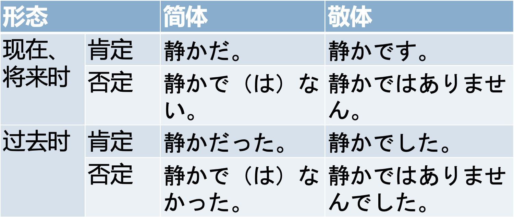

## 第一课
### 判断句系列
- NはNです
	- です为断定助动词，前接体言构成谓语
		- 我が征くは星の大海
	- NはNでは（じゃ）ありません
		- ~not~ 私は日本人ではありません
	-  NはNですか
		- ~is~? 貴方は中国人ですか
		- Answer: はい、そうです　いいえ、違います　わかりません
- N1のN2
	- 大学の先生
	- 日本語の本
	- 帝都大の湯川です
	- 貝塚北署の岸谷と言います
- 私　わたし　貴方　あなた　あの人
	- 僕ぼく　俺おれ　私わたくし　わたし　
	- 貴方あなた　君きみ　お前おまえ
	- 彼かれ　彼女かのじょ
- ~さん
- 第一第二人称主语的省略
- [初めての挨拶](https://www.erin.jpf.go.jp/jp/lesson/01/basic/)

## 第二课
### 单词
鞄かばん・バッグ
テレビ番組（ばんぐみ）
携帯電話（けいたいでんわ）・スマホ・スマートフォン・ガラケー
シャープペンシル・シャーペン

***
## 第三课
### 周一周日
月曜日　げつようび
火曜日　かようび
水曜日　すいようび
木曜日　もくようび
金曜日　きにようび
土曜日　どようび
日曜日　にちようび
 - 由于有一首日语歌叫《月月火水木金金》，意思是舍弃周六周日，全周无修，因而我记住了周一到周五，额外记一个周六周日就好
### ……在哪
1. ここ・そこ・あそにはNです：指示场所，这里，那里，那里
	- あそこは図書館です
2. N1はN2です：N1存在于N2
	- お手洗いはあそこです
	- 小野さんは事務所です
3. Nはどこですか：询问N在哪里
	- 学校はどこですか

## 2-28
### N1はN2にN3をあげます
- N1（给予人）给N2（接收人）N3（物品）
- N2（接收人）不能作为第一人称
- N1（我）给N2（他人）
#### 例句
- 私は木村さんにプレゼントをあげます
- 木村さんは山田さんにお土産をあげます
- 妹は山田さんにお土産をあげます
### N1はN2にN3をもらいます
- N1（接收者）从N2（赠送者）得到N3
- N2不能为第一人称
#### 例句
- 誕生日に山田さんからプレゼントをもらいました
### Nにかいます
- 去见N

### Nは一类型です
- 一类形容词/二类形容词——形容词/形容动词
- 以い结尾
- 否定：い变く加ないです/ありません
- いいーよくないです・よくありません
### 一类形做谓语时的过去式
- い变成かった再加です
	- 暑い・暑かったです
	- 寒い・寒かったです
- 否定：い变成くなかったです 或者くありませんでした
	- 暑くないです・暑くなかったです
	- 寒くありません・寒くありませんでした

## 3-2
### Nは二类形です
- 大部分不以い结尾| 綺麗　嫌い
	- 公園は賑やかです
	- 先生は親切です
- 否定：Nは二类形では（じゃ）ありません
	- 公園は静かではありません
	- いいえ、綺麗じゃありません
	- いいえ、全然ハンサムじゃありません
### Nは二类形でした
- 过去式
	- 昨日のパーテイーはとても賑やかでした、いろいろ人に会いました
- 过去否定：Nは二类形ではありませんでした
	- いいえ、暇ではありませんでした

### Nは二类形なNです
- 修饰名词
- 二类型なN
	- 素敵な絵ですね
	- 田中さんは元気な人です
	- 図書館は静かな所です
### Nでした
- 过去式
- 否定:では（じゃ）ありませんでした
	- 一昨日はバレンタインデーでした
	- 昨日は土曜日ではありませんでした
### どんなN
- 询问性质（好不好，精彩、热闹与否类似的，询问adj）
- 什么样的
	- かれはどんな人ですか　優しい人です
	- 羊羹はどんな食べ物ですか　おまいお菓子です
	- どんな映画ですか　日本の古い映画です
	- どんな鞄ですか　丈夫な鞄です
### 何の
- 询问材料或内容（这个是什么，询问n）
#### 区分どんな
- どんな本　面白い本
- なんの本　生物学の本
- どんな映画　つまらない映画
- なんの映画　についての映画
### 接续词でも、そして
- 接续词主要在词与词，句与句，段落与段落间起作用
#### でも（转折）
頑張りました。でも負けました
日本語は難しいです。でも面白いです
#### そして（并列）
かれが頭が良い。そしてイケメンだ
京都は綺麗な町です。そして、古いお寺がたくさんあります
#### ところで
- 结束上一个话题，转换
### 场所+中/时间（期间）+中
- 表示场所范围内的全部，在某个期间一直
### 形容词+の
- 形容词+の，使前面的形容词具有名词性质

## 3-11
### 一类动词、二类动词、三类动词
#### 一类动词
- 去掉ます后的第一个音大部分位于い段 
- 词干加う段假名词尾/单词的最后一个假名是う、く、ぐ、す、つ、ぬ、ぶ、む的都是一类动词，部分以る结尾的也是一类动词
【简体变敬体】う段移到い段加ます
#### 二类动词
- 去掉ます后的最后一个音大部分位于え段
- 词干+ｲ段或エ段假名+る
【简体变敬体】词尾去掉る+ます
#### 三类动词
する　します。　来る　きます
### N（数量）+V
- 助词+数量词+动词
- 数词的副词用法
彼女のお母さんの本を三冊買いました
好きな俳優を四人あげます
- 数+の+名词
ここに一冊本があります
三日の休みが取れました
- 询问数量：何＋量词
何個・何冊・何杯・何人・何足
### N（时间）+V
- 时间数量词语（时间段）+动词，表示动作、状态的持续时间
- 不加に
昨日は八時間寝ました
10秒休みます
### N（时间）に N（次数）+V
- 一定时间内进行若干次动作
1日（いちにち）に２回歯磨き（はみがき）をします
### N（场所）へ +V
- 移动行为的目的
- V为ます型去ます
	友達が私を迎えにきた
	デパートへカメラを買いに行きます
	食堂へいきます、ご飯を食べます
	公園へ行きます。遊びます
### 动词性名词（多为サ变动词词干）に行きます/来ます
*サ变动词即三类动词*
いつも公園へ散歩に行きます
先週香港へ買い物に行きます
### N（数量）+で
- 不称重而以个数的方式买东西
	このコーナーは三つで1,000円です
	八十円の切手を買いました。四枚で三百二十円でした
### ぐらい/くらい
- 表示数量的词语后面，表示大概的数量